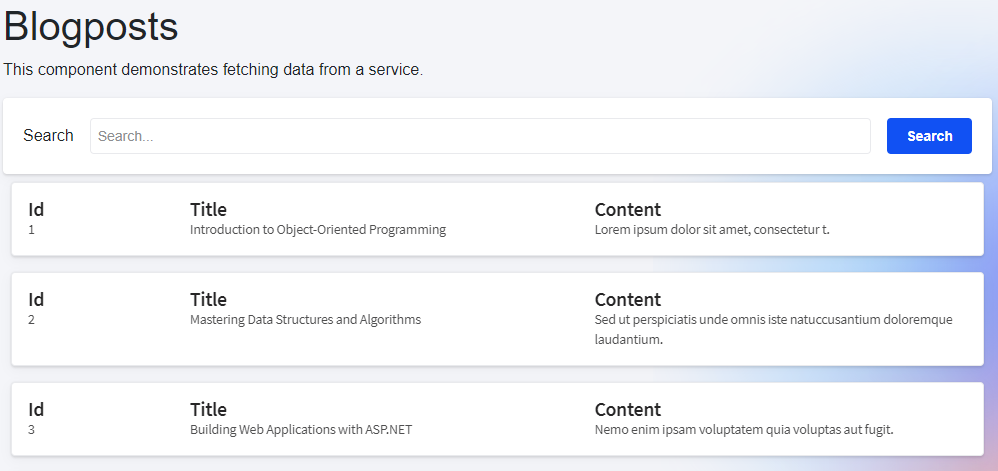

<p style="text-align: center;">
<br>
<p>

##### **Blazor Radzen SearchComponent**

###### 1. **Blazor Radzen List Page**

<p style="text-align: center;">
<br>
<p>

The code provided is a Blazor component that demonstrates how to fetch data from a service and display it in a RadzenDataList component. It also includes a custom search component that allows users to search for specific blog posts.

- Blazor: Blazor is a web framework for building interactive client-side web applications using C# instead of JavaScript. It allows developers to write code in C# that runs on the client-side, eliminating the need for JavaScript.
- Radzen: Radzen is a set of UI components for Blazor that provides pre-built components for building responsive and interactive web applications.
- RadzenDataList: RadzenDataList is a component from the Radzen UI library that displays a list of items in a grid-like format. It supports features like paging, sorting, and filtering.
- RadzenCard: RadzenCard is a component from the Radzen UI library that displays content in a card-like format. It provides a visually appealing way to present data.
- ComponentSearch: ComponentSearch is a custom search component that allows users to search for specific blog posts. It triggers the search functionality when the user clicks the search button.
- BlogPostService: BlogPostService is a service that provides methods for fetching blog post data from a backend API.

The code starts with the `@page` directive, which specifies the URL route for this component. In this case, the component is accessible at "/fetchdata".

The code then includes the necessary `@using` directives to import the required namespaces and inject the `BlogPostService` into the component.
The component's markup is defined within the `<PageTitle>` tag. It starts with an `<h1>` heading that displays the title "Blogposts" followed by a paragraph explaining the purpose of the component.

Next, a `<RadzenCard>` component is used to wrap the search component. The search component is a custom component called `ComponentSearch` that is defined in a separate file. It is injected into the component using the `@using` directive and its `SearchButtonClick` event is bound to the `SearchButtonClick` method in the code section.

After the search component, a `<RadzenDataList>` component is used to display the list of blog posts. It is configured with various properties like `WrapItems, AllowPaging, IsLoading, LoadData, Data, Count, TItem, PageSize, PagerHorizontalAlign, and ShowPagingSummary`. These properties control the behavior and appearance of the data list.

Inside the `<RadzenDataList>`, a `<Template>` component is used to define the layout of each item in the list. It contains a `<RadzenCard>` component that displays the blog post details in a card-like format. The details include the blog post ID, title, and content.

The code section contains the C# code that handles the data loading and search functionality. It defines various private fields and properties like `itemPageSize, totalCount, isLoading, currentArgs, blogposts, search, and searchProperty`.

The `LoadData` method is responsible for fetching the blog post data from the `BlogPostService` based on the provided arguments. It sets the `isLoading` flag to true, assigns the current arguments, and calls the `GetBlogPostsbyPageAsync` method of the `BlogPostService`. It then assigns the result to the `blogposts` field and updates the `totalCount` field. Finally, it sets the `isLoading` flag to false.

The `SearchButtonClick` method is triggered when the user clicks the search button in the custom search component. It updates the search field with the provided `search` value and calls the `LoadData` method to reload the data with the updated search value.

Here is an example of how to use the `RadzenDataList` component in a Blazor application:
```html
<RadzenDataList Data="@blogposts" PageSize="10" AllowPaging="true">
    <Template Context="blogpost">
        <div>@blogpost.Title</div>
        <div>@blogpost.Content</div>
    </Template>
</RadzenDataList>
```
In this example, the `RadzenDataList` component is bound to a collection of `blogposts` and is configured to display 10 items per page with paging enabled. The `<Template>` component is used to define the layout of each item in the list, displaying the title and content of each blog post.

The provided code demonstrates how to fetch data from a service and display it in a Blazor component using the Radzen UI library. It also includes a custom search component for filtering the data based on user input. By understanding the key concepts and code structure, you can leverage this code to build similar functionality in your own Blazor applications.

###### 2. **Blazor Radzen Search Component**

Here is an example of how the search component can be used in a Blazor application:
```cs
<SearchComponent SearchButtonClick="HandleSearch" />
@code {
    private async Task HandleSearch(string searchValue)
    {
        // Perform search logic here
        // Example: Call an API endpoint with the search query
        await SearchService.Search(searchValue);
    }
}
```
In the above example, the `SearchComponent` is used with the `SearchButtonClick` event callback. When the user clicks the search button, the `HandleSearch` method is invoked. Inside the `HandleSearch` method, you can implement the search logic, such as calling an API endpoint with the search query.


###### **Source**
Full source code is available at this repository in GitHub: 
https://github.com/akifmt/DotNetCoding/tree/main/src/BlazorAppRadzenSearch