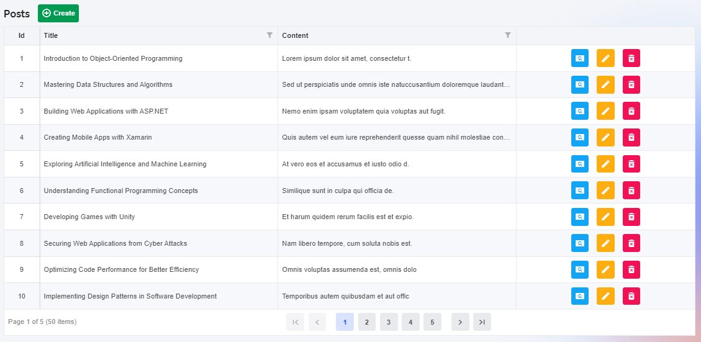
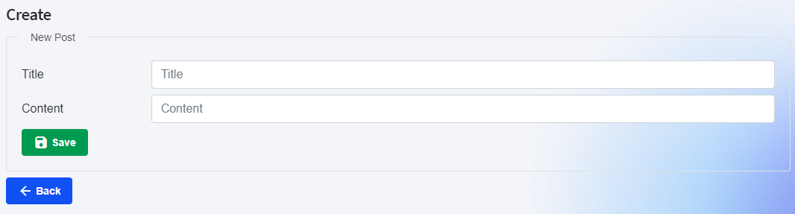
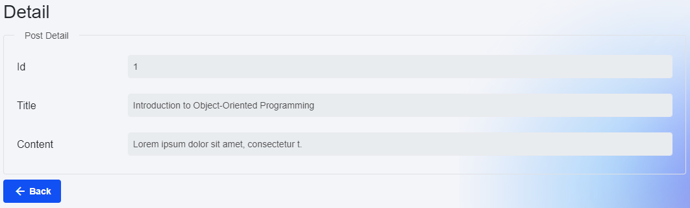
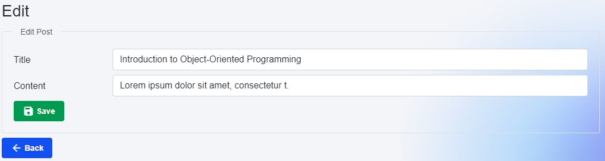
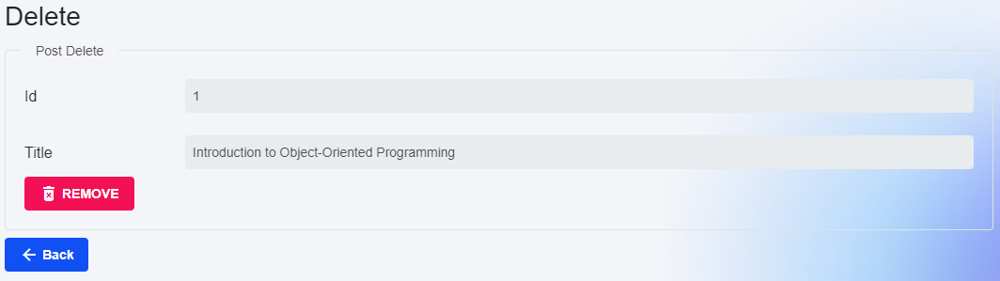

<p style="text-align: center;">
<br>
<p>

##### **Blazor Radzen CRUD**

In this article, we will explore the code for a Blazor page called "BlogPost". This page displays a list of blog posts using a RadzenDataGrid component. We will go through the key concepts, code structure, and code examples to understand how this page works.

Before diving into the code, let's understand some key concepts related to Blazor and RadzenDataGrid:

Blazor: Blazor is a web framework that allows developers to build interactive web UIs using C# instead of JavaScript. It enables the development of single-page applications (SPAs) with the power of .NET.

RadzenDataGrid: RadzenDataGrid is a component provided by Radzen, a popular UI component library for Blazor. It is used to display tabular data with features like sorting, filtering, and paging.

AutoMapper: AutoMapper is a library used for object-to-object mapping. It simplifies the mapping process between different object types by automatically mapping properties with matching names.

BlogPostViewModel: BlogPostViewModel is a class that represents the data model for the blog post form. It contains properties for the title and content of the blog post.

BlogPostService: BlogPostService is a service class responsible for handling CRUD operations related to blog posts. It provides methods for adding, updating, deleting, and retrieving blog posts from the database.

NavigationManager: NavigationManager is a Blazor service that provides navigation functionality. It allows us to navigate to different pages within the application.

The code provided represents the ```"BlogPost"``` page in a Blazor application. Let's break down the code structure and understand its different sections:

Page Directive: The ```@page "/BlogPost"``` directive specifies the URL route for this page. It means that when the user navigates to "/BlogPost", this page will be displayed.

Page Directive: The ```@page``` directive specifies the URL route for this page. In this case, the page is accessible at "/BlogPost/Create".

RadzenDataGrid Component: The main component on this page is the RadzenDataGrid. It is configured with various properties and columns to display the blog post data.

Using Directives: The ```@using``` directives import the necessary namespaces for the code to work correctly. We import the ```AutoMapper, BlazorAppRadzenCRUD.Data, BlazorAppRadzenCRUD.Models, and BlazorAppRadzenCRUD.Services``` namespaces.

Dependency Injection: The ```@inject``` directives inject the required services into the page. We inject the ```IMapper, NavigationManager, and BlogPostService``` services.

Page Content: The page content is wrapped in a ```<RadzenStack>``` component, which provides a vertical stack layout for the elements.

Loading Indicator: If the ```blogPostViewModel``` is null, a loading message is displayed. This is useful when the page is still initializing and fetching data.

Blog Post Form: Once the ```blogPostViewModel``` is populated, the blog post form is rendered. The form is wrapped in an ```<EditForm>``` component, which handles form validation and submission.

Form Fields: The form contains two fields: title and content. Each field is wrapped in a ```<RadzenRow>``` component, which represents a row in the form layout. The ```<RadzenColumn>``` components define the size of the columns within the row.

Input Fields: The ```<InputText>``` components represent the input fields for the title and content. The ```@bind-Value``` attribute binds the input field to the corresponding property in the ```blogPostViewModel```.

Validation: The ```<DataAnnotationsValidator>``` and ```<ValidationSummary>``` components handle form validation. They display error messages if the user enters invalid data.

Save Button: The ```<RadzenButton>``` component represents the save button. It triggers the form submission when clicked and has a success style.

Back Button: The ```<RadzenButton>``` component represents the back button. It navigates the user back to the blog post index page when clicked.

Code Block: The ```@code``` block contains the C# code for the page. It defines the ```blogPostViewModel``` property, initializes it in the ```OnInitialized``` method, and handles the form submission and navigation.

###### **List Posts (Index.razor)**
<p style="text-align: center;">
<br>
<p>

Now, let's take a closer look at some important code examples from the provided code:

- Loading Data:
```
private async Task LoadData(LoadDataArgs args)
{
    isLoading = true;

    var result = await BlogPostService.GetBlogPostsAsync(filter: args.Filter, top: args.Top, skip: args.Skip, orderby: args.OrderBy, count: true);

    blogPosts = Mapper.Map<IEnumerable<BlogPost>, IEnumerable<BlogPostViewModel>>(result.Result);
    totalCount = result.TotalCount;

    isLoading = false;
}
```
The ```LoadData``` method is responsible for loading the blog post data. It is called when the RadzenDataGrid needs to fetch new data, such as when the user changes the page or applies filters. It makes an asynchronous call to the ```BlogPostService.GetBlogPostsAsync``` method to retrieve the data. The result is then mapped to a collection of ```BlogPostViewModel``` objects using the ```Mapper``` class. Finally, the ```isLoading``` flag is updated to indicate the loading state.

- Navigation Methods:
```
private void NavigatetoCreate() => NavigationManager.NavigateTo("/BlogPost/Create");
private void NavigatetoDetail(int id) => NavigationManager.NavigateTo(quot;/BlogPost/Detail/{id}");
private void NavigatetoEdit(int id) => NavigationManager.NavigateTo(quot;/BlogPost/Edit/{id}");
private void NavigatetoDelete(int id) => NavigationManager.NavigateTo(quot;/BlogPost/Delete/{id}");
```
These methods handle the navigation to different pages related to the blog posts. For example, ```NavigatetoCreate``` navigates to the page for creating a new blog post, ```NavigatetoDetail``` navigates to the page for viewing the details of a specific blog post, and so on. The ```NavigationManager``` class is used to perform the navigation by specifying the desired URL.


###### **Create Post (Create.razor)**
<p style="text-align: center;">
<br>
<p>

Here are some code examples to illustrate the concepts discussed above:

Mapping the ```BlogPostViewModel``` to ```BlogPost```:
```
var blogPost = Mapper.Map<BlogPostViewModel, BlogPost>(blogPostViewModel);
```
In this example, we use AutoMapper to map the properties of the ```blogPostViewModel``` to the corresponding properties of the ```BlogPost``` model.

Adding a new blog post:
```
bool result = await BlogPostService.AddBlogPostAsync(blogPost);
```
Here, we call the ```AddBlogPostAsync``` method of the ```BlogPostService``` to add the new blog post to the database. The method returns a boolean value indicating the success of the operation.

Navigating to the blog post index page:
```
NavigationManager.NavigateTo("/BlogPost");
```
This code snippet uses the NavigationManager to navigate the user back to the blog post index page ```("/BlogPost")``` after a successful save operation.


###### **Post Detail (Detail.razor)**
<p style="text-align: center;">
<br>
<p>

Here is an example of how the code retrieves the blog post data and maps it to the view model:

```
protected override async Task OnInitializedAsync()
{
    if (blogPostViewModel == null)
    {
        var blogPost = await BlogPostService.GetbyId(id);
        if (blogPost == null)
            return;

        blogPostViewModel = Mapper.Map<BlogPost, BlogPostViewModel>(blogPost);
    }
}
```
In this example, the GetbyId method of the BlogPostService is called to retrieve the blog post data based on the provided ID. If the blog post is found, it is then mapped to the BlogPostViewModel using AutoMapper.


###### **Edit Post (Edit.razor)**
<p style="text-align: center;">
<br>
<p>

Here are some key code examples from the provided code:

Binding the input fields to the ```blogPostViewModel``` properties:
```
<InputText id="title" class="form-control" placeholder="Title"
    @bind-Value="blogPostViewModel.Title" />
```
The ```@bind-Value``` directive binds the value of the input field to the ```Title``` property of the ```blogPostViewModel```.

Handling the form submission:
```
<EditForm Context="editFormEdit" Model="@blogPostViewModel" OnValidSubmit="HandleValidSubmit">
    ...
    <RadzenButton Text="Save" Icon="save"
        ButtonType="ButtonType.Submit" ButtonStyle="ButtonStyle.Success" />
</EditForm>
```
The ```OnValidSubmit``` event handler is triggered when the form is submitted and passes the form data to the ```HandleValidSubmit``` method.

Navigating to the blog post index page:
```
private void NavigatetoBlogPostIndex() => NavigationManager.NavigateTo("/BlogPost");
```
The ```NavigatetoBlogPostIndex``` method uses the ```NavigationManager``` service to navigate to the blog post index page.


###### **Delete Post (Delete.razor)**
<p style="text-align: center;">
<br>
<p>

The code example provided includes the following key components:

Retrieving the Blog Post Details:

```
protected override async Task OnInitializedAsync()
{
    if (blogPostViewModel == null)
    {
        var blogPost = await BlogPostService.GetbyId(id);
        if (blogPost == null)
            return;

        blogPostViewModel = Mapper.Map<BlogPost, BlogPostViewModel>(blogPost);
    }
}
```
This method is executed when the page is initialized. It retrieves the blog post details using the ```BlogPostService``` and maps the retrieved ```BlogPost``` object to a ```BlogPostViewModel``` object using AutoMapper. The ```blogPostViewModel``` property is then set to the mapped object.

Deleting the Blog Post:

```
private async void RemoveButtonClick()
{
    bool result = await BlogPostService.DeletebyIdAsync(id);
    if (result)
        NavigationManager.NavigateTo("/BlogPost");
}
```
This method is called when the "REMOVE" button is clicked. It calls the ```DeletebyIdAsync``` method of the ```BlogPostService``` to delete the blog post with the specified ID. If the deletion is successful, the user is redirected to the blog post index page using the ```NavigationManager```.

Navigating to the Blog Post Index Page:
```
private void NavigatetoBlogPostIndex() => NavigationManager.NavigateTo("/BlogPost");
```
This method is called when the "Back" button is clicked. It uses the ```NavigationManager``` to navigate to the blog post index page.


###### **Source**
Full source code is available at this repository in GitHub: 
https://github.com/akifmt/DotNetCoding/tree/main/src/BlazorAppRadzenCRUD
