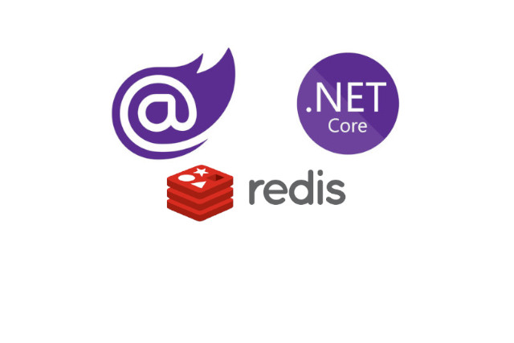

<p style="text-align: center;">
<br>
<p>

#### **Blazor Redis as Backplane (with Master and Slave)**

Blazor: Blazor is a web framework developed by Microsoft that allows developers to build interactive web applications using C# instead of JavaScript. It enables the creation of ```single-page applications (SPAs)``` that run entirely in the browser.

Redis: Redis is an ```open-source```, ```in-memory data structure store``` that can be used as a ```database, cache, and message broker```. It provides ```high-performance data storage``` and retrieval, making it suitable for use in applications that require fast and scalable data access.

Redis as Backplane: In the context of a web application, a backplane is a ```communication channel``` that allows ```multiple instances of the application to synchronize and share data```. Redis can be used as a backplane to ```enable real-time communication``` and data sharing between different instances of a Blazor application.

ServiceStack.Redis: ServiceStack.Redis is a ```high-performance, feature-rich Redis client``` library for .NET. It provides a simple and intuitive API for interacting with Redis servers and supports advanced features such as ```connection pooling, pipelining, and pub/sub```.

StackExchange.Redis: StackExchange.Redis is another popular Redis client library for .NET. It is widely used and offers a ```high-performance, low-level API for interacting with Redis servers```. It supports advanced features such as ```distributed locks, Lua scripting, and Redis Cluster```.

##### **Prerequisites**
- Redis Server Files and Master-Slave Configurations:
  https://github.com/akifmt/DotNetCoding/tree/main/src/BlazorAppwithRedis/RedisServerFiles

- Download and Run ```RUN_SERVERS.bat```

```
if not exist "Redis-x64-3.0.504_master" (
  mkdir "Redis-x64-3.0.504_master"
  tar -xf Redis-x64-3.0.504.zip -C "Redis-x64-3.0.504_master"
)

if not exist "Redis-x64-3.0.504_slave" (
  mkdir "Redis-x64-3.0.504_slave"
  tar -xf Redis-x64-3.0.504.zip -C "Redis-x64-3.0.504_slave"
)

start "Start RedisMaster" Redis-x64-3.0.504_master\redis-server.exe redis.windows.master.conf
start "Start RedisSlave" Redis-x64-3.0.504_slave\redis-server.exe redis.windows.slave.conf
```

- Now, Redis Master-Slave Servers are ready.
	- MASTER 127.0.0.1:6379
	- slave 127.0.0.1:6380

##### **ConfigurationManager.cs**
The ```ConfigurationManager``` class is defined as a static class, meaning it cannot be instantiated. It contains a single static property called ```AppSetting```, which represents the application's configuration settings.

The ```AppSetting``` property is of type ```IConfiguration```, which is an interface that provides access to configuration settings. This property is read-only, meaning it can only be accessed but not modified.

The class also has a static constructor, denoted by the static ```ConfigurationManager()``` syntax. This constructor is automatically called when the class is accessed for the first time and is used to initialize the ```AppSetting``` property.
```
namespace BlazorAppwithRedis;

public static class ConfigurationManager
{
    public static IConfiguration AppSetting
    {
        get;
    }

    static ConfigurationManager()
    {
        AppSetting = new ConfigurationBuilder().SetBasePath(Directory.GetCurrentDirectory()).AddJsonFile("appsettings.json").Build();
    }
}
```

##### **ConnectionHelper.cs**

The ```ConnectionHelper``` class is declared as a public class. Three private static fields are defined to store the Redis clients and manager: ```_clientsManager```, ```_redisClientMaster```, and ```_redisClientSlave```.

A static constructor is defined to initialize the ```Redis``` connection. It is executed only once when the class is first accessed.
Inside the static constructor, the Redis clients manager is initialized with the Redis server URLs obtained from the configuration.
The Redis client instances for master and slave are obtained from the clients manager.
The lazy connection is initialized using a lambda expression that creates a connection string from the Redis server URLs and connects to the Redis server using ```ConnectionMultiplexer```.

The ```lazyConnection``` field is declared as a ```Lazy<ConnectionMultiplexer>``` to ensure lazy initialization of the Redis connection.
A public static property ```Connection``` is defined to provide access to the Redis connection.
The ```Connection``` property returns the value of the ```lazyConnection``` field.
A public static method ```GetServers()``` is defined to get the Redis servers from the connection.

```
using ServiceStack.Redis;
using StackExchange.Redis;

namespace BlazorAppwithRedis;

public class ConnectionHelper
{
    private static readonly IRedisClientsManager _clientsManager;
    private static readonly IRedisClient _redisClientMaster;
    private static readonly IRedisClient _redisClientSlave;

    static ConnectionHelper()
    {
        _clientsManager = new PooledRedisClientManager(ConfigurationManager.AppSetting["RedisURLMaster"], ConfigurationManager.AppSetting["RedisURLSlave"]);
        _redisClientMaster = _clientsManager.GetClient();
        _redisClientSlave = _clientsManager.GetReadOnlyClient();
        ConnectionHelper.lazyConnection = new Lazy<ConnectionMultiplexer>(() =>
        {
            string urls = $"{ConfigurationManager.AppSetting["RedisURLMaster"]},{ConfigurationManager.AppSetting["RedisURLSlave"]},allowAdmin=true";
            return ConnectionMultiplexer.Connect(urls);
        });
    }

    private static Lazy<ConnectionMultiplexer> lazyConnection;

    public static ConnectionMultiplexer Connection
    {
        get
        {
            return lazyConnection.Value;
        }
    }

    public static IEnumerable<IServer> GetServers()
    {
        return Connection.GetServers();
    }
}
```

##### **ICacheService.cs**
```ICacheService``` in the ```BlazorAppwithRedis.Cache``` namespace. This interface defines a set of methods that can be used to interact with a cache service.

GetConnectionState(): This method returns the connection state of the cache service. It returns a tuple containing the connection state ```(ConnectionStates)``` and a message ```(string)``` indicating the current state of the connection.

GetTTL(string key): This method returns the ```time-to-live (TTL)``` of a cached item specified by the key. The TTL represents the remaining time until the item expires and is automatically removed from the cache. It returns a TimeSpan object representing the remaining time.

GetDataMaster<T>(string key): This method retrieves data from the cache using the key. It returns the cached data of type ```T``` if it exists, or null if the data is not found.

GetDataSlave<T>(string key): This method retrieves data from a slave cache using the key. It is similar to ```GetDataMaster```, but it retrieves data from a ```read-only replica``` of the cache.

SetDataMaster<T>(string key, T value, DateTimeOffset expirationTime): This method sets data in the cache using the ```key, value, and expirationTime```. It stores the data in the master cache and specifies the expiration time for the data.

RemoveDataMaster(string key): This method removes data from the cache using the key. It deletes the data from the master cache.

```
namespace BlazorAppwithRedis.Cache;

public interface ICacheService
{
    (ConnectionStates ConnectionState, string Message) GetConnectionState();

    TimeSpan? GetTTL(string key);

    T? GetDataMaster<T>(string key);

    T? GetDataSlave<T>(string key);

    bool? SetDataMaster<T>(string key, T value, DateTimeOffset expirationTime);

    object? RemoveDataMaster(string key);
}
```


##### **CacheService.cs**
It implements the ```ICacheService``` interface, which defines the contract for interacting with the cache.

private IDatabase? _db: A private field that holds the reference to the Redis database.
private ConnectionStates _connectionState: An enumeration that represents the current connection state of the cache service.
private string _currentConnectionStatusMessage: A string that stores the current connection status message.

The class also has a ```constructor``` that initializes the cache service by establishing a connection to ```Redis```. If the connection is successful, the connection state is set to ```Connected```, and the current connection status message is set to "Connected." If an exception occurs during the connection process, the connection state is set to ```NoConnection```, and the current connection status message is set to the error message.

```
using StackExchange.Redis;
using System.Text.Json;

namespace BlazorAppwithRedis.Cache;

public enum ConnectionStates
{
    Unknown = 0, Connected = 1, NoConnection = 2,
}

public class CacheService : ICacheService
{
    private IDatabase? _db;
    private ConnectionStates _connectionState = ConnectionStates.Unknown;
    private string _currentConnectionStatusMessage;

    public CacheService()
    {
        try
        {
            _db = ConnectionHelper.Connection.GetDatabase(0);
            _connectionState = ConnectionStates.Connected;
            _currentConnectionStatusMessage = "Connected.";
        }
        catch (Exception ex)
        {
            _connectionState = ConnectionStates.NoConnection;

            string errorMessage = ex.Message;

            var innerEx = ex.InnerException;
            while (innerEx != null)
            {
                errorMessage += Environment.NewLine + innerEx.Message;
                innerEx = innerEx.InnerException;
            }

            _currentConnectionStatusMessage = errorMessage;
        }
    }

    public (ConnectionStates ConnectionState, string Message) GetConnectionState() => (_connectionState, _currentConnectionStatusMessage);

    public TimeSpan? GetTTL(string key)
    {
        if (_connectionState != ConnectionStates.Connected) return null;
        var value = _db.KeyTimeToLive(key, CommandFlags.PreferMaster);
        if (value != null)
        {
            return value;
        }
        return default;
    }

    public T? GetDataMaster<T>(string key)
    {
        if (_connectionState != ConnectionStates.Connected) return default;
        var value = _db.StringGet(key, CommandFlags.PreferMaster);
        if (!string.IsNullOrEmpty(value))
        {
            return JsonSerializer.Deserialize<T>(value!);
        }
        return default;
    }

    public T? GetDataSlave<T>(string key)
    {
        if (_connectionState != ConnectionStates.Connected) return default;
        var value = _db.StringGet(key, CommandFlags.PreferReplica);
        if (!string.IsNullOrEmpty(value))
        {
            return JsonSerializer.Deserialize<T>(value!);
        }
        return default;
    }

    public bool? SetDataMaster<T>(string key, T value, DateTimeOffset expirationTime)
    {
        if (_connectionState != ConnectionStates.Connected) return default;
        TimeSpan expiryTime = expirationTime.DateTime.Subtract(DateTime.Now);
        var isSet = _db.StringSet(key, JsonSerializer.Serialize(value), expiryTime, flags: CommandFlags.PreferMaster);
        return isSet;
    }

    public object? RemoveDataMaster(string key)
    {
        if (_connectionState != ConnectionStates.Connected) return null;
        bool _isKeyExist = _db.KeyExists(key);
        if (_isKeyExist == true)
        {
            return _db.KeyDelete(key, CommandFlags.PreferMaster);
        }
        return false;
    }
}
```
GetConnectionState(): Returns the current connection state and status message of the cache service.

GetTTL(string key): Retrieves the ```time-to-live (TTL)``` of a cache key, which represents the remaining time until the key expires.

GetDataMaster<T>(string key): Retrieves data from the cache using the specified key, preferring the ```master``` node in a Redis cluster.

GetDataSlave<T>(string key): Retrieves data from the cache using the specified key, preferring a ```replica``` node in a Redis cluster.

SetDataMaster<T>(string key, T value, DateTimeOffset expirationTime): Stores data in the cache using the specified key, with an optional ```expiration time```.

RemoveDataMaster(string key): Removes data from the cache using the specified key, preferring the ```master node in a Redis``` cluster.


##### **appsettings.json**
```
{
  "RedisURLMaster": "127.0.0.1:6379",
  "RedisURLSlave": "127.0.0.1:6380",
  "Logging": {
    "LogLevel": {
      "Default": "Information",
      "Microsoft.AspNetCore": "Warning"
    }
  },
  "AllowedHosts": "*"
}
```

The above code snippet shows two key settings related to Redis: ```RedisURLMaster and RedisURLSlave```. These settings define the URLs of the Redis instances that will be used as the master and slave nodes in a Redis cluster.

##### **BlogPostService.cs**
BlogPostService class is structured as follows:

It imports the necessary namespaces for the ```cache, data, and models```. It defines the class and its dependencies, including the ```ApplicationDbContext and ICacheService```. It initializes the class with the required dependencies through the ```constructor```. It provides methods for ```retrieving, creating, updating, and deleting blog posts```. It includes a private method for setting the ```blog post data``` in the ```cache```.

```
using BlazorAppwithRedis.Cache;
using BlazorAppwithRedis.Data;
using BlazorAppwithRedis.Models;
using Microsoft.EntityFrameworkCore;

namespace BlazorAppwithRedis.Services;

public class BlogPostService
{
    private readonly ApplicationDbContext _context;
    private readonly ICacheService _cacheService;
    private static object _lock = new object();

    public BlogPostService(ApplicationDbContext context, ICacheService cacheService)
    {
        _context = context;
        _cacheService = cacheService;
    }

    public async Task<(BlogPost? Data, string From)> GetbyIdAsync(int id)
    {
        BlogPost? filteredData;
        var data = _cacheService.GetDataSlave<IEnumerable<BlogPost>>("blogpost");
        if (data is not null)
        {
            filteredData = data.Where(x => x.Id == id).FirstOrDefault();
            return (Data: filteredData, From: "cache");
        }
        data = await SetBlogPostData();
        filteredData = data.Where(x => x.Id == id).FirstOrDefault();
        return (Data: filteredData, From: "database");
    }

    public async Task<(IEnumerable<BlogPost> Data, string From)> GetAllAsync()
    {
        var data = _cacheService.GetDataSlave<IEnumerable<BlogPost>>("blogpost");
        if (data is not null)
            return (Data: data, From: "cache");
        data = await SetBlogPostData();
        return (Data: data, From: "database");
    }

    public async Task<bool> AddBlogPostAsync(BlogPost blogPost)
    {
        try
        {
            var result = await _context.BlogPosts.AddAsync(blogPost);
            await _context.SaveChangesAsync();
            _cacheService.RemoveDataMaster("blogpost");
            await SetBlogPostData();
        }
        catch (Exception ex)
        {
            return false;
        }
        return true;
    }

    public async Task<bool> UpdateBlogPostAsync(int id, BlogPost blogPost)
    {
        try
        {
            var oldBlogPost = await _context.BlogPosts.FirstOrDefaultAsync(x => x.Id == id);
            if (oldBlogPost == null) return false;
            oldBlogPost.Title = blogPost.Title;
            oldBlogPost.Content = blogPost.Content;
            await _context.SaveChangesAsync();
            _cacheService.RemoveDataMaster("blogpost");
            await SetBlogPostData();
        }
        catch (Exception ex)
        {
            return false;
        }
        return true;
    }

    public async Task<bool> DeletebyIdAsync(int id)
    {
        try
        {
            var blogPost = await _context.BlogPosts.FirstOrDefaultAsync(x => x.Id == id);
            if (blogPost is null)
                return false;
            _context.BlogPosts.Remove(blogPost);
            await _context.SaveChangesAsync();
            _cacheService.RemoveDataMaster("blogpost");
            await SetBlogPostData();
        }
        catch (Exception ex)
        {
            return false;
        }
        return true;
    }

    private async Task<IEnumerable<BlogPost>> SetBlogPostData()
    {
        var expirationTime = DateTimeOffset.Now.AddMinutes(5.0);
        var data = await _context.BlogPosts.ToListAsync();
        lock (_lock)
        {
            _cacheService.SetDataMaster<IEnumerable<BlogPost>>("blogpost", data, expirationTime);
        }
        return data;
    }
}
```


#### **Source**
Full source code is available at this repository in GitHub:
https://github.com/akifmt/DotNetCoding/tree/main/src/BlazorAppwithRedis

