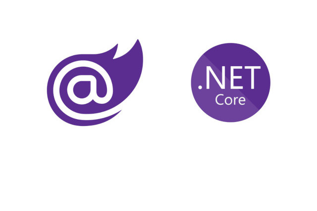

<p class="d-flex justify-content-center">
<br>
<p>

#### **Blazor Send Email with MailKit**
How to send emails using MailKit in a Blazor application. MailKit is a cross-platform .NET library that provides a simple and efficient way to send and receive emails. We will create a class called EmailConfiguration to store the email server configuration settings.

MailKit: MailKit is an open-source .NET library that provides a high-level API for sending and receiving emails using various protocols such as SMTP, POP3, and IMAP.

SMTP: Simple Mail Transfer Protocol (SMTP) is a standard protocol used for sending emails over the internet. It is responsible for transferring the email from the sender's mail server to the recipient's mail server.

Blazor: Blazor is a web framework for building interactive client-side web applications using C# instead of JavaScript. It allows developers to write code that runs on the client-side in the browser.

ethereal.email: https://ethereal.email/  is a service that allows developers to test email functionality in web applications by providing temporary email addresses and capturing the sent emails for inspection on their website. It is a useful tool for ensuring the proper functioning of email features without the need for real email accounts.


##### **EmailConfiguration.cs**
A class called ```EmailConfiguration``` that represents the ```email server configuration``` settings. It has the following properties:

```
namespace BlazorAppSendEmailwithMailKit.Data;
public class EmailConfiguration
{
    public string Host { get; set; } = string.Empty;
    public int Port { get; set; }
    public string Username { get; set; } = string.Empty;
    public string Password { get; set; } = string.Empty;
    public string From { get; set; } = string.Empty;
    public string Name { get; set; } = string.Empty;
    public bool EnableSSL { get; set; }
}
```

Host: The hostname or ```IP address``` of the email server.

Port: The ```port``` number to connect to the email server.

Username: The ```username``` to authenticate with the email server.

Password: The ```password``` to authenticate with the email server.

From: The email address from which the email will be sent.

Name: The name associated with the email address.

EnableSSL: A boolean value indicating whether to ```use SSL/TLS encryption``` for the connection.


##### **EmailMessage.cs**
EmailMessage class is defined within the BlazorAppSendEmailwithMailKit.Data namespace. It contains three properties: ```Email, Subject, and Message```.

```
using System.ComponentModel.DataAnnotations;

namespace BlazorAppSendEmailwithMailKit.Data;

public class EmailMessage
{
    [EmailAddress]
    public string Email { get; set; } = string.Empty;

    [Required]
    public string Subject { get; set; } = string.Empty;

    [Required]
    public string Message { get; set; } = string.Empty;
}
```


##### **IEmailSender.cs**
We define an interface called ```IEmailSender``` with a single method ```SendEmailAsync```. This method takes three parameters: ```email (the recipient's email address)```, ```subject (the subject of the email)```, and ```htmlMessage (the HTML content of the email)```.

```
namespace BlazorAppSendEmailwithMailKit.Data;

public interface IEmailSender
{
    Task SendEmailAsync(string email, string subject, string htmlMessage);
}
```
This interface will serve as the contract for sending emails.

##### **EmailSenderMailKit.cs**
The ```EmailSenderMailKit``` class implements the ```IEmailSender``` interface, which requires the implementation of the ```SendEmailAsync``` method. This method takes the ```recipient's email address```, ```subject```, and ```HTML message``` as parameters.

```
using MailKit.Net.Smtp;
using Microsoft.Extensions.Options;
using MimeKit;
using MimeKit.Text;

namespace BlazorAppSendEmailwithMailKit.Data;

public class EmailSenderMailKit : IEmailSender
{
    private readonly EmailConfiguration _emailConfiguration;

    public EmailSenderMailKit(IOptions<EmailConfiguration> emailConfiguration)
    {
        this._emailConfiguration = emailConfiguration.Value;
    }

    public Task SendEmailAsync(string email, string subject, string htmlMessage)
    {
        return Execute(email, subject, htmlMessage);
    }

    private async Task Execute(string to, string subject, string htmlMessage)
    {
        string host = _emailConfiguration.Host;
        int port = _emailConfiguration.Port;
        string username = _emailConfiguration.Username;
        string password = _emailConfiguration.Password;
        string from = _emailConfiguration.From;
        string name = _emailConfiguration.Name;
        bool enableSsl = _emailConfiguration.EnableSSL;

        var email = new MimeMessage();

        var sender = MailboxAddress.Parse(from);
        if (!string.IsNullOrEmpty(name))
            sender.Name = name;
        email.Sender = sender;
        email.From.Add(sender);
        email.To.Add(MailboxAddress.Parse(to));
        email.Subject = subject;
        email.Body = new TextPart(TextFormat.Html) { Text = htmlMessage };

        using (var smtp = new SmtpClient())
        {
            smtp.Timeout = 10000; // 10secs
            try
            {
                await smtp.ConnectAsync(host, port, enableSsl);
                if (!string.IsNullOrEmpty(username))
                    smtp.Authenticate(username, password);
                await smtp.SendAsync(email);
                await smtp.DisconnectAsync(true);
            }
            catch (Exception ex)
            {
                throw;
            }
        }
    }
}
```
The ```EmailSenderMailKit``` class also has a constructor that accepts an instance of ```IOptions<EmailConfiguration>```. This allows us to retrieve the email server configuration settings from the ```appsettings.json``` file or any other configuration source.

Inside the ```Execute``` method, we retrieve the email server configuration settings from the ```_emailConfiguration``` object. We then create a new ```MimeMessage``` object and set the ```sender, recipient, subject, and body``` of the email.

Next, we create an instance of ```SmtpClient``` and set its timeout to 10 seconds. We then connect to the email server using the ```ConnectAsync``` method, authenticate if a username and password are provided, send the email using the ```SendAsync``` method, and finally disconnect from the server using the ```DisconnectAsync``` method.


##### **appsettings.json**
```appsettings.json``` file is a configuration file used in ```ASP.NET Core``` applications to store application settings. It follows a ```JSON format``` and can be used to store various settings, including email configuration.

```
{
  "Email": {
    "Host": "HOST_ADDRESS",
    "Port": 587,
    "Username": "USERNAME",
    "Password": "PASSWORD",
    "From": "FROM_EMAIL",
    "Name": "FROM_NAME",
    "EnableSSL": true
  },
  "Logging": {
    "LogLevel": {
      "Default": "Information",
      "Microsoft.AspNetCore": "Warning"
    }
  },
  "AllowedHosts": "*"
}
```

Email: This section contains the email configuration settings such as the host address, port number, username, password, from email address, from name, and whether to enable SSL.


##### **Program.cs**
In the ```program.cs``` file sets up the email sending functionality using MailKit in a Blazor application. Let's break down the code and understand its structure:
```
// Add services to the container.
builder.Services.AddTransient<IEmailSender, EmailSenderMailKit>();
builder.Services.Configure<EmailConfiguration>(options =>
{
    builder.Configuration.GetSection("Email").Bind(options);
});
```
The ```builder.Services.AddTransient<IEmailSender, EmailSenderMailKit>()``` line registers the ```EmailSenderMailKit``` class as the implementation for the ```IEmailSender``` interface. This allows us to inject the ```IEmailSender``` interface wherever we need to send emails.

The ```builder.Services.Configure<EmailConfiguration>(options => { ... })``` line configures the ```EmailConfiguration``` class by binding the configuration settings from the ```appsettings.json``` file. This allows us to retrieve the email configuration settings easily.


##### **SendEmail.razor**
Blazor component named ```SendEmail.razor```. It allows users to enter ```an email address, subject, and message, and then sends``` the email using the ```IEmailSender``` service.

```
@page "/sendemail"

@using BlazorAppSendEmailwithMailKit.Data
@inject IEmailSender EmailSender

<PageTitle>Send Email</PageTitle>

@if (emailMessage is null)
{
    <p>Loading...</p>
}
else
{
    <EditForm Model=@emailMessage OnValidSubmit=@ValidFormSubmitted>
        <DataAnnotationsValidator />
        <ValidationSummary />
        <p>Send Email</p>
        <div class="form-group">
            <label for="email">Email</label>
            <InputText @bind-Value=emailMessage.Email class="form-control" id="email" />
            <ValidationMessage For="() => emailMessage.Email" />
        </div>
        <div class="form-group">
            <label for="subject">Subject</label>
            <InputText @bind-Value=emailMessage.Subject class="form-control" id="subject" />
            <ValidationMessage For="() => emailMessage.Subject" />
        </div>
        <div class="form-group">
            <label for="message">Message</label>
            <InputTextArea @bind-Value=emailMessage.Message class="form-control" id="message" />
            <ValidationMessage For="() => emailMessage.Message" />
        </div>

        <input type="submit" class="btn btn-primary" value="Send" />

    </EditForm>

    <div class="form-group">
        <label for="result">Result:</label>
        <input type="text" value=@result readonly class="form-control" id="result" />
    </div>
}

@code {
    private string result = string.Empty;
    private EmailMessage? emailMessage;

    protected override void OnInitialized()
    {
        emailMessage = new();
    }

    private async Task ValidFormSubmitted()
    {
        if (emailMessage is null) return;
        try
        {
            result = "sending...";
            await EmailSender.SendEmailAsync(emailMessage.Email, emailMessage.Subject, emailMessage.Message);
            result = "success";
        }
        catch (Exception ex)
        {
            result = ex.Message;
        }
    }

}
```
The code is structured as follows:

Page Directive: The ```@page``` directive specifies the URL route for the component.

Using Directive: The ```@using``` directive imports the necessary namespaces for the component.

Dependency Injection: The ```@inject``` directive injects the ```IEmailSender``` service into the component.

PageTitle: The ```PageTitle``` component sets the page title.

Conditional Rendering: The code uses conditional rendering to display a loading message while the email message is being loaded, and the email form once the message is loaded.

EditForm: The ```EditForm``` component wraps the email form and handles form submission and validation.

DataAnnotationsValidator: The ```DataAnnotationsValidator``` component performs validation based on data annotations applied to the ```EmailMessage``` model.

ValidationSummary: The ```ValidationSummary``` component displays a summary of validation errors.

Form Fields: The code defines form fields for ```email, subject, and message``` using ```Blazor's InputText``` and ```InputTextArea``` components. It also includes validation messages for each field.

Submit Button: The code includes a submit button that triggers the ```ValidFormSubmitted``` method when clicked.

Result Display: The code displays the result of the email sending operation.

Code Block: The @code block contains the C# code for the component. It initializes the result variable, handles form submission, and sends the email using the EmailSender service.


#### **Source**
Full source code is available at this repository in GitHub:  
https://github.com/akifmt/DotNetCoding/tree/main/src/BlazorAppSendEmailwithMailKit
