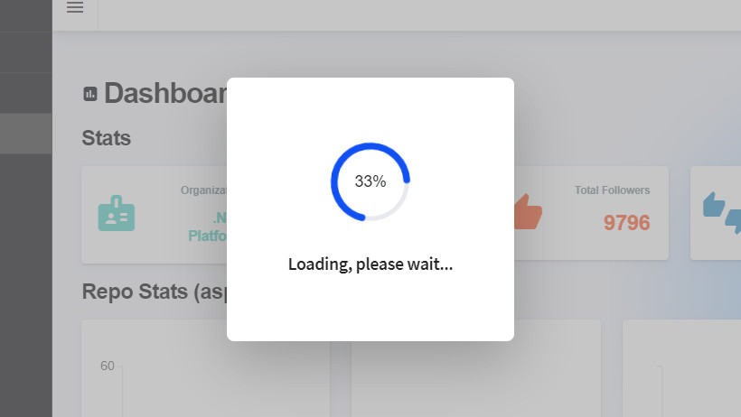

<p class="d-flex justify-content-center">
<br>
<p>

#### **Blazor Radzen Loading on Page**
<p style="text-align: center;">
<br>
<p>

Blazor: Blazor is a web framework that allows developers to build interactive web UIs using C# instead of JavaScript. It enables full-stack development with .NET.

Radzen: Radzen is a set of UI components for Blazor that provides ready-to-use components for building responsive and user-friendly web applications.

Loading Indicator: A loading indicator is a visual element that indicates the progress of an ongoing operation, such as data loading or processing.

ProgressBarCircular: ProgressBarCircular is a Radzen component that displays a circular progress bar. It can be customized to show the current step number and percentage.

##### **LoadingIndicatorOptions.cs**
LoadingIndicatorOptions class is a C# code that defines the options for a loading indicator component in a Blazor application. This code provides a way to customize the behavior and appearance of the loading indicator.

```
namespace BlazorAppRadzenLoading.Components;

public class LoadingIndicatorOptions
{
    public LoadingIndicatorOptions(
        bool startAfterRender = true,
        bool showStepNumbers = false, bool showPercentage = true,
        int currentStep = 0, int totalSteps = 1)
    {
        StartAfterRender = startAfterRender;
        ShowStepNumbers = showStepNumbers;
        ShowPercentage = showPercentage;
        CurrentStep = currentStep;
        TotalSteps = totalSteps;
    }

    public Action? UpdateAction { get; set; }

    private bool startAfterRender;

    public bool StartAfterRender
    {
        get => startAfterRender;
        set
        {
            startAfterRender = value;
            if (UpdateAction is not null) UpdateAction.Invoke();
        }
    }

    private bool showStepNumbers;

    public bool ShowStepNumbers
    {
        get => showStepNumbers;
        set
        {
            showStepNumbers = value;
            if (UpdateAction is not null) UpdateAction.Invoke();
        }
    }

    private bool showPercentage;

    public bool ShowPercentage
    {
        get => showPercentage;
        set
        {
            showPercentage = value;
            if (UpdateAction is not null) UpdateAction.Invoke();
        }
    }

    private int currentStep;

    public int CurrentStep
    {
        get => currentStep;
        set
        {
            currentStep = value;
            CurrentPercent = (int)(((float)currentStep / (float)totalSteps) * 100);
            if (UpdateAction is not null) UpdateAction.Invoke();
        }
    }

    private int currentPercent;

    public int CurrentPercent
    {
        get => currentPercent;
        set
        {
            currentPercent = value;
            if (UpdateAction is not null) UpdateAction.Invoke();
        }
    }

    private int totalSteps = 1;

    public int TotalSteps
    {
        get => totalSteps;
        set
        {
            totalSteps = value;
            if (UpdateAction is not null) UpdateAction.Invoke();
        }
    }
}
```

```LoadingIndicatorOptions``` class: This class represents the options for the ```loading indicator```. It contains properties and methods to control various aspects of the loading indicator, such as when to ```start rendering```, whether ```to show step numbers or percentage```, ```the current step```, and ```the total number of steps```.

Constructor: The ```LoadingIndicatorOptions``` class has a constructor that initializes the properties of the class. It takes several optional parameters that allow you to customize the initial state of the loading indicator.

Properties:

StartAfterRender: A ```boolean``` property that determines whether the ```loading indicator``` should start rendering after the component has finished rendering.

ShowStepNumbers: A ```boolean``` property that determines whether to ```show step numbers``` in the loading indicator.

ShowPercentage: A ```boolean``` property that determines whether to ```show the percentage of completion``` in the loading indicator.

CurrentStep: An ```integer``` property that represents the ```current step``` of the loading process.

TotalSteps: An ```integer``` property that represents the ```total number of steps``` in the loading process.

UpdateAction: An ```optional action delegate``` that is invoked whenever a property is updated. This allows you to perform additional actions when the loading indicator options change.

Property Setters: The properties of the ```LoadingIndicatorOptions``` class have custom setters that update the corresponding property value and invoke the ```UpdateAction``` delegate if it is not null. This ensures that any changes to the ```options trigger a refresh``` of the loading indicator.

##### **LoadingIndicatorRenderFragment.razor**

It consists of a RadzenStack component that contains a RadzenProgressBarCircular and a RadzenText component. The RadzenProgressBarCircular is used to display the loading progress, while the RadzenText component shows a loading message.

```
<RadzenStack Orientation="Orientation.Vertical" AlignItems="AlignItems.Center" JustifyContent="JustifyContent.Center" Wrap="FlexWrap.Wrap" Class="rz-m-12" Gap="2rem">
    <RadzenProgressBarCircular ShowValue="true" Mode="ProgressBarMode.Indeterminate" Size="ProgressBarCircularSize.Large">
        <Template>
            @if (Option.ShowStepNumbers)
            {
                @($"{Option.CurrentStep} / {Option.TotalSteps}")
            }
            @if (Option.ShowPercentage)
            {
                @($"{Option.CurrentPercent}%")
            }
        </Template>
    </RadzenProgressBarCircular>
    <RadzenText TextStyle="TextStyle.H6">Loading, please wait...</RadzenText>
</RadzenStack>

@code {

    [Parameter]
    public LoadingIndicatorOptions Option { get; set; }

    protected override void OnInitialized()
    {
        Option.UpdateAction = StateHasChanged;
    }

}
```


##### **LoadingIndicator.razor**

```
@inject DialogService DialogService

@code {

    [Parameter, EditorRequired]
    public EventCallback DoLoadDataCallback { get; set; }

    [Parameter, EditorRequired]
    public LoadingIndicatorOptions Option { get; set; }

    private CancellationTokenSource? cts;

    protected async override Task OnAfterRenderAsync(bool firstRender)
    {
        if (firstRender)
            if (Option.StartAfterRender)
                await this.Run();
    }

    public async Task Run()
    {
        await this.ShowLoadingDialog();
        await DoLoadDataCallback.InvokeAsync();
        Option.CurrentStep = Option.TotalSteps;
        await this.HideDialog();
    }

    private async Task ShowLoadingDialog()
    {
        cts = new CancellationTokenSource();
        _ = InvokeAsync(async () => await LoadingDialog());
        await Task.Run(() => CheckForHide(), cts.Token);
    }

    private async Task HideDialog()
    {
        if (cts is not null)
            cts.Cancel();
        await InvokeAsync(StateHasChanged);
    }

    private async void CheckForHide()
    {
        if (cts is null) return;

        while (!cts.IsCancellationRequested)
            await Task.Delay(500);
        await InvokeAsync(() => DialogService.Close());
    }

    private async Task LoadingDialog()
    {
        await DialogService.OpenAsync<LoadingIndicatorRenderFragment>("", new Dictionary<string, object> { { "Option", Option } },
                new DialogOptions() { ShowTitle = false, Style = "min-height:auto;min-width:auto;width:auto", CloseDialogOnEsc = false });
    }

}
```
Dependency Injection: The ```@inject``` directive is used to inject the DialogService into the component. This service is provided by ```Radzen``` and allows us to interact with the dialog components.

Component Parameters: The component defines two parameters: ```DoLoadDataCallback and Option```. These parameters are used to pass the necessary ```data and options``` to the component.

Lifecycle Method: The ```OnAfterRenderAsync``` method is overridden to execute code after the component has been rendered. In this method, we check if it's the first render and if the ```StartAfterRender``` option is enabled. If so, we call the ```Run``` method.

Run Method: The ```Run method``` is responsible for displaying the loading dialog, invoking the ```DoLoadDataCallback``` method to load the data, updating the current step, and hiding the dialog.

ShowLoadingDialog Method: This method creates a new ```CancellationTokenSource``` and invokes the ```LoadingDialog``` method asynchronously. It also starts ```a background task``` to check for cancellation and hide the dialog.

HideDialog Method: This method cancels the ```CancellationTokenSource``` and updates the ```component's state``` to trigger a re-render.

CheckForHide Method: This method continuously checks if the ```cancellation token``` has been requested and hides the dialog when it's canceled.

LoadingDialog Method: This method opens the loading indicator dialog using the ```DialogService```. It passes the ```Option``` parameter and customizes the dialog options.


##### **PagewithLoading.razor**
Blazor page with a loading indicator component and some UI elements. It fetches data from the GitHub API and updates the page content accordingly.

```
@page "/pagewithloading"
@using System.Text.Json.Serialization;
@using BlazorAppRadzenLoading.Models;

@inject DialogService DialogService

<PageTitle>Index</PageTitle>

<!-- LOADING COMPONENT -->
<BlazorAppRadzenLoading.Components.LoadingIndicator DoLoadDataCallback="LoadDataAsync"
                                                    Option="options" />

<RadzenContent Container="main">
    <RadzenIcon Icon="assessment" />
    <RadzenHeading Size="H1" style="display: inline-block" Text="Dashboard" />
    <RadzenHeading Size="H2" Text="Stats" />
    <div class="row">
        <div class="col-md-12 col-xl-3 col-lg-6">
            <RadzenCard style="margin-bottom: 16px">
                <div class="row">
                    <div class="col-md-4 col-4">
                        <RadzenIcon Icon="badge" style="color: #68d5c8; font-size: 48px; height: 64px; width: 100%" />
                    </div>
                    <div class="col-md-8 col-8">
                        <RadzenHeading Size="H4" style="margin-bottom: 0px; text-align: right" />
                        <RadzenHeading Text="Organization"
                                       Size="H4" style="color: #88989b; font-size: 12px; margin-bottom: 0px; text-align: right" />
                        <RadzenHeading Text="@organization?.Name"
                                       Size="H4" style="color: #68d5c8; font-size: 16px; margin-bottom: 0px; margin-top: 13px; text-align: right" />
                    </div>
                </div>
            </RadzenCard>
        </div>
        <div class="col-md-12 col-xl-3 col-lg-6">
            <RadzenCard style="margin-bottom: 16px">
                <div class="row">
                    <div class="col-md-4 col-4">
                        <RadzenIcon Icon="functions" style="color: #f9777f; font-size: 48px; height: 64px; width: 100%" />
                    </div>
                    <div class="col-md-8 col-8">
                        <RadzenHeading Size="H4" style="margin-bottom: 0px; text-align: right" />
                        <RadzenHeading Text="Total Repos"
                                       Size="H4" style="color: #88989b; font-size: 12px; margin-bottom: 0px; text-align: right" />
                        <RadzenHeading Text="@organization?.TotalPublicRepos.ToString()"
                                       Size="H4" style="color: #f9777f; font-size: 24px; margin-bottom: 0px; margin-top: 13px; text-align: right" />
                    </div>
                </div>
            </RadzenCard>
        </div>
        <div class="col-md-12 col-xl-3 col-lg-6">
            <RadzenCard style="margin-bottom: 16px">
                <div class="row">
                    <div class="col-md-4 col-4">
                        <RadzenIcon Icon="thumb_up" style="color: #ff6d41; font-size: 48px; height: 64px; width: 100%" />
                    </div>
                    <div class="col-md-8 col-8">
                        <RadzenHeading Size="H4" style="margin-bottom: 0px; text-align: right" />
                        <RadzenHeading Text="Total Followers"
                                       Size="H4" style="color: #88989b; font-size: 12px; margin-bottom: 0px; text-align: right" />
                        <RadzenHeading Text="@organization?.TotalFollowers.ToString()"
                                       Size="H4" style="color: #ff6d41; font-size: 24px; margin-bottom: 0px; margin-top: 13px; text-align: right" />
                    </div>
                </div>
            </RadzenCard>
        </div>
        <div class="col-md-12 col-xl-3 col-lg-6">
            <RadzenCard style="margin-bottom: 16px">
                <div class="row">
                    <div class="col-md-4 col-4">
                        <RadzenIcon Icon="thumbs_up_down" style="color: #479cc8; font-size: 48px; height: 64px; width: 100%" />
                    </div>
                    <div class="col-md-8 col-8">
                        <RadzenHeading Size="H4" style="margin-bottom: 0px; text-align: right" />
                        <RadzenHeading Text="Total Followings"
                                       Size="H4" style="color: #88989b; font-size: 12px; margin-bottom: 0px; text-align: right" />
                        <RadzenHeading Text="@organization?.TotalFollowings.ToString()"
                                       Size="H4" style="color: #479cc8; font-size: 24px; margin-bottom: 0px; margin-top: 13px; text-align: right" />
                    </div>
                </div>
            </RadzenCard>
        </div>
    </div>

    <div class="row">
        <div class="col-md-12">
            <RadzenHeading Size="H2" Text="Repo Stats (aspnetcore)" />
        </div>
    </div>
    <div class="row">
        <div class="col-md-12">
            <div class="row">
                <div class="col-md-12 col-lg-6 col-xl-4">
                    <RadzenCard style="margin-bottom: 16px">
                        <RadzenChart ColorScheme="ColorScheme.Pastel">
                            <RadzenColumnSeries Title="Issues by Label"
                                                CategoryProperty="@(nameof(IssueGroupbyLabel.LabelName))"
                                                TItem="IssueGroupbyLabel"
                                                Data="@issueGroupsbyLabel"
                                                ValueProperty="@(nameof(IssueGroupbyLabel.Count))" />
                        </RadzenChart>
                    </RadzenCard>
                </div>
                <div class="col-md-12 col-lg-6 col-xl-4">
                    <RadzenCard style="margin-bottom: 16px">
                        <RadzenChart ColorScheme="ColorScheme.Pastel">
                            @if (issueGroupsbyLabelandCreatedAt is not null)
                            {
                                @foreach (var key in issueGroupsbyLabelandCreatedAt.Keys)
                                {
                                    IEnumerable<IssueGroupbyLabel> list = issueGroupsbyLabelandCreatedAt[key].AsEnumerable();
                                    <RadzenLineSeries Title="@key"
                                                      CategoryProperty="@(nameof(IssueGroupbyLabel.CreatedAtString))"
                                                      TItem="IssueGroupbyLabel"
                                                      Data="@list"
                                                      ValueProperty="@(nameof(IssueGroupbyLabel.Count))" />
                                }
                            }
                        </RadzenChart>
                    </RadzenCard>
                </div>
                <div class="col-md-12 col-lg-6 col-xl-4">
                    <RadzenCard style="margin-bottom: 16px">
                        <RadzenChart ColorScheme="ColorScheme.Pastel">
                            <RadzenBarSeries Title="Issues by Date"
                                             CategoryProperty="@(nameof(IssueGroup.CreatedAtString))"
                                             TItem="IssueGroup"
                                             Data="@issueGroupsCreatedAt"
                                             ValueProperty="@(nameof(IssueGroup.Count))" />
                        </RadzenChart>
                    </RadzenCard>
                </div>
            </div>
        </div>
    </div>

    <div class="row">
        <div class="col-md-12">
            <RadzenHeading Size="H2" Text="Repositories" />
        </div>
    </div>
    <div class="row">
        <div class="col-md-12 col-xl-6">
            <RadzenCard>
                <RadzenHeading Size="H3" Text="Last Updated Repos" />
                <RadzenDataGrid Data="@reposLastUpdated" TItem="Repo"
                                AllowFiltering="false" AllowColumnResize="true" AllowAlternatingRows="false" AllowSorting="true">
                    <Columns>
                        <RadzenDataGridColumn TItem="Repo"
                                              Property="@nameof(Repo.Name)" Title="@nameof(Repo.Name)" />
                        <RadzenDataGridColumn TItem="Repo"
                                              Property="@nameof(Repo.UpdatedAt)" Title="@nameof(Repo.UpdatedAt)" />
                    </Columns>
                </RadzenDataGrid>
            </RadzenCard>
        </div>
        <div class="col-md-12 col-xl-6">
            <RadzenCard>
                <RadzenHeading Size="H3" Text="Last Issues (aspnetcore)" />
                <RadzenDataGrid Data="@issuesLastUpdated" TItem="Issue"
                                AllowFiltering="false" AllowColumnResize="true" AllowAlternatingRows="false" AllowSorting="true">
                    <Columns>
                        <RadzenDataGridColumn TItem="Issue"
                                              Property="@nameof(Issue.Title)" Title="@nameof(Issue.Title)" />
                        <RadzenDataGridColumn TItem="Issue"
                                              Property="@nameof(Issue.State)" Title="@nameof(Issue.State)" />
                        <RadzenDataGridColumn TItem="Issue"
                                              Property="@nameof(Issue.UpdatedAt)" Title="@nameof(Issue.UpdatedAt)" />
                    </Columns>
                </RadzenDataGrid>
            </RadzenCard>
        </div>
    </div>
</RadzenContent>

@code {
    BlazorAppRadzenLoading.Components.LoadingIndicatorOptions options =
                        new(true, false, true, 0, 6);

    Organization? organization;
    IEnumerable<Repo>? reposLastUpdated;
    IEnumerable<IssueGroupbyLabel>? issueGroupsbyLabel;
    Dictionary<string, List<IssueGroupbyLabel>>? issueGroupsbyLabelandCreatedAt;
    IEnumerable<Issue>? issuesLastUpdated;
    IEnumerable<IssueGroup>? issueGroupsCreatedAt;

    private async Task LoadDataAsync()
    {
        //Thread.Sleep(5000); // testing
        organization = await GetOrganization();
        await InvokeAsync(StateHasChanged); // update this page
        options.CurrentStep = 1; // property updates loading component

        //Thread.Sleep(5000); // testing
        issueGroupsbyLabel = await GetIssueGroupsbyLabel();
        await InvokeAsync(StateHasChanged); // update this page
        options.CurrentStep = 2; // property updates loading component

        //Thread.Sleep(5000); // testing
        issueGroupsbyLabelandCreatedAt = await GetIssueGroupsbyLabelandCreatedAt();
        await InvokeAsync(StateHasChanged); // update this page
        options.CurrentStep = 3; // property updates loading component

        //Thread.Sleep(5000); // testing
        issueGroupsCreatedAt = await GetIssueGroupsCreatedAt();
        await InvokeAsync(StateHasChanged); // update this page
        options.CurrentStep = 4; // property updates loading component

        //Thread.Sleep(5000); // testing
        reposLastUpdated = await GetReposLastUpdated();
        await InvokeAsync(StateHasChanged); // update this page
        options.CurrentStep = 5; // property updates loading component

        //Thread.Sleep(5000); // testing
        issuesLastUpdated = await GetIssuesLastUpdated();
        await InvokeAsync(StateHasChanged); // update this page
        options.CurrentStep = 6; // property updates loading component
    }

    private async Task<Organization> GetOrganization()
    {
        using var request = new HttpRequestMessage(HttpMethod.Get,
            "https://api.github.com/orgs/dotnet");

        using HttpClient client = new HttpClient();
        client.DefaultRequestHeaders.UserAgent.ParseAdd("dotnetcoding");

        var response = await client.SendAsync(request);
        if (response.IsSuccessStatusCode)
        {
            var result = await response.Content.ReadFromJsonAsync<Organization>();
            if (result is not null)
            {
                return result;
            }
        }
        return new();
    }

    private async Task<IEnumerable<IssueGroupbyLabel>> GetIssueGroupsbyLabel()
    {
        List<IssueGroupbyLabel> res = new List<IssueGroupbyLabel>();

        using var request = new HttpRequestMessage(HttpMethod.Get,
            $"https://api.github.com/repos/dotnet/aspnetcore/issues?per_page=100&sort=created&order=desc");

        using HttpClient client = new HttpClient();
        client.DefaultRequestHeaders.UserAgent.ParseAdd("dotnetcoding");

        using var response = await client.SendAsync(request);
        if (response.IsSuccessStatusCode)
        {
            var result = await response.Content.ReadFromJsonAsync<IEnumerable<Issue>>();
            if (result is not null && result.Count() > 0)
            {
                foreach (var item in result)
                {
                    foreach (var label in item.Labels)
                    {
                        var cont = res.FirstOrDefault(x => x.LabelName == label.Name);
                        if (cont is null)
                        {
                            cont = new IssueGroupbyLabel { LabelName = label.Name, Count = 1 };
                            res.Add(cont);
                        }
                        else
                        {
                            cont.Count++;
                        }
                    }
                }
                res = res.OrderByDescending(x => x.Count).Take(10).ToList();
            }
        }
        return res;
    }

    private async Task<Dictionary<string, List<IssueGroupbyLabel>>> GetIssueGroupsbyLabelandCreatedAt()
    {
        Dictionary<string, List<IssueGroupbyLabel>> dict = new Dictionary<string, List<IssueGroupbyLabel>>();

        using var request = new HttpRequestMessage(HttpMethod.Get,
            $"https://api.github.com/repos/dotnet/aspnetcore/issues?per_page=100&sort=created&order=desc");

        using HttpClient client = new HttpClient();
        client.DefaultRequestHeaders.UserAgent.ParseAdd("dotnetcoding");

        using var response = await client.SendAsync(request);
        if (response.IsSuccessStatusCode)
        {
            var result = await response.Content.ReadFromJsonAsync<IEnumerable<Issue>>();
            if (result is not null && result.Count() > 0)
            {
                foreach (var item in result)
                {
                    foreach (var label in item.Labels)
                    {
                        if (!dict.ContainsKey(label.Name))
                            dict.Add(label.Name, new List<IssueGroupbyLabel>());

                        var contain = dict[label.Name].FirstOrDefault(x => x.LabelName == label.Name && x.CreatedAt.Date == item.CreatedAt.Date);
                        if (contain is not null)
                        {
                            contain.Count++;
                        }
                        else
                        {
                            dict[label.Name].Add(new IssueGroupbyLabel { LabelName = label.Name, CreatedAt = item.CreatedAt.Date, Count = 1 });
                        }

                    }
                }
                dict = dict.OrderByDescending(x => x.Value.Count).Take(5).ToDictionary(x => x.Key, x => x.Value);
            }
        }
        return dict;
    }

    private async Task<IEnumerable<IssueGroup>> GetIssueGroupsCreatedAt()
    {
        using var request = new HttpRequestMessage(HttpMethod.Get,
            $"https://api.github.com/repos/dotnet/aspnetcore/issues?per_page=100&sort=created&order=desc");

        using HttpClient client = new HttpClient();
        client.DefaultRequestHeaders.UserAgent.ParseAdd("dotnetcoding");

        using var response = await client.SendAsync(request);
        if (response.IsSuccessStatusCode)
        {
            var result = await response.Content.ReadFromJsonAsync<IEnumerable<Issue>>();
            if (result is not null && result.Count() > 0)
            {
                return result.GroupBy(x => new DateTime(x.CreatedAt.Year, x.CreatedAt.Month, x.CreatedAt.Day),
                                      x => x,
                                      (key, g) => new IssueGroup { CreatedAt = key, Count = g.Count() })
                             .Take(10);
            }
        }
        return new List<IssueGroup>();
    }

    private async Task<IEnumerable<Repo>> GetReposLastUpdated()
    {
        using var request = new HttpRequestMessage(HttpMethod.Get,
            "https://api.github.com/orgs/dotnet/repos?per_page=10&sort=updated&order=desc");

        using HttpClient client = new HttpClient();
        client.DefaultRequestHeaders.UserAgent.ParseAdd("dotnetcoding");

        var response = await client.SendAsync(request);
        if (response.IsSuccessStatusCode)
        {
            var result = await response.Content.ReadFromJsonAsync<IEnumerable<Repo>>();
            if (result is not null)
            {
                return result;
            }
        }
        return new List<Repo>();
    }

    private async Task<IEnumerable<Issue>> GetIssuesLastUpdated()
    {
        using var request = new HttpRequestMessage(HttpMethod.Get,
            "https://api.github.com/repos/dotnet/aspnetcore/issues?per_page=10&sort=updated&order=desc");

        using HttpClient client = new HttpClient();
        client.DefaultRequestHeaders.UserAgent.ParseAdd("dotnetcoding");

        var response = await client.SendAsync(request);
        if (response.IsSuccessStatusCode)
        {
            var result = await response.Content.ReadFromJsonAsync<IEnumerable<Issue>>();
            if (result is not null)
            {
                return result;
            }
        }
        return new List<Issue>();
    }

}
```

Loading indicator component in the Blazor page. It specifies a callback method LoadDataAsync to be executed when the loading indicator is triggered. It also passes an options object to customize the loading indicator's behavior.

```Page with Loading Indicator``` is a Blazor page that demonstrates the use of a loading indicator component to show the progress of data fetching. It fetches organization data from the GitHub API and updates the page content accordingly. This code can be customized and extended to fetch and display other data as well.


#### **Source**
Full source code is available at this repository in GitHub:  
https://github.com/akifmt/DotNetCoding/tree/main/src/BlazorAppRadzenLoading
