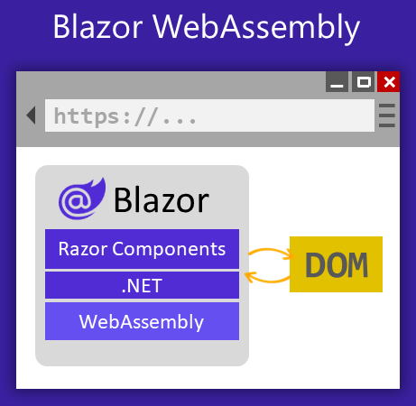

 

#### **Blazor .NET8 Hosting Models**
Blazor, a web framework developed by Microsoft, offers three hosting models: Blazor Server, Blazor WebAssembly, and Blazor Hybrid. Each hosting model has its own unique characteristics and use cases.

##### **Blazor Server**
With the Blazor Server hosting model, components are executed on the server from within an ASP.NET Core app. UI updates, event handling, and JavaScript calls are handled over a SignalR connection using the WebSockets protocol.

 

- In the Blazor Server hosting model, the application runs on the server and the UI is rendered on the client using SignalR.
- The client-side UI updates are sent to the server, which then updates the UI on the client.
- This model provides a rich user experience with real-time updates and minimal client-side resources.
- It is suitable for applications that require high interactivity and real-time communication.	
		
##### **Blazor WebAssembly**
The Blazor WebAssembly hosting model runs components client-side in the browser on a WebAssembly-based .NET runtime.

 

- In the Blazor WebAssembly hosting model, the application is downloaded and executed on the client-side using WebAssembly.
- The entire application, including the UI and business logic, is executed in the client's browser.
- This model provides a fully client-side experience with offline support and the ability to run in any modern browser.
- It is suitable for applications that require offline capabilities or need to run in a browser without a server connection.

##### **Blazor Hybrid**
Blazor can also be used to build native client apps using a hybrid approach. Hybrid apps are native apps that leverage web technologies for their functionality. In a Blazor Hybrid app, Razor components run directly in the native app (not on WebAssembly) along with any other .NET code and render web UI based on HTML and CSS to an embedded Web View control through a local interop channel.

 

- The Blazor Hybrid hosting model combines the features of both Blazor Server and Blazor WebAssembly.
- The application is initially rendered on the server and then downloaded to the client-side for further execution.
- This model provides the benefits of both server-side and client-side rendering, offering a balance between interactivity and performance.
- It is suitable for applications that require a mix of real-time updates and client-side execution.
	
##### **Choosing Blazor Hosting Model**
Each hosting model has its own advantages and considerations, and the choice depends on the specific requirements of the application. Blazor .NET 8 provides developers with the flexibility to choose the most suitable hosting model for their projects.
		
- With the Blazor Server hosting model, components are executed on the server from within an ASP.NET Core app.
- For standalone Blazor WebAssembly apps, all of the app's components are rendered on the client with the Blazor WebAssembly hosting model.
- Blazor Hybrid apps include .NET MAUI, WPF, and Windows Forms framework apps.

#### **Source**
https://learn.microsoft.com/en-us/aspnet/core/blazor/hosting-models?view=aspnetcore-8.0
