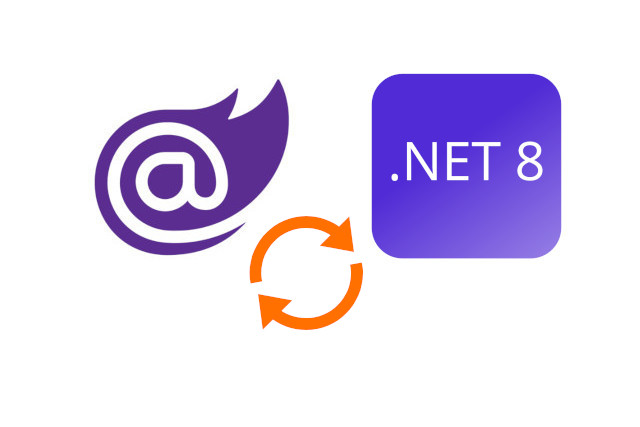

<p style="text-align: center;">
<br>
<p>

#### **Blazor .NET 8 Object Mapping with Mapster**
In a Blazor application, object mapping is a common task that involves converting data from one object type to another. This is often required when working with ```data transfer objects``` (DTOs) or when mapping data between different layers of an application. ```Mapster``` is a popular mapping library in the .NET ecosystem that provides a simple and efficient way to perform object mapping in Blazor applications.

DTOs: ```Data Transfer Objects``` (DTOs) are objects that are used to transfer data between different layers of an application. They typically contain only the necessary properties and are used to reduce the amount of data transferred over the network.

Object Mapping: ```Object mapping``` is the process of converting data from one object type to another. It involves copying properties from the source object to the destination object, taking into account any necessary transformations or mappings.

Mapster: ```Mapster``` is a lightweight and fast ```object-to-object mapper``` for .NET. It provides a fluent API for configuring object mappings and performs the mapping operation efficiently using compiled expressions.

##### **Program.cs**
```
internal class Program
{
    private static void Main(string[] args)
    {
		...
        builder.Services.AddMapster();
		...
    }
}
```

The ```AddMapster``` extension method is added to the ```IServiceCollection``` in the ```Program.cs``` file. This method is responsible for configuring Mapster and registering the necessary services.

```
public static class MapsterConfiguration
{
    public static void AddMapster(this IServiceCollection services)
    {
        var typeAdapterConfig = TypeAdapterConfig.GlobalSettings;
        Assembly applicationAssembly = typeof(BaseDTO<,>).Assembly;
        typeAdapterConfig.Scan(applicationAssembly);

        var mapperConfig = new Mapper(typeAdapterConfig);
        services.AddSingleton<IMapper>(mapperConfig);
    }
}
```
The ```MapsterConfiguration``` class contains the implementation of the ```AddMapster``` extension method. Inside this method, the ```TypeAdapterConfig``` is retrieved from the ```GlobalSettings``` and the application assembly is scanned for mappings.

Finally, an instance of the ```Mapper``` class is created with the ```TypeAdapterConfig``` and registered as a ```singleton``` service in the ```IServiceCollection```.


##### **BaseDTO.cs**
The ```BaseDTO``` class has two generic type parameters: ```TDTO``` and ```TEntity```. These parameters represent the DTO and entity types, respectively. The class constraints ensure that ```TDTO``` and ```TEntity``` are reference types and have a default constructor.
```
using Mapster;
namespace BlazorAppObjectMappingwithMapster.Data;
public abstract class BaseDTO<TDTO, TEntity> : IRegister
                                               where TDTO : class, new()
                                               where TEntity : class, new()
{

    public TEntity ToEntity()
    {
        return this.Adapt<TEntity>();
    }

    public TEntity ToEntity(TEntity entity)
    {
        return (this as TDTO).Adapt(entity);
    }

    public static TDTO FromEntity(TEntity entity)
    {
        return entity.Adapt<TDTO>();
    }

    private TypeAdapterConfig Config { get; set; }

    public virtual void AddCustomMappings() { }

    protected TypeAdapterSetter<TDTO, TEntity> SetCustomMappings()
        => Config.ForType<TDTO, TEntity>();

    protected TypeAdapterSetter<TEntity, TDTO> SetCustomMappingsInverse()
        => Config.ForType<TEntity, TDTO>();

    public void Register(TypeAdapterConfig config)
    {
        Config = config;
        AddCustomMappings();
    }
}
```
ToEntity(): This method converts the current ```DTO``` instance to an entity instance using the ```Adapt``` method provided by the ```Mapster``` library.

ToEntity(TEntity entity): This overloaded method converts the current ```DTO``` instance to an ```entity``` instance and assigns the values to an existing ```entity``` object.

FromEntity(TEntity entity): This ```static``` method converts an entity instance to a ```DTO``` instance using the ```Adapt``` method.

AddCustomMappings(): This method can be overridden in derived classes to add custom mappings using the ```SetCustomMappings``` method.

SetCustomMappings(): This method returns a ```TypeAdapterSetter``` object that allows for configuring custom mappings between the ```DTO``` and ```entity``` types.

SetCustomMappingsInverse(): This method returns a ```TypeAdapterSetter``` object that allows for configuring custom mappings in the inverse direction (from entity to DTO).


##### **BlogPostViewModel.cs**
The ```BlogPostViewModel``` class is defined in the ```BlazorAppObjectMappingwithMapster.ViewModels``` namespace. It inherits from the ```BaseDTO<BlogPostViewModel, BlogPost>``` class, which suggests that it is a data transfer object (DTO) used for mapping between the view and the model.

```
using BlazorAppObjectMappingwithMapster.Data;
using BlazorAppObjectMappingwithMapster.Models;
using System.ComponentModel.DataAnnotations;

namespace BlazorAppObjectMappingwithMapster.ViewModels;

public class BlogPostViewModel : BaseDTO<BlogPostViewModel, BlogPost>
{
    public int Id { get; set; }

    [Required(AllowEmptyStrings = false, ErrorMessage = "Title can not be empty")]
    public string Title { get; set; } = string.Empty;

    [Required(AllowEmptyStrings = false, ErrorMessage = "Content can not be empty")]
    public string Content { get; set; } = string.Empty;

    public string TitleShort { get; set; } = string.Empty;
    public string ContentShort { get; set; } = string.Empty;

    public override void AddCustomMappings()
    {
        // from BlogPostViewModel to BlogPost
        SetCustomMappings().Map(dst => dst.Title,
                                src => src.Title);

        // from BlogPost to BlogPostViewModel
        SetCustomMappingsInverse().Map(dst => dst.TitleShort,
                                       src => src.Title.Substring(0, Math.Min(src.Title.Count(), 10)))
                                  .Map(dst => dst.ContentShort,
                                       src => src.Content.Substring(0, Math.Min(src.Content.Count(), 50)));

        // base.AddCustomMappings();
    }

}
```
In the ```AddCustomMappings``` method, we define the custom mappings between the ```BlogPostViewModel``` and ```BlogPost``` objects.


##### **Index.razor**
```
blogPosts = Mapper.Map<IEnumerable<BlogPost>, IEnumerable<BlogPostViewModel>>(result);
```
In this code, ```blogPosts``` is a variable of type ```IEnumerable<BlogPostViewModel>```, and result is a variable of type ```IEnumerable<BlogPost>```. We use the ```Mapper.Map``` method provided by ```Mapster``` to perform the object mapping. The method takes two parameters: the ```source object``` (result) and the ```destination type``` (IEnumerable<BlogPostViewModel>).


##### **Create.razor**
```
// option 1
// var model = blogPost.ToEntity();
// option 2
var model = Mapper.Map<BlogPostViewModel, BlogPost>(blogPost);
bool result = await BlogPostService.AddBlogPostAsync(model);
if (result)
	NavigationManager.NavigateTo("/BlogPost");
```

The first option ```(blogPost.ToEntity())``` is commented out, indicating an alternative approach to object mapping. This option suggests that there might be a custom method ```ToEntity()``` defined in the ```blogPost``` object that performs the mapping to the desired entity type.

The second option uses the ```Mapper.Map``` method provided by the ```Mapster``` library. It takes two parameters: the ```source object (blogPost)``` and the ```destination type (BlogPost)```. It performs the mapping operation and returns an instance of the destination type (model).


##### **Details.razor**
```
// option 1
// blogPost = BlogPostViewModel.FromEntity(result);
// option 2
blogPost = Mapper.Map<BlogPost, BlogPostViewModel>(result);
```

The first option involves using a ```static``` method ```FromEntity``` defined in the ```BlogPostViewModel``` class. This method takes a ```BlogPost``` object as a parameter and returns a ```BlogPostViewModel``` object.

The second option utilizes the ```Mapper``` class provided by ```Mapster```. This class provides a convenient way to perform object mapping using a fluent syntax.


##### **Delete.razor**
```
// option 1
// blogPost = BlogPostViewModel.FromEntity(result);
// option 2
blogPost = Mapper.Map<BlogPost, BlogPostViewModel>(result);
```

In first option, we are calling a static method ```FromEntity``` defined in the ```BlogPostViewModel``` class. This method is responsible for creating a new instance of ```BlogPostViewModel``` and mapping the properties from the result object to the corresponding properties in the ```BlogPostViewModel``` object.

In second option, we are using ```Mapster's Mapper``` class to perform the object mapping. The Map method is a generic method that takes the ```source object type (BlogPost)``` and the ```destination object type (BlogPostViewModel)``` as type arguments.


##### **Edit.razor**
```
protected override async Task OnInitializedAsync()
{
	if (blogPost is null)
	{
		var result = await BlogPostService.GetbyId(id);
		if (result != null)
		{
			// option 1
			// blogPost = BlogPostViewModel.FromEntity(result);
			// option 2
			blogPost = Mapper.Map<BlogPost, BlogPostViewModel>(result);
		}
	}
}

private async void HandleValidSubmit()
{
	if (blogPost is null) return;

	// option 1
	// var model = blogPost.ToEntity();
	// option 2
	var model = Mapper.Map<BlogPostViewModel, BlogPost>(blogPost);
	bool result = await BlogPostService.UpdateBlogPostAsync(id, model);
	if (result)
		NavigationManager.NavigateTo("/BlogPost");
}
```
The ```OnInitializedAsync``` method and check if the ```blogPost``` object is null. If it is ```null```, we retrieve the blog post from the ```BlogPostService``` using the ```GetById``` method. If the result is ```not null```, we perform the object mapping using Mapster's ```Mapper.Map``` method. We pass the ```source object``` result of type ```BlogPost``` and the ```destination type``` ```BlogPostViewModel```. The mapped object is then assigned to the ```blogPost``` variable.

The ```HandleValidSubmit``` method that is called when the form is submitted and the data is valid. We first check if the ```blogPost``` object is ```null```. If it is ```null```, we return. Otherwise, we perform the object mapping using Mapster's ```Mapper.Map``` method. We pass the source object ```blogPost``` of type ```BlogPostViewModel``` and the destination type ```BlogPost```. The mapped object is then assigned to the model variable. We then call the ```UpdateBlogPostAsync``` method of the ```BlogPostService``` to update the blog post with the new model. If the update is successful, we navigate to the ```"/BlogPost"``` page.


#### **Source**
Full source code is available at this repository in GitHub:
https://github.com/akifmt/DotNetCoding/tree/main/src/BlazorAppObjectMappingwithMapster
