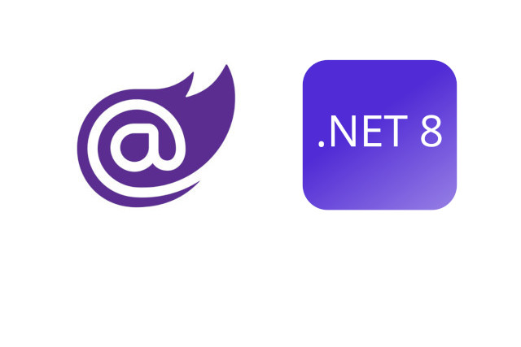

<p class="d-flex justify-content-center">
<br>
<p>

#### **Blazor .NET 8 Microservices Blazor Client and Securing API with Duende Identity Server**

A Blazor .NET 8 microservices client application and integrates it with Duende Identity Server for securing the API endpoints. The code demonstrates the configuration of services, authentication, authorization, and HTTP request pipeline setup.

Blazor: ```Blazor``` is a framework for building interactive web UIs using C# instead of JavaScript. It allows developers to create web applications using .NET and C#.

.NET 8: ```.NET 8``` is a version of the .NET framework that provides a platform for building various types of applications, including web, desktop, and mobile applications.

Microservices: ```Microservices``` architecture involves breaking down an application into ```smaller```, ```independent services``` that can be ```developed```, ```deployed```, and ```scaled``` independently.

Securing API: ```Securing APIs``` involves implementing ```authentication``` and ```authorization``` mechanisms to control access to API endpoints.

Identity Server: ```Identity Server``` is an ```open-source``` identity and access control solution for .NET applications. ```Duende Identity Server``` is a fork of Identity Server with additional features and improvements.

API Controller: An ```API controller``` is a class in a web application that handles ```HTTP requests``` and returns HTTP responses. It contains methods (also known as actions) that correspond to different HTTP verbs (```GET, POST, PUT, DELETE```) and perform specific operations.

-------
##### **Projects**
| Project Name  			 | Port  | Template  |
|---|---|---|
| Microser.IdS				 | :5001 | Duende IdentityServer with Entity Framework Stores (Duende Software) |
| Microser.API.Weather		 | :6001 | ASP.NET Core Web API |
| Microser.BlazorAppClient	 | :7001 | Blazor Web App |

-------

##### **Test Users**
| Role			   | Username	| Password	|
| :---: | :---: | :---: |
| <kbd>admin</kbd> | alice		| alice 	|
| <kbd>user</kbd>  | bob		| bob		|


##### **Microser.API.Weather - Web API Project**

A Blazor .NET 8 ```Microservices``` project with ```authentication and authorization``` using JWT tokens. By configuring services for ```controllers```, ```Swagger documentation```, ```authentication```, and ```authorization policies```, the application ensures secure access to APIs while enabling efficient development and documentation processes.

<kbd>Program.cs</kbd>
```
using Microsoft.IdentityModel.Tokens;

internal class Program
{
    private static void Main(string[] args)
    {
        var builder = WebApplication.CreateBuilder(args);

        // Add services to the container.

        builder.Services.AddControllers();
        // Learn more about configuring Swagger/OpenAPI at https://aka.ms/aspnetcore/swashbuckle
        builder.Services.AddEndpointsApiExplorer();
        builder.Services.AddSwaggerGen();

        builder.Services.AddAuthentication("Bearer")
            .AddJwtBearer("Bearer", options =>
            {
                options.Authority = "https://localhost:5001";
                options.TokenValidationParameters = new TokenValidationParameters
                {
                    ValidateAudience = false
                };
            });

        builder.Services.AddAuthorization(options =>
        {
            options.AddPolicy("ClientIdPolicy", policy => policy.RequireClaim("client_id", "microser_api_weather", "dotnet_blazor_serverapp"));
        });

        var app = builder.Build();

        // Configure the HTTP request pipeline.
        if (app.Environment.IsDevelopment())
        {
            app.UseSwagger();
            app.UseSwaggerUI();
        }

        app.UseHttpsRedirection();

        app.UseAuthentication();

        app.UseAuthorization();

        app.MapControllers();

        app.Run();
    }
}
```

Initializes a ```WebApplication builder```, adds necessary services like ```controllers```, ```Swagger```, ```authentication```, and ```authorization```. It configures ```JWT bearer``` authentication with ```Duende Identity Server```, sets up ```authorization policies```, and defines the ```request``` pipeline. In development mode, it enables Swagger UI for API testing.


<kbd>WeatherForecastController.cs</kbd>
```
using Microser.Core.Models;
using Microsoft.AspNetCore.Authorization;
using Microsoft.AspNetCore.Mvc;

namespace Microser.API.Weather.Controllers;

[Authorize(Policy = "ClientIdPolicy")]
[ApiController]
[Route("[controller]")]
public class WeatherForecastController : ControllerBase
{
    private readonly ILogger<WeatherForecastController> _logger;

    public WeatherForecastController(ILogger<WeatherForecastController> logger)
    {
        _logger = logger;
    }

    [HttpGet(Name = "GetWeatherForecasts")]
    public ActionResult<IEnumerable<WeatherForecast>> Get()
    {
        return Ok(Data.WeatherForecasts);
    }

    [HttpGet("{id}", Name = "GetWeatherForecast")]
    public ActionResult<WeatherForecast> Get(int id)
    {
        var item = Data.WeatherForecasts.FirstOrDefault(x => x.Id == id);
        if (item == null)
            return NotFound();
        return Ok(item);
    }

    [HttpPost(Name = "PostWeatherForecast")]
    public ActionResult<WeatherForecast> Post(WeatherForecast weatherForecast)
    {
        var last = Data.WeatherForecasts.LastOrDefault();
        if (last == null)
            weatherForecast.Id = 1;
        else
            weatherForecast.Id = last.Id + 1;

        Data.WeatherForecasts.Add(weatherForecast);

        return new CreatedAtRouteResult("GetWeatherForecast", new { id = weatherForecast.Id }, weatherForecast);
    }

    [HttpPut("{id}", Name = "PutWeatherForecast")]
    public ActionResult<WeatherForecast> Put(int id, WeatherForecast weatherForecast)
    {
        var item = Data.WeatherForecasts.FirstOrDefault(x => x.Id == id);
        if (item == null)
            return NotFound();

        item.Date = weatherForecast.Date;
        item.TemperatureC = weatherForecast.TemperatureC;
        item.Summary = weatherForecast.Summary;

        return NoContent();
    }

    [HttpDelete("{id}", Name = "DeleteWeatherForecast")]
    public ActionResult<WeatherForecast> Delete(int id)
    {
        var item = Data.WeatherForecasts.FirstOrDefault(x => x.Id == id);
        if (item == null)
            return NotFound();

        Data.WeatherForecasts.Remove(item);

        return Ok();
    }
}
```
The ```WeatherForecastController``` class is defined within the Microser.API.Weather.Controllers namespace. It is decorated with various attributes that provide additional information and behavior to the controller.

```[Authorize(Policy = "ClientIdPolicy")]``` This attribute specifies that the controller requires authorization based on a policy named ```"ClientIdPolicy"```. It ensures that only authenticated clients with the appropriate policy can access the controller's actions.

```[ApiController]``` This attribute indicates that the class is an API controller. It enables various features and conventions for API controllers, such as automatic model validation and attribute routing.

```[Route("[controller]")]``` This attribute specifies the ```base route``` for the controller. In this case, the route is determined by the controller's name, which is ```"WeatherForecast"```. So, the base route for this controller is "/WeatherForecast".

The controller inherits from the ```ControllerBase``` class, which provides a base implementation for API controllers in ASP.NET Core.


##### **Microser.IdS - IdentityServer Project**

Create from template:
https://github.com/DuendeSoftware/IdentityServer.Templates

Install with:
```
dotnet new install Duende.IdentityServer.Templates
```

Identity Server migrations and seed:
```
Microser\Microser.IdS> .\buildschema.bat
Microser\Microser.IdS> dotnet run /seed
```

The ```HostingExtensions.cs``` file contains two extension methods: ```ConfigureServices``` and ```ConfigurePipeline```. Let's explore each method in detail.

<kbd>HostingExtensions.cs</kbd>
```
using Duende.IdentityServer;
using Microser.IdS.Pages.Admin.ApiScopes;
using Microser.IdS.Pages.Admin.Clients;
using Microser.IdS.Pages.Admin.IdentityScopes;
using Microsoft.AspNetCore.Mvc.RazorPages;
using Microsoft.EntityFrameworkCore;
using Serilog;

namespace Microser.IdS
{
    internal static class HostingExtensions
    {
        public static WebApplication ConfigureServices(this WebApplicationBuilder builder)
        {
            builder.Services.AddRazorPages();

            var connectionString = builder.Configuration.GetConnectionString("DefaultConnection");

            var isBuilder = builder.Services
                .AddIdentityServer(options =>
                {
                    options.Events.RaiseErrorEvents = true;
                    options.Events.RaiseInformationEvents = true;
                    options.Events.RaiseFailureEvents = true;
                    options.Events.RaiseSuccessEvents = true;

                    // see https://docs.duendesoftware.com/identityserver/v5/fundamentals/resources/
                    options.EmitStaticAudienceClaim = true;
                })
                .AddTestUsers(TestUsers.Users)
                // this adds the config data from DB (clients, resources, CORS)
                .AddConfigurationStore(options =>
                {
                    options.ConfigureDbContext = b =>
                        b.UseSqlite(connectionString, dbOpts => dbOpts.MigrationsAssembly(typeof(Program).Assembly.FullName));
                })
                // this is something you will want in production to reduce load on and requests to the DB
                //.AddConfigurationStoreCache()
                //
                // this adds the operational data from DB (codes, tokens, consents)
                .AddOperationalStore(options =>
                {
                    options.ConfigureDbContext = b =>
                        b.UseSqlite(connectionString, dbOpts => dbOpts.MigrationsAssembly(typeof(Program).Assembly.FullName));
                });

            builder.Services.AddAuthentication()
                .AddGoogle(options =>
                {
                    options.SignInScheme = IdentityServerConstants.ExternalCookieAuthenticationScheme;

                    // register your IdentityServer with Google at https://console.developers.google.com
                    // enable the Google+ API
                    // set the redirect URI to https://localhost:5001/signin-google
                    options.ClientId = "copy client ID from Google here";
                    options.ClientSecret = "copy client secret from Google here";
                });

            // this adds the necessary config for the simple admin/config pages
            {
                builder.Services.AddAuthorization(options =>
                    options.AddPolicy("admin",
                        policy => policy.RequireClaim("sub", "1"))
                );

                builder.Services.Configure<RazorPagesOptions>(options =>
                    options.Conventions.AuthorizeFolder("/Admin", "admin"));

                builder.Services.AddTransient<Microser.IdS.Pages.Portal.ClientRepository>();
                builder.Services.AddTransient<ClientRepository>();
                builder.Services.AddTransient<IdentityScopeRepository>();
                builder.Services.AddTransient<ApiScopeRepository>();
            }

            // if you want to use server-side sessions: https://blog.duendesoftware.com/posts/20220406_session_management/
            // then enable it
            //isBuilder.AddServerSideSessions();
            //
            // and put some authorization on the admin/management pages using the same policy created above
            //builder.Services.Configure<RazorPagesOptions>(options =>
            //    options.Conventions.AuthorizeFolder("/ServerSideSessions", "admin"));

            return builder.Build();
        }

        public static WebApplication ConfigurePipeline(this WebApplication app)
        {
            app.UseSerilogRequestLogging();

            if (app.Environment.IsDevelopment())
            {
                app.UseDeveloperExceptionPage();
            }

            app.UseStaticFiles();
            app.UseRouting();
            app.UseIdentityServer();
            app.UseAuthorization();

            app.MapRazorPages()
                .RequireAuthorization();

            return app;
        }
    }
}
```
The ```ConfigureServices``` method is responsible for configuring the ```services``` required by the application
The ```ConfigurePipeline``` method is responsible for configuring the ```middleware pipeline``` of the application.

<kbd>Config.cs</kbd>
```
using Duende.IdentityServer;
using Duende.IdentityServer.Models;
using IdentityModel;

namespace Microser.IdS
{
    public static class Config
    {
        public static IEnumerable<IdentityResource> IdentityResources =>
            new IdentityResource[]
            {
                new IdentityResources.OpenId(),
                new IdentityResources.Profile(),
                new IdentityResources.Address(),
                new IdentityResources.Email(),
                new IdentityResource(
                        "roles",
                        "Your role(s)",
                        new List<string>(){ JwtClaimTypes.Role })
            };

        public static IEnumerable<ApiScope> ApiScopes =>
            new ApiScope[]
            {
                new ApiScope("scope1"),
                new ApiScope("scope2"),

                new ApiScope("microser_api_weather"),
            };

        public static IEnumerable<Client> Clients =>
            new Client[]
            {
                new Client
                {
                    ClientId = "dotnet_blazor_serverapp",
                    ClientName = "Blazor Server App",
                    ClientSecrets = {
                        new Secret("E8C65E41BB0E4E519D409023CF5112F4".Sha256())
                    },
                    AllowedGrantTypes = GrantTypes.Code,
                    RequirePkce = true,
                    RequireClientSecret = true,
                    AllowedCorsOrigins = { "https://localhost:7001" },
                    AllowedScopes = {
                        IdentityServerConstants.StandardScopes.OpenId,
                        IdentityServerConstants.StandardScopes.Profile,
                        IdentityServerConstants.StandardScopes.Address,
                        IdentityServerConstants.StandardScopes.Email,
                        "roles",
                        "scope1",
                        "microser_api_weather"
                    },
                    RedirectUris = { "https://localhost:7001/signin-oidc" },
                    PostLogoutRedirectUris = { "https://localhost:7001/signout-callback-oidc" },
                    Enabled = true
                },

                // m2m client credentials flow client
                new Client
                {
                    ClientId = "m2m.client",
                    ClientName = "Client Credentials Client",

                    AllowedGrantTypes = GrantTypes.ClientCredentials,
                    ClientSecrets = { new Secret("511536EF-F270-4058-80CA-1C89C192F69A".Sha256()) },

                    AllowedScopes = { "scope1" }
                },

                // interactive client using code flow + pkce
                new Client
                {
                    ClientId = "interactive",
                    ClientSecrets = { new Secret("49C1A7E1-0C79-4A89-A3D6-A37998FB86B0".Sha256()) },

                    AllowedGrantTypes = GrantTypes.Code,

                    RedirectUris = { "https://localhost:44300/signin-oidc" },
                    FrontChannelLogoutUri = "https://localhost:44300/signout-oidc",
                    PostLogoutRedirectUris = { "https://localhost:44300/signout-callback-oidc" },

                    AllowOfflineAccess = true,
                    AllowedScopes = { "openid", "profile", "scope2" }
                },
            };
    }
}
```
The ```Config.cs``` file contains a static class called ```Config``` that defines three static properties: ```IdentityResources```, ```ApiScopes```, and ```Clients```. Each property returns an array of objects representing the available identity resources, API scopes, and clients, respectively.

The ```IdentityResources``` property defines the available identity resources. The ```ApiScopes``` property defines the available API scopes.

The ```Clients``` property defines the available client applications.

<kbd>TestUsers.cs</kbd>
```
// Copyright (c) Duende Software. All rights reserved.
// See LICENSE in the project root for license information.

using Duende.IdentityServer;
using Duende.IdentityServer.Test;
using IdentityModel;
using System.Security.Claims;
using System.Text.Json;

namespace Microser.IdS
{
    public static class TestUsers
    {
        public static class Roles
        {
            public static string IdentityAdmin = "IdentityAdmin";
            public static string Admin = "Admin";
            public static string User = "User";
        }

        public static List<TestUser> Users
        {
            get
            {
                var address = new
                {
                    street_address = "One Hacker Way",
                    locality = "Heidelberg",
                    postal_code = "69118",
                    country = "Germany"
                };

                return new List<TestUser>
                {
                    new TestUser
                    {
                        SubjectId = "1",
                        Username = "alice",
                        Password = "alice",
                        Claims =
                        {
                            new Claim(JwtClaimTypes.Name, "Alice Smith"),
                            new Claim(JwtClaimTypes.GivenName, "Alice"),
                            new Claim(JwtClaimTypes.FamilyName, "Smith"),
                            new Claim(JwtClaimTypes.Email, "AliceSmith@email.com"),
                            new Claim(JwtClaimTypes.EmailVerified, "true", ClaimValueTypes.Boolean),
                            new Claim(JwtClaimTypes.WebSite, "http://alice.com"),
                            new Claim(JwtClaimTypes.Address, JsonSerializer.Serialize(address), IdentityServerConstants.ClaimValueTypes.Json),

                            new Claim(JwtClaimTypes.Role, Roles.IdentityAdmin),
                            new Claim(JwtClaimTypes.Role, Roles.Admin),
                            new Claim(JwtClaimTypes.Role, Roles.User)
                        }
                    },
                    new TestUser
                    {
                        SubjectId = "2",
                        Username = "bob",
                        Password = "bob",
                        Claims =
                        {
                            new Claim(JwtClaimTypes.Name, "Bob Smith"),
                            new Claim(JwtClaimTypes.GivenName, "Bob"),
                            new Claim(JwtClaimTypes.FamilyName, "Smith"),
                            new Claim(JwtClaimTypes.Email, "BobSmith@email.com"),
                            new Claim(JwtClaimTypes.EmailVerified, "true", ClaimValueTypes.Boolean),
                            new Claim(JwtClaimTypes.WebSite, "http://bob.com"),
                            new Claim(JwtClaimTypes.Address, JsonSerializer.Serialize(address), IdentityServerConstants.ClaimValueTypes.Json),

                            new Claim(JwtClaimTypes.Role, Roles.User)
                        }
                    }
                };
            }
        }
    }
}
```
The ```TestUsers.cs``` file contains a static class named ```TestUsers``` that defines test users and their associated ```claims``` and ```roles```. The class also includes a nested class named ```Roles``` that defines some role constants.

##### **Microser.BlazorAppClient - Blazor Web App Project**

<kbd>Program.cs</kbd>
```
using Microser.BlazorAppClient;
using Microser.BlazorAppClient.Components;
using Microser.BlazorAppClient.HttpHandlers;
using Microser.BlazorAppClient.Services;
using Microsoft.AspNetCore.Authentication;
using Microsoft.AspNetCore.Authentication.Cookies;
using Microsoft.AspNetCore.Authentication.OpenIdConnect;
using Microsoft.IdentityModel.Tokens;
using Microsoft.Net.Http.Headers;

internal class Program
{
    private static void Main(string[] args)
    {
        var builder = WebApplication.CreateBuilder(args);

        // Add services to the container.
        builder.Services.AddRazorComponents()
            .AddInteractiveServerComponents();

        builder.Services.AddTransient<AuthenticationDelegatingHandler>();
        builder.Services.AddScoped<IWeatherForecastApiService, WeatherForecastApiService>();

        builder.Services.AddOIDCAuthentication();

        builder.Services.AddHttpClients();

        builder.Services.AddPolicies();

        builder.Services.AddHttpContextAccessor();

        var app = builder.Build();

        // Configure the HTTP request pipeline.
        if (!app.Environment.IsDevelopment())
        {
            app.UseExceptionHandler("/Error", createScopeForErrors: true);
            // The default HSTS value is 30 days. You may want to change this for production scenarios, see https://aka.ms/aspnetcore-hsts.
            app.UseHsts();
        }

        app.UseHttpsRedirection();

        app.UseAuthentication();
        app.UseAuthorization();

        app.UseStaticFiles();
        app.UseAntiforgery();

        app.MapRazorComponents<App>()
            .AddInteractiveServerRenderMode();

        app.MapPost("/account/logout", async (HttpContext context) =>
        {
            await context.SignOutAsync(CookieAuthenticationDefaults.AuthenticationScheme);
            await context.SignOutAsync(OpenIdConnectDefaults.AuthenticationScheme);
        });

        app.MapGet("/account/login", async (string redirectUri, HttpContext context) =>
        {
            await context.ChallengeAsync(OpenIdConnectDefaults.AuthenticationScheme, new AuthenticationProperties { RedirectUri = redirectUri });
        });

        app.Run();
    }
}

public static class StartupExtensions
{
    public static void AddOIDCAuthentication(this IServiceCollection services)
    {
        services
            .AddAntiforgery(options => options.Cookie.Name = "ClientBlazorAppAntiForgeryCookie")
            .AddAuthentication(options =>
            {
                options.DefaultScheme = CookieAuthenticationDefaults.AuthenticationScheme;
                options.DefaultChallengeScheme = OpenIdConnectDefaults.AuthenticationScheme;
            })
        .AddCookie(options =>
        {
            options.Cookie.Name = "ClientBlazorAppAuthCookie";
            options.AccessDeniedPath = "/AccessDenied";
        })
        .AddOpenIdConnect(OpenIdConnectDefaults.AuthenticationScheme, options =>
        {
            options.Authority = "https://localhost:5001/";
            options.ClientId = "dotnet_blazor_serverapp";
            options.ClientSecret = "E8C65E41BB0E4E519D409023CF5112F4";
            options.ResponseType = "code";
            options.SaveTokens = true;
            options.GetClaimsFromUserInfoEndpoint = true;
            options.UseTokenLifetime = false;

            //options.SignedOutRedirectUri = "/";

            options.Scope.Add("openid");
            options.Scope.Add("profile");
            options.Scope.Add("address");
            options.Scope.Add("email");
            options.Scope.Add("roles");

            options.Scope.Add("microser_api_weather");

            options.ClaimActions.MapJsonKey("role", "role");
            //options.ClaimActions.MapUniqueJsonKey("role", "role");
            //options.ClaimActions.MapAll();

            options.TokenValidationParameters = new
                TokenValidationParameters
            {
                NameClaimType = "name",
                RoleClaimType = "role"
            };

            options.Events = new OpenIdConnectEvents
            {
                OnAccessDenied = context =>
                {
                    context.HandleResponse();
                    context.Response.Redirect("/");
                    return Task.CompletedTask;
                }
            };
        });
    }

    public static void AddHttpClients(this IServiceCollection services)
    {
        services.AddHttpClient("WeatherForecastAPIClient", client =>
        {
            client.BaseAddress = new Uri("https://localhost:6001/");
            client.DefaultRequestHeaders.Clear();
            client.DefaultRequestHeaders.Add(HeaderNames.Accept, "application/json");
        })
            .AddHttpMessageHandler<AuthenticationDelegatingHandler>();

        // added for get user info
        services.AddHttpClient("IDPClient", client =>
        {
            client.BaseAddress = new Uri("https://localhost:5001/");
            client.DefaultRequestHeaders.Clear();
            client.DefaultRequestHeaders.Add(HeaderNames.Accept, "application/json");
        });
    }

    public static void AddPolicies(this IServiceCollection services)
    {
        services.AddAuthorization(opts =>
        {
            opts.AddPolicy(nameof(ProjectPolicies.UserRolePolicy), policy =>
            {
                foreach (var role in ProjectPolicies.UserRolePolicy.RequiredRoles)
                    policy.RequireRole(role.RoleName);
            });
            opts.AddPolicy(nameof(ProjectPolicies.IdentityAdminRolePolicy), policy =>
            {
                foreach (var role in ProjectPolicies.IdentityAdminRolePolicy.RequiredRoles)
                    policy.RequireRole(role.RoleName);
            });
            opts.AddPolicy(nameof(ProjectPolicies.AdminRolePolicy), policy =>
            {
                foreach (var role in ProjectPolicies.AdminRolePolicy.RequiredRoles)
                    policy.RequireRole(role.RoleName);
            });
        });

        services.AddAuthorization(opts =>
        {
            opts.AddPolicy(nameof(ProjectPolicies.WeatherForecastCreatePolicy), policy =>
            {
                foreach (var claim in ProjectPolicies.WeatherForecastCreatePolicy.RequiredClaims)
                    policy.RequireClaim(claim.Type, new[] { claim.Value });
            });
            opts.AddPolicy(nameof(ProjectPolicies.WeatherForecastReadPolicy), policy =>
            {
                foreach (var claim in ProjectPolicies.WeatherForecastReadPolicy.RequiredClaims)
                    policy.RequireClaim(claim.Type, new[] { claim.Value });
            });
            opts.AddPolicy(nameof(ProjectPolicies.WeatherForecastUpdatePolicy), policy =>
            {
                foreach (var claim in ProjectPolicies.WeatherForecastUpdatePolicy.RequiredClaims)
                    policy.RequireClaim(claim.Type, new[] { claim.Value });
            });
            opts.AddPolicy(nameof(ProjectPolicies.WeatherForecastDeletePolicy), policy =>
            {
                foreach (var claim in ProjectPolicies.WeatherForecastDeletePolicy.RequiredClaims)
                    policy.RequireClaim(claim.Type, new[] { claim.Value });
            });
        });
    }
}
```

The ```Program.cs``` contains the entry point of the application and the configuration of the HTTP request pipeline. It sets up the authentication and authorization middleware, handles static files, and defines routes for login and logout.

The ```StartupExtensions``` contains extension methods for configuring authentication, HTTP clients, and authorization policies. It sets up the OpenID Connect authentication scheme, configures the Identity Server endpoints, and defines the required scopes and claims.


<kbd>WeatherForecastApiService.cs</kbd>
```
using Microser.BlazorAppClient.Extensions;
using Microser.Core.Models;

namespace Microser.BlazorAppClient.Services;

public class WeatherForecastApiService : IWeatherForecastApiService
{
    private readonly IHttpClientFactory _httpClientFactory;
    private readonly IHttpContextAccessor _httpContextAccessor;

    public WeatherForecastApiService(IHttpClientFactory httpClientFactory, IHttpContextAccessor httpContextAccessor)
    {
        _httpClientFactory = httpClientFactory ?? throw new ArgumentNullException(nameof(httpClientFactory));
        _httpContextAccessor = httpContextAccessor ?? throw new ArgumentNullException(nameof(httpContextAccessor));
    }

    public async Task<WeatherForecast[]?> GetAllAsync()
    {
        var httpClient = _httpClientFactory.CreateClient("WeatherForecastAPIClient");
        var request = new HttpRequestMessage(
            HttpMethod.Get,
            "/WeatherForecast");
        var response = await httpClient.SendAsync(request, HttpCompletionOption.ResponseHeadersRead)
            .ConfigureAwait(false);
        response.EnsureSuccessStatusCode();

        //var content = await response.Content.ReadAsStringAsync();
        //var weatherForecastList = JsonSerializer.Deserialize<List<WeatherForecast>>(content);

        var weatherForecastList = await response.ReadContentAs<WeatherForecast[]>();
        return weatherForecastList;

    }

    public async Task<WeatherForecast?> GetByIdAsync(int id)
    {
        var httpClient = _httpClientFactory.CreateClient("WeatherForecastAPIClient");
        var request = new HttpRequestMessage(
            HttpMethod.Get,
            "/WeatherForecast/" + id);
        var response = await httpClient.SendAsync(request, HttpCompletionOption.ResponseHeadersRead)
            .ConfigureAwait(false);
        response.EnsureSuccessStatusCode();
        var item = await response.ReadContentAs<WeatherForecast>();
        return item;
    }

    public async Task<WeatherForecast?> AddAsync(WeatherForecast weatherForecast)
    {
        var httpClient = _httpClientFactory.CreateClient("WeatherForecastAPIClient");
        var request = new HttpRequestMessage(
            HttpMethod.Post, "/WeatherForecast")
        {
            Content = JsonContent.Create(weatherForecast)
        };

        var response = await httpClient.SendAsync(request, HttpCompletionOption.ResponseHeadersRead)
            .ConfigureAwait(false);
        response.EnsureSuccessStatusCode();

        weatherForecast = await response.ReadContentAs<WeatherForecast>();
        return weatherForecast;
    }

    public async Task<bool> DeleteByIdAsync(int id)
    {
        var httpClient = _httpClientFactory.CreateClient("WeatherForecastAPIClient");
        var request = new HttpRequestMessage(
            HttpMethod.Delete, "/WeatherForecast/" + id.ToString());

        try
        {
            var response = await httpClient.SendAsync(request, HttpCompletionOption.ResponseHeadersRead)
            .ConfigureAwait(false);
            response.EnsureSuccessStatusCode();
        }
        catch (Exception)
        {
            return false;
        }

        return true;
    }

    public async Task<bool> UpdateAsync(int id, WeatherForecast weatherForecast)
    {
        var httpClient = _httpClientFactory.CreateClient("WeatherForecastAPIClient");
        var request = new HttpRequestMessage(
            HttpMethod.Put, "/WeatherForecast/" + weatherForecast.Id.ToString())
        {
            Content = JsonContent.Create(weatherForecast)
        };

        try
        {
            var response = await httpClient.SendAsync(request, HttpCompletionOption.ResponseHeadersRead)
            .ConfigureAwait(false);
            response.EnsureSuccessStatusCode();
        }
        catch (Exception)
        {
            return false;
        }
        return true;
    }
}
```
The ```WeatherForecastApiService``` class in the Blazor .NET 8 Microservices Blazor Client project provides methods to interact with a weather forecast API. It allows for retrieving, adding, updating, and deleting weather forecasts using HTTP requests. By utilizing the IHttpClientFactory and IHttpContextAccessor, it ensures efficient and secure communication with the API.

#### **Source**
Full source code is available at this repository in GitHub:  
https://github.com/akifmt/DotNetCoding/tree/main/src/Microser

