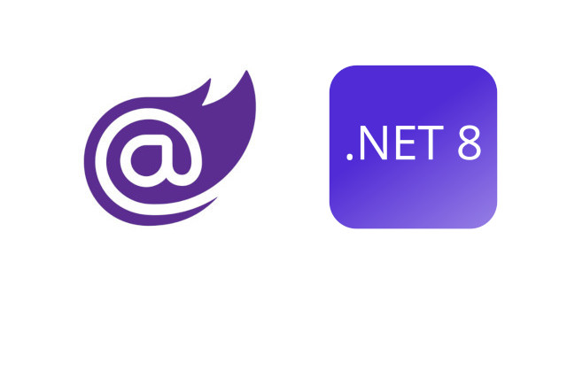

<p class="d-flex justify-content-center">
<br>
<p>

#### **Blazor .NET 8 Microservices 2 Blazor Client Ocelot Gateway and Securing API with Duende Identity Server**

<strong>Part 1:</strong>
Demonstrates ASP.NET Core Web API, Blazor Web App and Securing API with Duende Identity Server <br>
[Click here Part 1](/dotnet/2024-03-15-blazor-.net8-microservices-blazor-client-and-securing-api-with-duende-identity-server-copy/)

<strong>Part 2:</strong>
Demonstrates Ocelot Gateway in a Blazor .NET 8 application. <br>
[Click here Part 2](/dotnet/2024-03-20-blazor-.net8-microservices-2-blazor-client-ocelot-gateway-and-securing-api-with-duende-identity-server/)

-------
##### **Projects**
| Project Name  			 | Port  | Template  |
|---|---|---|
| Microser.IdS				 | :5001 | Duende IdentityServer with Entity Framework Stores (Duende Software) |
| Microser.API.Weather		 | :6001 | ASP.NET Core Web API |
| Microser.ApiGateway		 | :6501 | ASP.NET Core Empty |
| Microser.BlazorAppClient	 | :7001 | Blazor Web App |

-------


##### **Microser.ApiGateway - Ocelot Gateway Project**

```Ocelot``` is a lightweight ```API Gateway``` that sits in front of your microservices architecture, providing features like routing, load balancing, authentication, and more.
By setting up the ```Ocelot middleware```, adding authentication services, and loading the Ocelot configuration, developers can create a robust API Gateway for their applications. Understanding and implementing ```Ocelot``` in your projects can ```enhance security```, ```scalability```, and ```routing capabilities```.


<kbd>Program.cs</kbd>
```
using Microsoft.IdentityModel.Tokens;
using Ocelot.DependencyInjection;
using Ocelot.Middleware;

internal class Program
{
    private static void Main(string[] args)
    {
        var builder = WebApplication.CreateBuilder(args);

        builder.Configuration.AddJsonFile("ocelot.json", optional: false, reloadOnChange: true);

        var authenticationProviderKey = "IdentityApiKey";

        builder.Services.AddAuthentication()
        .AddJwtBearer(authenticationProviderKey, x =>
        {
            x.Authority = "https://localhost:5001";
            x.TokenValidationParameters = new TokenValidationParameters
            {
                ValidateAudience = false
            };
        });

        builder.Services.AddOcelot(builder.Configuration);

        var app = builder.Build();

        app.UseOcelot().Wait();

        app.Run();
    }
}
```
It sets up the ```Ocelot middleware```, adds ```authentication services``` for ```JWT Bearer``` authentication, and loads the ```Ocelot configuration``` from the ```ocelot.json``` file.

<kbd>ocelot.json</kbd>
```
{
  "Routes": [
    {
      "DownstreamPathTemplate": "/api/weatherforecast",
      "DownstreamScheme": "https",
      "DownstreamHostAndPorts": [
        {
          "Host": "localhost",
          "Port": 6001
        }
      ],
      "UpstreamPathTemplate": "/weatherforecast",
      "UpstreamHttpMethod": [ "GET", "POST" ],
      "AuthenticationOptions": {
        "AuthenticationProviderKey": "IdentityApiKey",
        "AllowedScopes": []
      }
    },
    {
      "DownstreamPathTemplate": "/api/weatherforecast/{id}",
      "DownstreamScheme": "https",
      "DownstreamHostAndPorts": [
        {
          "Host": "localhost",
          "Port": 6001
        }
      ],
      "UpstreamPathTemplate": "/weatherforecast/{id}",
      "UpstreamHttpMethod": [ "GET", "PUT", "DELETE" ],
      "AuthenticationOptions": {
        "AuthenticationProviderKey": "IdentityApiKey",
        "AllowedScopes": []
      }
    },


  ]
}
```
The provided ```JSON``` snippet represents the ```configuration``` for two routes in the ```Ocelot Gateway```. Each route defines how ```requests``` are ```handled``` and ```secured``` when interacting with the ```downstream service```.

<strong>Routes: 					</strong>Define the mapping between ```upstream and downstream paths``` along with associated configurations. <br>
<strong>DownstreamPathTemplate: 	</strong>Specifies the ```path template``` of the downstream service. <br>
<strong>DownstreamScheme: 			</strong>Indicates the ```scheme (HTTP/HTTPS)``` of the downstream service. <br>
<strong>DownstreamHostAndPorts: 	</strong>Specifies the ```host and port``` of the downstream service. <br>
<strong>UpstreamPathTemplate: 		</strong>Defines the ```path template``` of the upstream request. <br>
<strong>UpstreamHttpMethod: 		</strong>Specifies the ```HTTP methods``` allowed for the upstream path. <br>
<strong>AuthenticationOptions: 		</strong>Contains settings related to ```authentication and authorization```. <br>
<strong>AuthenticationProviderKey: 	</strong>Identifies the ```authentication provider``` to be used. <br>
<strong>AllowedScopes: 				</strong>Lists the ```scopes``` allowed for accessing the route.

The provided ```Ocelot Gateway``` configuration snippet demonstrates how ```routes``` are defined to ```secure APIs``` using Duende Identity Server. By specifying the path ```mappings, HTTP methods, and authentication settings, developers``` can ensure secure communication between the ```client and downstream services```. This setup enhances the overall security and control over API access within a microservices architecture.


#### **Source**
Full source code is available at this repository in GitHub:  
https://github.com/akifmt/DotNetCoding/tree/main/src/Microser

