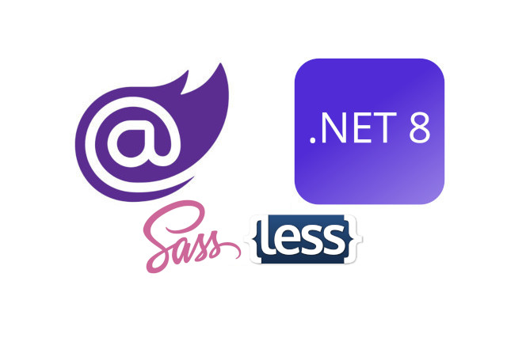

<p class="d-flex justify-content-center">
<br>
<p>

#### **Blazor .NET 8 Autocompile Sass and Less**

Sass: ```Sass``` is a CSS preprocessor that simplifies styling by providing features like variables, nesting, and mixins. It allows for more organized and efficient CSS code.

Less: ```Less``` is another CSS preprocessor that offers similar features to Sass, enabling developers to write cleaner and more maintainable stylesheets.

Autocompile: ```Autocompilation``` refers to the automatic conversion of ```Sass or Less``` files into standard ```CSS``` files whenever changes are made to the source files. This process eliminates the need for manual compilation and ensures that the styles are always up to date.

To achieve Sass and Less autocompilation in a Blazor .NET 8 project, we need to follow these key steps:

- Initialize ```npm``` in the project directory.
- Install the necessary ```Node.js packages```, such as ```node-sass``` for Sass and ```lessc``` for Less.
- Update the ```package.json``` file to include scripts for compiling Sass and Less files into CSS.
- Configure the scripts to watch for changes in the ```Sass and Less``` files and automatically compile them into CSS in the wwwroot directory.

```
npm init
npm install node-sass
npm install lessc
```

- package.json:
```
{
...
  "scripts": {
...
	"sass": "node-sass styles/ -o ../wwwroot/css/"
	"less": "lessc styles/mainless.less ../wwwroot/css/mainless.css --verbose"
...
  },
... 
}
```

To install packages and run the compilation scripts, use:
```
npm install
npm run sass
npm run less
```


##### **.csproj for Autocompile**
```
...
<!--Npm Install and Run (\nodepack>): 'npm install' and 'npm run sass' or 'npm run less'-->
<Target Name="DebugEnsureNodeEnv" BeforeTargets="Build" Condition=" '$(Configuration)' == 'Debug' And !Exists('nodepack\node_modules') ">
	<Exec Command="node --version" ContinueOnError="true">
		<Output TaskParameter="ExitCode" PropertyName="ErrorCode" />
	</Exec>
	<Error Condition="'$(ErrorCode)' != '0'" Text="Node.js is required to build and run this project. To continue, please install Node.js from https://nodejs.org/, and then restart your command prompt or IDE." />
	<Message Importance="high" Text="Restoring dependencies using 'npm'. This may take several minutes..." />
	<Exec WorkingDirectory="nodepack" Command="npm install" />
</Target>
<Target Name="RunSass" BeforeTargets="Build">
	<Exec Command="npm run sass" WorkingDirectory="nodepack" />
</Target>
<Target Name="RunLess" BeforeTargets="Build">
	<Exec Command="npm run less" WorkingDirectory="nodepack" />
</Target>
...
```

The first target, ```DebugEnsureNodeEnv```, checks for the existence of ```Node.js``` and installs dependencies if needed. The subsequent targets, ```RunSass``` and ```RunLess```, execute the respective``` Sass and Less``` compilation scripts before the build process begins.

#### **Source**
Full source code is available at this repository in GitHub:  
https://github.com/akifmt/DotNetCoding/tree/main/src/BlazorAppSassLessComp
