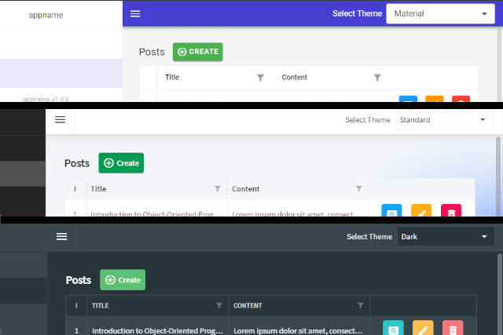

<p class="d-flex justify-content-center">
<br>
<p>

#### **Blazor Radzen .NET 8 Multiple Themes Dark and Light Mode**
We are implementing dynamic theme switching in a ```Blazor application``` using ```Radzen```. The code allows users to switch between different themes (e.g., default, dark, humanistic, software, standard, material) based on their preference.

.NET 8: ```.NET 8``` is a version of the .NET framework that provides developers with a platform to build various types of applications. It offers improved performance, security, and features for developing modern applications.

Blazor: ```Blazor``` is a web framework by Microsoft that allows developers to build interactive web applications using C# and .NET instead of JavaScript. It enables developers to create single-page applications with rich user interfaces.

Radzen: ```Radzen``` is a low-code development platform that simplifies and accelerates web and mobile application development. It provides tools and components to build responsive and customizable applications quickly.

Dark and Light Theme: ```Dark``` and ```Light``` themes refer to the visual appearance of an application. Dark themes use darker colors for backgrounds and lighter colors for text, providing a sleek and modern look. Light themes, on the other hand, use lighter colors for backgrounds and darker colors for text, offering a more traditional and bright appearance. Users can choose between these themes based on their preference and visual comfort.


Information

- Free Themes
  - Material:  
  ```<link rel="stylesheet" href="_content/Radzen.Blazor/css/material.css">```
  - Standard:  
  ```<link rel="stylesheet" href="_content/Radzen.Blazor/css/standard.css">```
  - Default:  
  ```<link rel="stylesheet" href="_content/Radzen.Blazor/css/default.css">```
  - Humanistic:  
  ```<link rel="stylesheet" href="_content/Radzen.Blazor/css/humanistic.css">```
  - Software:  
  ```<link rel="stylesheet" href="_content/Radzen.Blazor/css/software.css">```
  - Dark:  
  ```<link rel="stylesheet" href="_content/Radzen.Blazor/css/dark.css">```  

- Premium Themes
  - Material 3
  - Fluent
  - Material 3 Dark
  - Material Dark  
  - Fluent Dark

Explore free theming options in Radzen Blazor Components demos.  
Premium themes can be used with an active ```Radzen Professional``` or ```Enterprise subscription```.  
More: https://blazor.radzen.com/themes



##### **App.razor**

<kbd>App.razor</kbd>
```
<!DOCTYPE html>
<html lang="en">

<head>
    <meta charset="utf-8" />
    <meta name="viewport" content="width=device-width, initial-scale=1.0" />
    <base href="/" />
    <link rel="stylesheet" href="bootstrap/bootstrap.min.css" />

    @* THEME CSS *@
    <Theme />

    <link rel="icon" type="image/png" href="favicon.png" />
    <HeadOutlet @rendermode="InteractiveServer" />
</head>

<body>
    <Routes @rendermode="InteractiveServer" />

    <script src="_content/Radzen.Blazor/Radzen.Blazor.js"></script>
    <script src="_framework/blazor.web.js"></script>
</body>

</html>
```
It includes the necessary ```HTML structure``` and ```references``` to ```CSS``` files for styling. Notably, it contains a placeholder ```<Theme />``` where the ```theme-specific CSS``` will be injected dynamically based on the selected theme (dark or light mode).

##### **MainLayout.razor**

<kbd>MainLayout.razor</kbd>
```
...
	<ThemeComponent />
...
```
To implement Dark and Light Mode with Multiple Themes in Blazor using Radzen, we need to create a ```ThemeComponent``` that handles the ```theme switching logic```. This component will dynamically apply the selected theme to the application based on user preference.

##### **Theme.razor**

<kbd>Theme.razor</kbd>
```
@inject NavigationManager NavigationManager
@inject ThemeService ThemeService

<link href="@Href" rel="stylesheet" />

@*
    //////// THEMES
    <link rel="stylesheet" href="_content/Radzen.Blazor/css/default.css">
    <link rel="stylesheet" href="_content/Radzen.Blazor/css/dark.css">
    <link rel="stylesheet" href="_content/Radzen.Blazor/css/humanistic.css">
    <link rel="stylesheet" href="_content/Radzen.Blazor/css/software.css">
    <link rel="stylesheet" href="_content/Radzen.Blazor/css/standard.css">
    <link rel="stylesheet" href="_content/Radzen.Blazor/css/material-base.css">
*@

@code {

    //string Href => $"_content/Radzen.Blazor/css/{ThemeService.CurrentTheme}-base.css";
    string Href => $"_content/Radzen.Blazor/css/{ThemeService.CurrentTheme}.css";

    protected override void OnInitialized()
    {
#if !RADZEN
        ThemeService.Initialize(NavigationManager);
#endif
    }
}
```
The code begins by injecting the ```NavigationManager``` and ```ThemeService``` into the component. It then includes a ```<link>``` tag that references the ```stylesheet``` based on the current theme selected. The available themes are predefined in the commented section.

The ```Href``` property dynamically generates the path to the ```CSS file``` based on the current theme selected in the ```ThemeService```. The ```OnInitialized``` method initializes the theme service, but only if the ```RADZEN preprocessor``` directive is not defined.

##### **ThemeComponent.razor**

<kbd>ThemeComponent.razor</kbd>
```
@inject ThemeService ThemeService
@inject NavigationManager UriHelper

<RadzenLabel Text="Select Theme" Component="DropDownTextValueProperties" class="rz-mr-2" />
<RadzenDropDown TValue="string"
                Value="@ThemeService.CurrentTheme" Data="@ThemeService.Themes"
                TextProperty="Text" ValueProperty="Value"
                Name="DropDownTextValueProperties"
                Change="@ChangeTheme" />

@code {

    protected override void OnInitialized()
    {
        ThemeService.Initialize(UriHelper);
    }

    void ChangeTheme(object value)
    {
        ThemeService.Change(UriHelper, $"{value}");
    }

}
```
By injecting the ```ThemeService``` and ```UriHelper``` services into the component. It then displays a ```label prompting``` the user to select ```a theme``` using ```a dropdown list``` populated with theme options. The ```OnInitialized``` method initializes the ```ThemeService``` with the ```UriHelper```. When a user selects a theme from the ```dropdown```, the ```ChangeTheme``` method is called to update the selected theme using the ```ThemeService```.

##### **ThemeService.cs**

<kbd>ThemeService.cs</kbd>
```
using System.Web;
using Microsoft.AspNetCore.Components;

namespace BlazorAppRadzenMultipleThemesDarkAndLightMode;

public class ThemeService
{
    public class Theme
    {
        public string Text { get; set; }
        public string Value { get; set; }
    }
    public static readonly Theme[] Themes = new[]
    {
        new Theme {
            Text = "Material",
            Value = "material"
        },
        new Theme {
            Text = "Standard",
            Value = "standard"
        },
        new Theme {
            Text = "Default",
            Value = "default"
        },
        new Theme {
            Text = "Humanistic",
            Value = "humanistic"
        },
        new Theme {
            Text = "Software",
            Value = "software"
        },
        new Theme {
            Text = "Dark",
            Value="dark"
        }
    };

    public const string DefaultTheme = "standard";
    public const string QueryParameter = "theme";

    public string CurrentTheme { get; set; } = DefaultTheme;

    public void Initialize(NavigationManager navigationManager)
    {
        var uri = new Uri(navigationManager.ToAbsoluteUri(navigationManager.Uri).ToString());
        var query = HttpUtility.ParseQueryString(uri.Query);
        var value = query.Get(QueryParameter);

        if (Themes.Any(theme => theme.Value == value))
        {
            CurrentTheme = value;
        }
    }

    public void Change(NavigationManager navigationManager, string theme)
    {
        var url = navigationManager.GetUriWithQueryParameters(navigationManager.Uri,
            new Dictionary<string, object>() { { QueryParameter, theme } });

        navigationManager.NavigateTo(url, true);
    }
}
```
The ```NavigationManager``` is injected into the component, and the ```Initialize``` method of the ```ThemeService``` is called to initialize the current theme based on the ```query parameter``` in the ```URL```.

The ```NavigationManager``` is injected into the component, and the ```Change``` method of the ```ThemeService``` is called to ```change the theme```. The updated ```URL``` with the new theme is navigated to.

#### **Source**
Full source code is available at this repository in GitHub:  
https://github.com/akifmt/DotNetCoding/tree/main/src/BlazorAppRadzenMultipleThemesDarkAndLightMode
