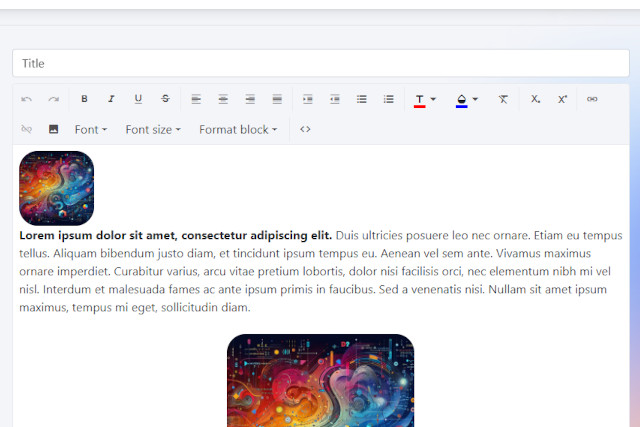

<p class="d-flex justify-content-center">
<br>
<p>

#### **Blazor Radzen .NET 8 Html Editor**

Blazor: ```Blazor``` is a framework for building interactive ```web UIs``` using C# instead of JavaScript.
Radzen: ```Radzen``` is a suite of tools that provides ```UI``` components for ```Blazor``` applications.
.NET 8: ```.NET 8``` is the latest version of the .NET framework that supports Blazor development.
Html Editor: ```An HTML editor``` is a tool that enables users to create, edit, and format ```HTML``` content.

The ```RadzenHtmlEditor``` is a powerful tool that allows users to input and edit ```HTML``` content within a Blazor application. We will explore its key concepts, code structure, and provide code examples to illustrate its functionality.


##### **Create.razor**

The implementation of the ```RadzenHtmlEditor``` component in a Blazor application. The component is bound to a ```blogPostViewModel.Content``` property, allowing users to manipulate the HTML content within the editor.

<kbd>Create.razor</kbd>
```
...
<RadzenHtmlEditor @bind-Value=@blogPostViewModel.Content
                                              Input=@OnInput Change=@OnChange
                                              Paste=@OnPaste Execute=@OnExecute
                                              UploadUrl="upload/image" />
...

@code {
...
    void OnPaste(HtmlEditorPasteEventArgs args)
    {
    }

    void OnChange(string html)
    {
    }

    void OnInput(string html)
    {
    }

    void OnExecute(HtmlEditorExecuteEventArgs args)
    {
    }
...
}
```

OnPaste: Handles the paste event when content is pasted into the editor.  
OnChange: Handles the change event when the HTML content is modified.  
OnInput: Handles the input event when the HTML content is being inputted.  
OnExecute: Handles the execute event when specific actions are executed within the editor.  


##### **Program.cs**

<kbd>Program.cs</kbd>
```
...
builder.Services.AddControllersWithViews();
builder.Services.AddRazorPages();
builder.Services.Configure<Microsoft.AspNetCore.Http.Features.FormOptions>(options =>
{
	options.MultipartBodyLengthLimit = long.MaxValue;
});
builder.Services.AddRazorComponents()
	.AddInteractiveServerComponents();
...
```


##### **UploadController.cs**

The ```UploadController.cs``` file in a Blazor application, focuses on uploading images to the server using a ```controller``` in a Blazor application.

<kbd>UploadController.cs</kbd>
```
...
    [HttpPost("upload/image")]
    public IActionResult Image(IFormFile file)
    {
        try
        {
            var fileName = $"upload-{DateTime.Today.ToString("yyyy-MM-dd")}-{Guid.NewGuid()}{Path.GetExtension(file.FileName)}";

            var filePath = Path.Combine(environment.WebRootPath, fileName);
            using (var stream = new FileStream(filePath, FileMode.Create))
            {
                // Save the file
                file.CopyTo(stream);

                // Return the URL of the file
                var url = Url.Content($"~/{fileName}");

                return Ok(new { Url = url });
            }
        }
        catch (Exception ex)
        {
            return StatusCode(500, ex.Message);
        }
    }
...
```

The ```UploadController.cs``` file contains a method named Image that handles ```image uploads```. It accepts an ```IFormFile``` parameter representing the file to be uploaded. It generates a ```unique file name``` based on the current date and a GUID, saves the ```uploaded file``` to the server using the generated file name, constructs the ```URL``` of the uploaded file, returns the ```URL``` of the uploaded file if the upload is successful or an error message if an ```exception``` occurs.  


#### **Source**
Full source code is available at this repository in GitHub:  
https://github.com/akifmt/DotNetCoding/tree/main/src/BlazorAppRadzenHtmlEditor
