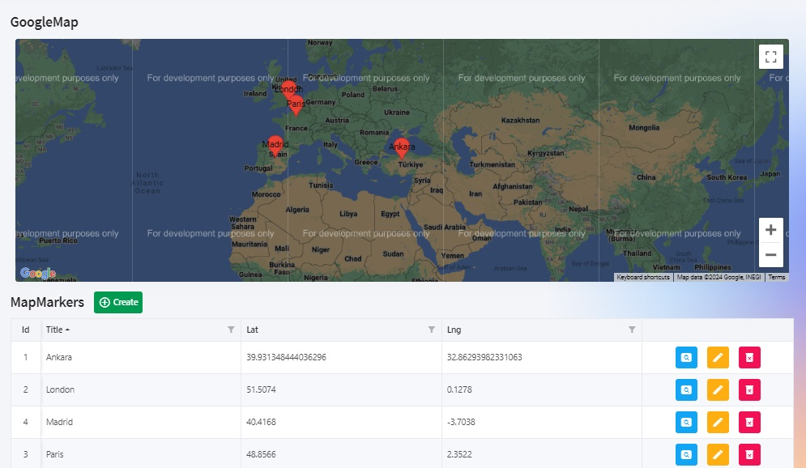

<p class="d-flex justify-content-center">
<br>
<p>

#### **Blazor Radzen .NET 8 Google Maps**

<p class="d-flex justify-content-center">
<br>
<p>

Blazor: ```Blazor``` is a web framework for building interactive client-side web applications using ```C#``` instead of JavaScript. It allows developers to write code in C# and have it run directly in the browser.

Radzen: ```Radzen``` is a low-code development platform that provides tools and components for building ```web applications```. It simplifies the development process by generating code and providing a visual interface for designing user interfaces.

.NET 8: ```.NET 8``` is the latest version of the .NET framework, a software development platform for building applications. It includes various improvements and new features for developing web, desktop, and mobile applications.

Google Maps: ```Google Maps``` is a ```web mapping service``` provided by Google. It allows users to view maps, get directions, and search for locations.

Google Maps API: ```The Google Maps API``` is a set of APIs provided by Google that allows developers to integrate ```Google Maps``` into their applications. It provides various functionalities for displaying maps, adding markers, and handling user interactions.

##### **MapMarker.cs**
<kbd>MapMarker.cs</kbd>
```
namespace BlazorAppRadzenGoogleMaps.Models;

public class MapMarker
{
    public int Id { get; set; }
    public string Title { get; set; } = string.Empty;
    public double Lat { get; set; }
    public double Lng { get; set; }
}
```
We have a ```C#``` class named ```MapMarker``` within the ```BlazorAppRadzenGoogleMaps.Models``` namespace. This class represents a map marker with properties such as ```Id```, ```Title```, ```Latitude (Lat)```, and ```Longitude (Lng)```.

The ```MapMarker``` class defines properties for ```Id```, ```Title```, ```Lat```, and ```Lng```. The ```Id``` property is an integer representing the marker's unique identifier. The ```Title``` property is a string initialized to an empty string. The ```Lat and Lng``` properties are doubles representing the latitude and longitude coordinates, respectively.

##### **MapMarkerService.cs**
<kbd>MapMarkerService.cs</kbd>
```
using BlazorAppRadzenGoogleMaps.Data;
using BlazorAppRadzenGoogleMaps.Models;
using Microsoft.EntityFrameworkCore;
using Radzen;
using System.Linq.Dynamic.Core;

namespace BlazorAppRadzenGoogleMaps.Services;

public class MapMarkerService
{
    private readonly ApplicationDbContext _context;

    public MapMarkerService(ApplicationDbContext context)
    {
        _context = context;
    }

    public Task<MapMarker?> GetbyId(int id)
    {
        return _context.MapMarkers.FirstOrDefaultAsync(x => x.Id == id);
    }

    public async Task<(IEnumerable<MapMarker> Result, int TotalCount)> GetMapMarkersAsync(string? filter = default, int? top = default, int? skip = default, string? orderby = default, string? expand = default, string? select = default, bool? count = default)
    {
        var query = _context.MapMarkers.AsQueryable();

        if (!string.IsNullOrEmpty(filter))
            query = query.Where(filter);

        if (!string.IsNullOrEmpty(orderby))
            query = query.OrderBy(orderby);

        int totalCount = 0;
        if (count == true)
            totalCount = query.Count();

        IEnumerable<MapMarker>? result;
        if (skip == null || top == null)
            result = await query.ToListAsync();
        else
            result = await query.Skip(skip.Value).Take(top.Value).ToListAsync();

        return (result, totalCount);
    }

    public async Task<bool> AddMapMarkerAsync(MapMarker mapMarker)
    {
        try
        {
            await _context.MapMarkers.AddAsync(mapMarker);
            await _context.SaveChangesAsync();
        }
        catch (Exception ex)
        {
            return false;
        }
        return true;
    }

    public async Task<bool> UpdateMapMarkerAsync(int id, MapMarker mapMarker)
    {
        try
        {
            var oldMapMarker = _context.MapMarkers.FirstOrDefault(x => x.Id == id);
            if (oldMapMarker == null) return false;

            oldMapMarker.Title = mapMarker.Title;
            oldMapMarker.Lat = mapMarker.Lat;
            oldMapMarker.Lng = mapMarker.Lng;

            await _context.SaveChangesAsync();
        }
        catch (Exception ex)
        {
            return false;
        }
        return true;
    }

    public async Task<bool> DeletebyIdAsync(int id)
    {
        var mapMarker = await _context.MapMarkers.FirstOrDefaultAsync(x => x.Id == id);
        if (mapMarker == null)
            return false;

        _context.MapMarkers.Remove(mapMarker);
        await _context.SaveChangesAsync();

        return true;
    }
}
```
The ```MapMarkerService``` class is a service that provides methods for interacting with ```map markers``` in a Blazor application. It is responsible for ```retrieving```, ```adding```, ```updating```, and ```deleting``` map markers from the database.  

##### **Index.razor**
<kbd>Index.razor</kbd>
```
@page "/GoogleMap"

@inject Microsoft.JSInterop.IJSRuntime JSRuntime

<PageTitle>GoogleMap</PageTitle>

<RadzenRow>
    <RadzenColumn SizeSM="12" SizeMD="12" SizeLG="12">
        <RadzenStack Orientation="Orientation.Horizontal" AlignItems="AlignItems.Center">
            <RadzenText Text="GoogleMap" TextStyle="TextStyle.H5" />
        </RadzenStack>
    </RadzenColumn>
</RadzenRow>

<RadzenRow class="rz-mb-2 rz-p-2">
    <RadzenColumn SizeSM="12" SizeMD="12" SizeLG="12">
        <RadzenStack Orientation="Orientation.Horizontal" AlignItems="AlignItems.Center">

            <RadzenGoogleMap @ref=map ApiKey=@YOUR_GOOGLE_MAP_API_KEY style="height: 400px; width: 100%;"
                             Options=@(new Dictionary<string, object> { { "disableDoubleClickZoom", true } })
                             Zoom=@zoom Center=@mapCenter
                             MapClick=@OnMapClick MarkerClick=@OnMarkerClick
                             Data="radzenGoogleMapMarkers">
            </RadzenGoogleMap>

        </RadzenStack>
    </RadzenColumn>
</RadzenRow>


<RadzenRow>
    <RadzenColumn SizeSM="12" SizeMD="12" SizeLG="4">
        <RadzenStack Orientation="Orientation.Horizontal" AlignItems="AlignItems.Center">
            <RadzenText Text="MapMarkers" TextStyle="TextStyle.H5" />
            <RadzenButton Text="Create" Icon="add_circle_outline"
                          Click="NavigatetoCreate"
                          ButtonStyle="ButtonStyle.Success" class="rz-mb-2 rz-p-2" />
        </RadzenStack>
    </RadzenColumn>
</RadzenRow>

<RadzenDataGrid KeyProperty="Id" IsLoading="@isLoading" ShowPagingSummary=true
                Count="@totalCount" Data="@mapMarkers" LoadData="@LoadData"
                FilterPopupRenderMode="PopupRenderMode.OnDemand"
                FilterCaseSensitivity="FilterCaseSensitivity.CaseInsensitive"
                FilterMode="FilterMode.Advanced" AllowSorting="true" AllowFiltering="true"
                AllowPaging="true" PageSize="@itemPageSize" PagerHorizontalAlign="HorizontalAlign.Center"
                TItem="MapMarkerViewModel" ColumnWidth="200px">
    <Columns>
        <RadzenDataGridColumn TItem="MapMarkerViewModel" Property="Id" Filterable="false" Title="Id" Frozen="true" Width="30px" MinWidth="30px" TextAlign="TextAlign.Center" />

        <RadzenDataGridColumn TItem="MapMarkerViewModel" Property="Title" Title="Title" />
        <RadzenDataGridColumn TItem="MapMarkerViewModel" Property="Lat" Title="Lat" />
        <RadzenDataGridColumn TItem="MapMarkerViewModel" Property="Lng" Title="Lng" />

        <RadzenDataGridColumn TItem="MapMarkerViewModel" Context="mapMarker" Filterable="false" Sortable="false" Width="150px" TextAlign="TextAlign.Center">
            <Template Context="mapMarker">

                <RadzenRow JustifyContent="JustifyContent.Center">
                    <RadzenButton Icon="pageview" ButtonStyle="ButtonStyle.Info" Variant="Variant.Flat" Size="ButtonSize.Medium"
                                  Click="@(args => NavigatetoDetail(mapMarker.Id))" @onclick:stopPropagation="true">
                    </RadzenButton>
                    <RadzenButton Icon="edit" ButtonStyle="ButtonStyle.Warning" Variant="Variant.Flat" Size="ButtonSize.Medium"
                                  Click="@(args => NavigatetoEdit(mapMarker.Id))" @onclick:stopPropagation="true">
                    </RadzenButton>
                    <RadzenButton Icon="delete_forever" ButtonStyle="ButtonStyle.Danger" Variant="Variant.Flat" Size="ButtonSize.Medium"
                                  Click="@(args => NavigatetoDelete(mapMarker.Id))" @onclick:stopPropagation="true">
                    </RadzenButton>
                </RadzenRow>

            </Template>
        </RadzenDataGridColumn>
    </Columns>
</RadzenDataGrid>


@code {

    const int itemPageSize = 10;
    private bool isLoading;
    private int totalCount;
    private IEnumerable<MapMarkerViewModel>? mapMarkers;

    private RadzenGoogleMap map;
    private string YOUR_GOOGLE_MAP_API_KEY = "";
    private int zoom = 3;
    private GoogleMapPosition mapCenter = new GoogleMapPosition() { Lat = 39.931348444036296, Lng = 32.86293982331063 };
    private IEnumerable<RadzenGoogleMapMarker>? radzenGoogleMapMarkers;

    protected override async Task OnInitializedAsync()
    {
        isLoading = true;

        var result = await MapMarkerService.GetMapMarkersAsync();

        mapMarkers = Mapper.Map<IEnumerable<MapMarker>, IEnumerable<MapMarkerViewModel>>(result.Result);
        totalCount = result.TotalCount;

        List<RadzenGoogleMapMarker> gMapMarkers = new();
        foreach (var mapMarker in mapMarkers)
            gMapMarkers.Add(new() { Title = mapMarker.Title, Label = mapMarker.Title, Position = new() { Lat = mapMarker.Lat, Lng = mapMarker.Lng } });
        radzenGoogleMapMarkers = gMapMarkers;

        isLoading = false;
    }

    private async Task LoadData(LoadDataArgs args)
    {
        isLoading = true;

        var result = await MapMarkerService.GetMapMarkersAsync(filter: args.Filter, top: args.Top, skip: args.Skip, orderby: args.OrderBy, count: true);

        mapMarkers = Mapper.Map<IEnumerable<MapMarker>, IEnumerable<MapMarkerViewModel>>(result.Result);
        totalCount = result.TotalCount;

        isLoading = false;
    }

    private void NavigatetoCreate() => NavigationManager.NavigateTo("/GoogleMap/Create");
    private void NavigatetoDetail(int id) => NavigationManager.NavigateTo($"/GoogleMap/Detail/{id}");
    private void NavigatetoEdit(int id) => NavigationManager.NavigateTo($"/GoogleMap/Edit/{id}");
    private void NavigatetoDelete(int id) => NavigationManager.NavigateTo($"/GoogleMap/Delete/{id}");

    void OnMapClick(GoogleMapClickEventArgs args) { }

    async Task OnMarkerClick(RadzenGoogleMapMarker marker)
    {
        var message = $"Custom information about <b>{marker.Title}</b>";

        var code = $@"
var map = Radzen['{map.UniqueID}'].instance;
var marker = map.markers.find(m => m.title == '{marker.Title}');
if(window.infoWindow) {{window.infoWindow.close();}}
window.infoWindow = new google.maps.InfoWindow({{content: '{message}'}});
setTimeout(() => window.infoWindow.open(map, marker), 200);
";

        await JSRuntime.InvokeVoidAsync("eval", code);
    }
}
```

A ```Blazor component``` called ```GoogleMap```. It includes the necessary imports, injects the ```IJSRuntime``` for JavaScript interop, and defines the ```UI``` layout using ```Radzen components```.

The ```RadzenGoogleMap``` component is used to initialize the ```Google Map```. It requires an ```API key``` to authenticate with the ```Google Maps API```. The ```Options parameter``` is used to customize the map's behavior, such as disabling double-click zoom. The Zoom and Center parameters define the initial zoom level and center position of the map. The ```MapClick``` and ```MarkerClick``` parameters specify the event handlers for map clicks and marker clicks, respectively. The ```Data parameter``` is used to bind the map markers.

When ```a marker``` is clicked, it creates ```a custom information message``` and opens an info window on the map with the message. The ```RadzenGoogleMap``` component provides access to the underlying ```Google Map``` instance through the map variable. The ```marker parameter``` contains information about the clicked marker.

The ```GoogleMap``` component in ```this Blazor application``` allows users to display and interact with a ```Google Map```. It provides features such as ```zooming```, ```centering```, ```adding markers```, and ```handling map``` and ```marker click``` events. By leveraging the ```Radzen components```and the ```Google Maps API```, developers can easily integrate maps into their Blazor applications.

#### **Source**
Full source code is available at this repository in GitHub:  
https://github.com/akifmt/DotNetCoding/tree/main/src/BlazorAppRadzenGoogleMaps
