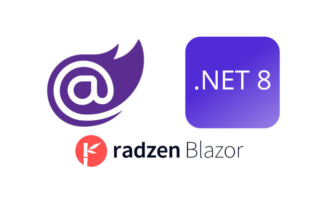

<p class="d-flex justify-content-center">
<br>
<p>


#### **Blazor Radzen .NET 8 Identity Automatically Logout Timer**

Blazor: ```Blazor``` is a web framework for building interactive client-side web applications using C# instead of JavaScript. It allows developers to write code that runs on the client-side and interacts with the server-side.

Radzen: ```Radzen``` is a low-code development platform that provides tools and components for building web applications. It simplifies the development process by generating code and providing a visual interface for designing UI components.

.NET 8: ```.NET``` is a free, open-source, cross-platform framework for building modern applications. .NET 8 is the latest version of the framework, offering improved performance, new features, and enhanced security.

.NET 8 Identity: ```.NET Identity``` is a membership system that allows developers to add authentication and authorization to their applications. It provides features like user registration, login, and role-based access control.


##### **Program.cs**
It sets up ```authentication```, ```user management```, ```password policies```, ```lockout settings```, and ```cookie configurations```. Additionally, it registers services required for ```Identity``` management and access to the HTTP context.  
<kbd>Program.cs</kbd>
```
...
builder.Services.AddCascadingAuthenticationState();
builder.Services.AddScoped<IdentityUserAccessor>();
builder.Services.AddScoped<IdentityRedirectManager>();
builder.Services.AddScoped<AuthenticationStateProvider, IdentityRevalidatingAuthenticationStateProvider>();

builder.Services.AddAuthentication(options =>
{
	options.DefaultScheme = IdentityConstants.ApplicationScheme;
	options.DefaultSignInScheme = IdentityConstants.ExternalScheme;
})
	.AddIdentityCookies();

builder.Services.AddDbContext<ApplicationDbContext>(options =>
	options.UseInMemoryDatabase("ConnectionInMemory"));
builder.Services.AddDatabaseDeveloperPageExceptionFilter();

builder.Services.AddIdentityCore<ApplicationUser>()
	.AddEntityFrameworkStores<ApplicationDbContext>()
	.AddSignInManager()
	.AddDefaultTokenProviders();

builder.Services.Configure<IdentityOptions>(options =>
{
	// Default Lockout settings.
	options.Lockout.DefaultLockoutTimeSpan = TimeSpan.FromMinutes(5);
	options.Lockout.MaxFailedAccessAttempts = 5;
	options.Lockout.AllowedForNewUsers = true;
	// Default Password settings.
	options.Password.RequireDigit = false;
	options.Password.RequireLowercase = false;
	options.Password.RequireNonAlphanumeric = false;
	options.Password.RequireUppercase = false;
	options.Password.RequiredLength = 6;
	options.Password.RequiredUniqueChars = 0;
	// Default SignIn settings.
	options.SignIn.RequireConfirmedEmail = false;
	options.SignIn.RequireConfirmedPhoneNumber = false;
	// Default User settings.
	options.User.AllowedUserNameCharacters =
			"abcdefghijklmnopqrstuvwxyzABCDEFGHIJKLMNOPQRSTUVWXYZ0123456789-._@+";
	options.User.RequireUniqueEmail = false;
});

builder.Services.ConfigureApplicationCookie(options =>
{
	//options.AccessDeniedPath = "/Identity/Account/AccessDenied";
	options.Cookie.Name = COOKIE_NAME;
	options.Cookie.HttpOnly = true;
	options.ExpireTimeSpan = EXPIRE_TIMESPAN;
	//options.LoginPath = "/Identity/Account/Login";
	options.ReturnUrlParameter = CookieAuthenticationDefaults.ReturnUrlParameter;
	options.SlidingExpiration = true;
});

builder.Services.Configure<PasswordHasherOptions>(option =>
{
	option.IterationCount = 12000;
});

builder.Services.AddSingleton<IEmailSender<ApplicationUser>, IdentityNoOpEmailSender>();

builder.Services.AddHttpContextAccessor();
builder.Services.AddTransient<AuthCheckService>();
...
```


##### **AuthCheckService.cs**
```AuthCheckService``` that is responsible for checking the expiration time of the ```user's authentication``` in a Blazor Radzen application using ```.NET 8 Identity```. The ```service``` retrieves the expiration time of the ```user's authentication token``` and ```calculates``` the remaining time until logout.  
<kbd>AuthCheckService.cs</kbd>
```
using Microsoft.AspNetCore.Authentication;
using Microsoft.AspNetCore.Authentication.Cookies;
using Microsoft.AspNetCore.DataProtection;
using Microsoft.Extensions.Options;

namespace BlazorAppRadzenAuthIdentityAutoLogoutTimer.Services;

public class AuthCheckService
{
    private readonly IHttpContextAccessor _httpContextAccessor;
    private readonly CookieAuthenticationOptions _options;

    public AuthCheckService(IHttpContextAccessor httpContextAccessor, IOptions<CookieAuthenticationOptions> options)
    {
        _httpContextAccessor = httpContextAccessor;
        _options = options.Value;
    }

    public Task<TimeSpan?> GetAuthExpiration()
    {
        TimeSpan? timeSpan = null;
        string? cookie = _httpContextAccessor?.HttpContext?.Request.Cookies[Program.COOKIE_NAME];
        if (cookie is null)
            return Task.FromResult(timeSpan);

        IDataProtectionProvider? provider = _options.DataProtectionProvider;
        if (provider is null)
            return Task.FromResult(timeSpan);

        IDataProtector protector = provider.CreateProtector(
            "Microsoft.AspNetCore.Authentication.Cookies." +
            "CookieAuthenticationMiddleware",
            "Identity.Application",
            "v2");

        TicketDataFormat format = new TicketDataFormat(protector);
        AuthenticationTicket? authTicket = format.Unprotect(cookie);
        if (authTicket is null)
            return Task.FromResult(timeSpan);

        AuthenticationProperties property = authTicket.Properties;
        DateTimeOffset? expiresUtc = property.ExpiresUtc;

        timeSpan = expiresUtc - DateTimeOffset.UtcNow;

        return Task.FromResult(timeSpan);
    }
}
```
The ```AuthCheckService``` class has two private fields: ```_httpContextAccessor``` and ```_options```. The ```constructor``` initializes these fields using dependency injection. The ```GetAuthExpiration``` method retrieves the authentication cookie, decrypts it using the data protector, and calculates the remaining time until expiration.


##### **ComponentAuthTimer.razor**
```ComponentAuthTimer.razor```, it is responsible for displaying the remaining authentication expiration time and automatically logging the user out when the time expires.  
<kbd>ComponentAuthTimer.razor</kbd>
```
@using BlazorAppRadzenAuthIdentityAutoLogoutTimer.Services
@using Microsoft.AspNetCore.Authorization
@using System.Security.Claims

@implements IDisposable

@attribute [Authorize]

@inject AuthCheckService AuthCheckService
@inject NavigationManager? NavigationManager

<AuthorizeView>

    @if (NavigationManager is not null && NavigationManager.Uri.Contains("/Account") == true)
    {
        <span style="margin: 10px;">
            Auto logout after <b><span id="logoutTime" val-seconds="@((int)authExpiration?.TotalSeconds)">@(authExpiration is not null ? authExpiration.Value.ToString(@"hh\:mm\:ss") : "")</span></b>
        </span>
    }
    else
    { 
        <span style="margin: 10px;">
            Auto logout after <b>@(authExpiration is not null ? authExpiration.Value.ToString(@"hh\:mm\:ss") : "")</b>
        </span>
    } 

</AuthorizeView>

@code {
    TimeSpan? authExpiration;
    System.Timers.Timer? authExpirationTimer;

    protected override async Task OnInitializedAsync()
    {
        authExpiration = await AuthCheckService.GetAuthExpiration();

        if (authExpirationTimer is null && NavigationManager?.Uri.Contains("/Account") != true)
        {
            authExpirationTimer = new System.Timers.Timer(1000);
            authExpirationTimer.Elapsed += AuthExpirationTimer_Elapsed;
            authExpirationTimer.Enabled = true;
        }
    }


    private async void AuthExpirationTimer_Elapsed(object? sender, System.Timers.ElapsedEventArgs e)
    {
        if (authExpiration is null || authExpirationTimer is null)
            return;


        if (authExpiration.Value.TotalSeconds > 0)
        {
            if (((int)authExpiration.Value.TotalSeconds % 60) == 0)
            {
                var expiration = await AuthCheckService.GetAuthExpiration();
                if (expiration is not null)
                    authExpiration = expiration;
            }

            authExpiration -= TimeSpan.FromSeconds(1);
            await InvokeAsync(StateHasChanged);
        }
        else
        {
            authExpirationTimer.Enabled = false;
            authExpirationTimer.Elapsed -= AuthExpirationTimer_Elapsed;

            NavigationManager?.Refresh(forceReload: true);

        }
    }


    public void Dispose()
    {
        if (authExpirationTimer is not null)
            authExpirationTimer.Elapsed -= AuthExpirationTimer_Elapsed;
        authExpirationTimer?.Dispose();
    }
}
```
The ```code``` block starts with the declaration of two variables: ```authExpiration of type TimeSpan?``` and ```authExpirationTimer of type System.Timers.Timer?```. The ```authExpiration``` variable stores the authentication expiration time, and the ```authExpirationTimer``` is used to update the countdown every second.  
The ```AuthExpirationTimer_Elapsed``` method is the event handler for the timer's Elapsed event. It checks if the authentication expiration time is ```null``` or the timer is ```null``` and returns if either condition is ```true```.  
If the ```authentication expiration time``` is greater than zero, it checks if the remaining seconds are divisible by 60. If so, it retrieves the updated expiration time from the ```AuthCheckService```. Then, it subtracts one second from the remaining time and updates the UI using StateHasChanged.  

```ComponentAuthTimer.razor``` component provides an ```automatic logout timer``` functionality in a Blazor application using Radzen and .NET 8 Identity. It displays a countdown timer indicating the time remaining before the user is automatically logged out due to inactivity.  


#### **Source**
Full source code is available at this repository in GitHub:  
https://github.com/akifmt/DotNetCoding/tree/main/src/BlazorAppRadzenAuthIdentityAutoLogoutTimer
