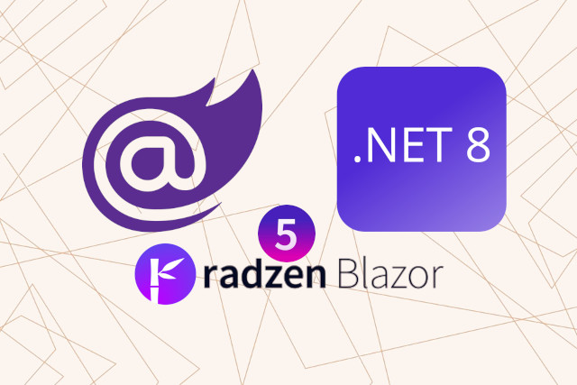

<p class="d-flex justify-content-center">
<br>
<p>


#### **Blazor Radzen .NET 8 Upgrade Radzen 4 to 5**

The process of upgrading the Radzen.Blazor package from version 4 to version 5 in a Blazor project targeting .NET 8.0. This upgrade is essential to leverage the latest features, improvements, and bug fixes provided by Radzen.


Information


Radzen Blazor Components v5 Changelog
Track and review changes to Radzen Blazor Components v5.

More: https://blazor.radzen.com/changelog?theme=default




##### **.csproj Update NuGet packages**
In the updated .csproj file, the version of the Radzen.Blazor package has been changed from 4 to 5. This modification ensures that the project now references the latest version of the Radzen.Blazor package.  
<kbd>(OLD) .csproj</kbd>
```
<Project Sdk="Microsoft.NET.Sdk.Web">

	<PropertyGroup>
		<TargetFramework>net8.0</TargetFramework>
		<Nullable>enable</Nullable>
		<ImplicitUsings>enable</ImplicitUsings>
	</PropertyGroup>

	<ItemGroup>
...
		<PackageReference Include="Radzen.Blazor" Version="4.34.0" />
...
	</ItemGroup>

</Project>
```
<kbd>(NEW) .csproj</kbd>
```
<Project Sdk="Microsoft.NET.Sdk.Web">

	<PropertyGroup>
		<TargetFramework>net8.0</TargetFramework>
		<Nullable>enable</Nullable>
		<ImplicitUsings>enable</ImplicitUsings>
	</PropertyGroup>

	<ItemGroup>
...
		<PackageReference Include="Radzen.Blazor" Version="5.0.8" />
...
	</ItemGroup>

</Project>
```


##### **App.razor**
he section of the App.razor file responsible for linking CSS files. In the old version, the CSS file default-base.css from Radzen was referenced using a relative path. However, in the new version, the reference to the CSS file has been updated to use the correct path.  
<kbd>(OLD) App.razor</kbd>
```
...
    <link rel="stylesheet" href="bootstrap/bootstrap.min.css" />

    <link rel="stylesheet" href="_content/Radzen.Blazor/css/default-base.css">
...
```
<kbd>(NEW) App.razor</kbd>
```
...
    <link rel="stylesheet" href="_content/Radzen.Blazor/css/default-base.css" />
...
```


##### **MainLayout.razor**
MainLayout.razor file before and after the upgrade from Radzen version 4 to version 5. The structure of the file remains the same, with the inclusion of Radzen components for Dialog, Notification, Tooltip, ContextMenu, and the new RadzenComponents.  
<kbd>(OLD) MainLayout.razor</kbd>
```
...
@inherits LayoutComponentBase

@inject IJSRuntime JSRuntime
@inject NavigationManager NavigationManager
@inject DialogService DialogService
@inject ContextMenuService ContextMenuService
@inject TooltipService TooltipService
@inject NotificationService NotificationService

<RadzenDialog />
<RadzenNotification />
<RadzenTooltip />
<RadzenContextMenu />
...
```
<kbd>(NEW) MainLayout.razor</kbd>
```
...
@inherits LayoutComponentBase

@inject IJSRuntime JSRuntime
@inject NavigationManager NavigationManager
@inject DialogService DialogService
@inject ContextMenuService ContextMenuService
@inject TooltipService TooltipService
@inject NotificationService NotificationService

<RadzenDialog />
<RadzenNotification />
<RadzenTooltip />
<RadzenContextMenu />
<RadzenComponents />
...
```

Upgrading Radzen components from version 4 to version 5 is essential to leverage the latest features and improvements offered by Radzen. By following the provided code examples and ensuring that all necessary components are included, you can successfully upgrade your Blazor application to use Radzen version 5 seamlessly.


#### **Source**
Full source code is available at this repository in GitHub:  
https://github.com/akifmt/DotNetCoding/tree/main/src/BlazorAppRadzenNet8UpgradeRadzen4to5
