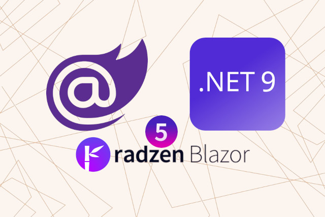

<p class="d-flex justify-content-center">
<br>
<p>


#### **New Features .NET 9 and C# 13: What Developers Need to Know**
```.NET 9``` introduces several significant enhancements across its runtime, libraries, and ```ASP.NET Core``` framework. The runtime now features a new attribute model for feature switches, enabling libraries to toggle functionalities effectively. Performance improvements, such as dynamic garbage collection and loop optimizations, enhance application efficiency.

In the libraries, ```System.Text.Json``` supports nullable reference types and allows for customized JSON formatting. New ```LINQ methods```, ```CountBy``` and ```AggregateBy```, facilitate efficient data aggregation without unnecessary allocations. The ```PriorityQueue<TElement, TPriority>``` type has been enhanced with a method to update item priorities seamlessly.

```ASP.NET Core ```benefits from improved security, optimized static file handling, and enhanced support for ```OpenAPI``` document generation. Additionally, new templates for ```Blazor``` applications and better monitoring capabilities contribute to a more robust development experience. Overall, ```.NET 9``` emphasizes performance, security, and developer productivity, making it a compelling upgrade for ```.NET developers```.



Information

.NET 9, will be supported for 18 months as a standard-term support (STS) release.  
End of support: May 12, 2026




##### **.NET 9 Features**

###### **Runtime Enhancements**
The new attribute model for feature switches allows libraries to toggle functionality easily. For example:

```
[FeatureSwitch("NewFeature")]
public void SomeMethod() { /* Implementation */ }
```

###### **Garbage Collection**
Dynamic adaptation to application size improves memory management automatically.

###### **System.Text.Json**
Supports nullable reference types and allows customization of JSON indentation:

```
var options = new JsonSerializerOptions { WriteIndented = true };
```

###### **LINQ Enhancements**
New methods like CountBy and AggregateBy streamline data aggregation:

```
var result = items.CountBy(x => x.Category);
```

###### **ASP.NET Core Improvements**
Enhanced security and performance, including optimized static file handling and built-in OpenAPI support.


##### **C# 13 Features**
C# 13, part of the .NET 9 SDK, brings a host of new features that improve both functionality and usability. Here are some key highlights:

###### **Raw String Literals**
Simplifies multi-line string handling:

```
var json = """
{
    "key": "value"
}
""";
```

###### **Required Members**
Enforces initialization of certain properties:

```
public class Person
{
    public required string Name { get; init; }
}
```

###### **Params Collections**
You can now use params with collections, allowing for more flexible method signatures.

```
public void ProcessItems(params List<string>[] items) { /* Implementation */ }
```

###### **New Lock Type and Semantics**
A refined locking mechanism enhances thread safety.

```
lock (new object()) { /* Critical section */ }
```

###### **New Escape Sequence - \e**
This allows for easier string formatting.

```
string message = "This is an escape sequence: \e";
```

###### **Method Group Natural Type Improvements**
Simplifies method group conversions.

###### **Implicit Indexer Access in Object Initializers**
You can now initialize collections more intuitively.

```
var dict = new Dictionary<string, int> { ["key"] = 1 };
```

###### **Ref Locals and Unsafe Contexts in Iterators**
Enhances performance in asynchronous programming.

###### **Ref Struct Types Implementing Interfaces**
Increases flexibility in struct usage.

###### **Partial Properties and Indexers**
Allows for better organization in partial classes.

###### **Overload Resolution Priority**
Library authors can now specify preferred overloads.

###### **Field Backed Properties**
Introduces a new way to define properties.  
  
  
  
These features collectively enhance the language's expressiveness and performance, making ```C# 13``` a significant update for developers.


#### **Resource**
Breaking changes in .NET 9  
https://learn.microsoft.com/en-us/dotnet/core/compatibility/9.0

What's new in .NET 9  
https://learn.microsoft.com/en-us/dotnet/core/whats-new/dotnet-9/overview

What's new in C# 13  
https://learn.microsoft.com/en-us/dotnet/csharp/whats-new/csharp-13
