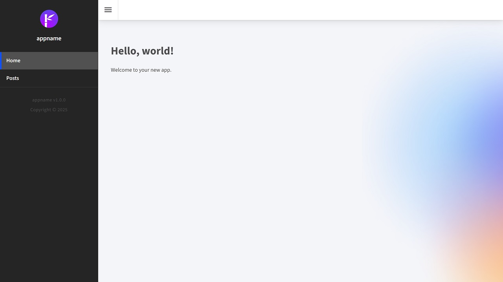

<p class="d-flex justify-content-center">
<br>
</p>


#### **Blazor Radzen .NET 8 Menu with Adaptive Behavior for Mobile and Desktop**

Blazor: ```Blazor``` A framework for building interactive web applications using C# instead of JavaScript. It allows developers to create rich web UIs with a component-based architecture.  
Radzen: ```Radzen``` A set of UI components for Blazor that simplifies the development of web applications. The ```Radzen``` Panel Menu is a versatile component that provides a collapsible menu structure.  
.NET 8: ```.NET 8``` is the latest version of the ```.NET framework```, which is a software development platform for building applications.  
Adaptive Behavior: This refers to the ability of the menu to adjust its layout and functionality based on the device being used, ensuring optimal usability on ```both mobile and desktop``` platforms.  
Responsive Design: The practice of creating ```web applications``` that provide an ```optimal viewing experience``` across a wide range of devices.  
JavaScript Interop: A feature in Blazor that allows C# code to call JavaScript functions.  

| Desktop | Mobile |
| -------- | ------- |
|  |  |

##### **NavMenu.razor**
<kbd>NavMenu.razor</kbd>
```
...  
<RadzenPanelMenu>
    <RadzenPanelMenuItem Text="Home" Path="/" Click="PanelMenuItemClick" />
    <RadzenPanelMenuItem Text="Posts" Path="/BlogPost" Click="PanelMenuItemClick" />
</RadzenPanelMenu>
...
...
...
@code {

    [Parameter]
    [EditorRequired]
    public Action? AfterClick { get; set; }

    async void PanelMenuItemClick()
    {
        if (AfterClick is not null)
            await InvokeAsync(AfterClick);
    }

}
...  
```
RadzenPanelMenu: This component serves as the ```parent``` for the menu items. It automatically handles the ```layout``` and ```styling``` based on the device.  
RadzenPanelMenuItem: Each item is defined with a ```Text property``` that specifies what the user sees and a ```Path property``` that indicates the ```URL``` to navigate to when clicked. The ```Click``` event is linked to the ```PanelMenuItemClick``` method.  
AfterClick Parameter: This is an optional parameter that allows the ```parent component``` to specify an action to be executed after ```a menu item``` is clicked. It is marked with ```[Parameter]``` and ```[EditorRequired]``` attributes to ensure it is set correctly.  
PanelMenuItemClick Method: This asynchronous method checks if the ```AfterClick``` action is not ```null``` and invokes it. The use of ```InvokeAsync``` ensures that the action is executed on the correct synchronization context, which is crucial in Blazor applications.  


##### **MainLayout.razor**
<kbd>MainLayout.razor</kbd>
```
...  
<NavMenu AfterClick="SidebarCloseIfMobile" />
...
...
...
public async void SidebarCloseIfMobile()
{
	/*
	Breakpoints: (https://blazor.radzen.com/breakpoints)
	xs - Extra Small ≥ 576px
	sm - Small ≥ 768px
	md - Medium ≥ 1024px
	lg - Large ≥ 1280px
	xl - Extra Large ≥ 1920px
	xx - Extra Extra Large ≥ 2560px
		 */

	int maxWidth = 768; // if 'xs' or 'sm'

	int? width = await JSRuntime.InvokeAsync<int?>("eval", "window.innerWidth");
	if (width is not null && width <= maxWidth)
	{
		sidebarExpanded = false;
		await InvokeAsync(StateHasChanged);
	}

}
...
```

```SidebarCloseIfMobile``` method will be invoked after a ```click``` event on the ```navigation menu```.  
Breakpoint Definition: The ```method``` starts by defining a maximum width of 768 pixels, which corresponds to mobile devices (extra small and small breakpoints).  
JavaScript Interop: The method uses ```JSRuntime.InvokeAsync``` to execute a JavaScript command that retrieves the ```current window's inner width```. This is crucial for determining the device type.  
Conditional Logic: If the retrieved width is not null and is less than or equal to the defined ```maximum width```, the sidebar is set to a collapsed state ```(sidebarExpanded = false)```.  
State Update: Finally, ```InvokeAsync(StateHasChanged)``` is called to notify the Blazor component that the state has changed, prompting a re-render of the UI.  


#### **Source**
Full source code is available at this repository in GitHub:  
https://github.com/akifmt/DotNetCoding/tree/main/src/BlazorAppRadzenNet8waMenuAdaptiveBehaviorMobile

#### **Live Preview**
Live Preview:  
https://akifmt.github.io/DotNetCodingDemo/BlazorAppRadzenNet8waMenuAdaptiveBehaviorMobile

