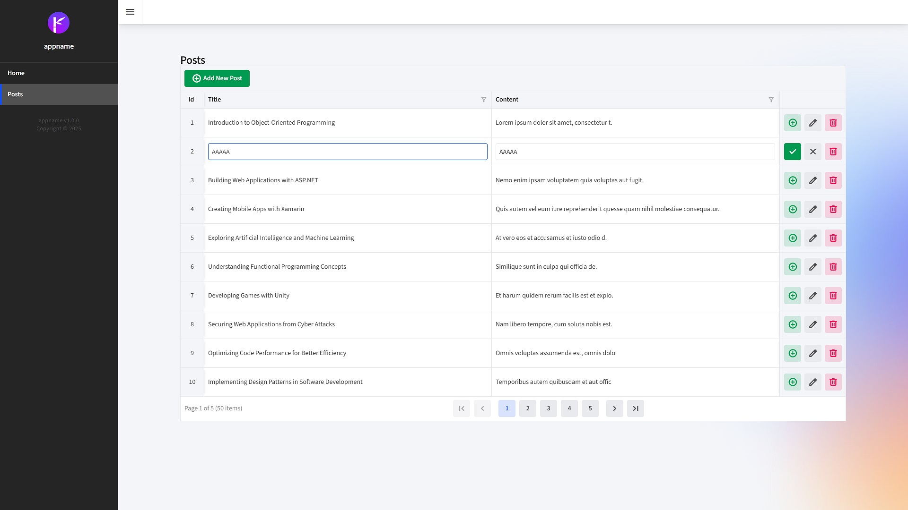

<p class="d-flex justify-content-center">
<br>
</p>


#### **Blazor Radzen .NET 8 DataGrid InLineEdit**

<p class="d-flex justify-content-center">
<br>
<p>

Blazor: ```Blazor``` A framework for building interactive web applications using C# instead of JavaScript. It allows developers to create rich web UIs with a component-based architecture.  
Radzen: ```Radzen``` A set of UI components for Blazor that simplifies the development of web applications. It provides a variety of ```controls```, including DataGrids, which are essential for displaying and managing data.
.NET 8: ```.NET 8``` is the latest version of the ```.NET framework```, which includes enhancements and new features that improve performance, security, and developer productivity.  
Inline Editing: Users can edit directly within the ```grid```, which simplifies the ```editing process```.  


##### **index.razor**
<kbd>index.razor</kbd>
```
@page "/BlogPost"

<PageTitle>Posts</PageTitle>

<RadzenRow>
    <RadzenColumn SizeSM="12" SizeMD="12" SizeLG="4">
        <RadzenStack Orientation="Orientation.Horizontal" AlignItems="AlignItems.Center">
            <RadzenText Text="Posts" TextStyle="TextStyle.H5" />
            @* <RadzenButton Text="Create" Icon="add_circle_outline"
                          Click="NavigatetoCreate"
                          ButtonStyle="ButtonStyle.Success" class="rz-mb-2 rz-p-2" /> *@
        </RadzenStack>
    </RadzenColumn>
</RadzenRow>

<RadzenDataGrid @ref="blogPostsGrid" KeyProperty="Id" IsLoading="@isLoading" Count="@totalCount" ShowPagingSummary=true AllowAlternatingRows="false" AllowFiltering="true" FilterMode="FilterMode.Advanced" FilterCaseSensitivity="FilterCaseSensitivity.CaseInsensitive" AllowPaging="true" PagerHorizontalAlign="HorizontalAlign.Center" PageSize="@itemPageSize" AllowSorting="true" EditMode="DataGridEditMode.Single" Data="@blogPosts" TItem="BlogPostViewModel" LoadData="@LoadData" RowUpdate="@OnUpdateRow" RowCreate="@OnCreateRow" Sort="@Reset" Page="@Reset" Filter="@Reset">
    <HeaderTemplate>
        <RadzenButton ButtonStyle="ButtonStyle.Success" Icon="add_circle" Text="Add New Post" Click="@InsertRow" Disabled="@(blogPostsToInsert.Count() > 0)" />
    </HeaderTemplate>
    <Columns>
        <RadzenDataGridColumn TItem="BlogPostViewModel" Property="Id" Filterable="false" Title="Id" Frozen="true" Width="50px" MinWidth="50px" TextAlign="TextAlign.Center" />
        <RadzenDataGridColumn TItem="BlogPostViewModel" Property="Title" Title="Title">
            <EditTemplate Context="blogPost">
                <RadzenTextBox @bind-Value="blogPost.Title" Name="Title" style="width: 100%" aria-label="Enter Title" />
                <RadzenRequiredValidator Text="Title is required" Component="Title" Popup="true" />
            </EditTemplate>
        </RadzenDataGridColumn>
        <RadzenDataGridColumn TItem="BlogPostViewModel" Property="Content" Title="Content">
            <EditTemplate Context="blogPost">
                <RadzenTextBox @bind-Value="blogPost.Content" Name="Content" style="width: 100%" aria-label="Enter Content" />
                <RadzenRequiredValidator Text="Content is required" Component="Content" Popup="true" />
            </EditTemplate>
        </RadzenDataGridColumn>

        <RadzenDataGridColumn Context="blogPost" Filterable="false" Sortable="false" TextAlign="TextAlign.Right" Frozen="true" FrozenPosition="FrozenColumnPosition.Right" Width="140px" MinWidth="140px">
            <Template Context="blogPost">
                <RadzenButton Icon="add_circle" ButtonStyle="ButtonStyle.Success" Variant="Variant.Flat" Size="ButtonSize.Medium" Shade="Shade.Lighter" Click="@(() => InsertAfterRow(blogPost))" title="Add new row after this row" Disabled="@(blogPostsToInsert.Count() > 0)" />
                <RadzenButton Icon="edit" ButtonStyle="ButtonStyle.Light" Variant="Variant.Flat" Size="ButtonSize.Medium" class="rz-my-1 rz-ms-1" Click="@(args => EditRow(blogPost))" @onclick:stopPropagation="true" />
                <RadzenButton Icon="delete" ButtonStyle="ButtonStyle.Danger" Variant="Variant.Flat" Size="ButtonSize.Medium" Shade="Shade.Lighter" class="rz-my-1 rz-ms-1" Click="@(args => DeleteRow(blogPost))" @onclick:stopPropagation="true" />
            </Template>
            <EditTemplate Context="blogPost">
                <RadzenButton Icon="check" ButtonStyle="ButtonStyle.Success" Variant="Variant.Flat" Size="ButtonSize.Medium" Click="@((args) => SaveRow(blogPost))" aria-label="Save" />
                <RadzenButton Icon="close" ButtonStyle="ButtonStyle.Light" Variant="Variant.Flat" Size="ButtonSize.Medium" class="rz-my-1 rz-ms-1" Click="@((args) => CancelEdit(blogPost))" aria-label="Cancel" />
                <RadzenButton Icon="delete" ButtonStyle="ButtonStyle.Danger" Variant="Variant.Flat" Size="ButtonSize.Medium" Shade="Shade.Lighter" class="rz-my-1 rz-ms-1" Click="@(args => DeleteRow(blogPost))" aria-label="Delete" />
            </EditTemplate>
        </RadzenDataGridColumn>
    </Columns>
</RadzenDataGrid>

@code {

    const int itemPageSize = 10;
    private bool isLoading;
    private int totalCount;
    RadzenDataGrid<BlogPostViewModel>? blogPostsGrid;
    private IEnumerable<BlogPostViewModel>? blogPosts;


    List<BlogPostViewModel> blogPostsToInsert = new List<BlogPostViewModel>();
    List<BlogPostViewModel> blogPostsToUpdate = new List<BlogPostViewModel>();

    protected override async Task OnInitializedAsync()
    {
        await base.OnInitializedAsync();
    }

    private async Task LoadData(LoadDataArgs args)
    {
        isLoading = true;

        var result = await BlogPostService.GetBlogPostsAsync(filter: args.Filter, top: args.Top, skip: args.Skip, orderby: args.OrderBy, count: true);

        blogPosts = Mapper.Map<IEnumerable<BlogPost>, IEnumerable<BlogPostViewModel>>(result.Result);
        totalCount = result.TotalCount;

        isLoading = false;
    }

    private void Reset()
    {
        blogPostsToInsert.Clear();
        blogPostsToUpdate.Clear();
    }

    private void Reset(BlogPostViewModel blogPost)
    {
        blogPostsToInsert.Remove(blogPost);
        blogPostsToUpdate.Remove(blogPost);
    }

    async Task EditRow(BlogPostViewModel blogPost)
    {
        if (!blogPostsGrid.IsValid) return;

        Reset();

        blogPostsToUpdate.Add(blogPost);
        await blogPostsGrid.EditRow(blogPost);
    }

    async Task OnUpdateRow(BlogPostViewModel blogPostViewModel)
    {
        Reset(blogPostViewModel);

        var blogPost = Mapper.Map<BlogPostViewModel, BlogPost>(blogPostViewModel);
        bool result = await BlogPostService.UpdateBlogPostAsync(blogPostViewModel.Id, blogPost);
    }

    async Task SaveRow(BlogPostViewModel blogPost)
    {
        await blogPostsGrid.UpdateRow(blogPost);
    }

    async Task CancelEdit(BlogPostViewModel blogPostViewModel)
    {
        Reset(blogPostViewModel);

        blogPostsGrid.CancelEditRow(blogPostViewModel);

        await blogPostsGrid.Reload();
    }

    async Task DeleteRow(BlogPostViewModel blogPost)
    {
        Reset(blogPost);

        if (blogPosts.Any(x => x.Id == blogPost.Id))
        {

            bool result = await BlogPostService.DeletebyIdAsync(blogPost.Id);

            await blogPostsGrid.Reload();
        }
        else
        {
            blogPostsGrid.CancelEditRow(blogPost);
            await blogPostsGrid.Reload();
        }
    }

    async Task InsertRow()
    {
        if (!blogPostsGrid.IsValid) return;

        Reset();

        var blogPost = new BlogPostViewModel();
        blogPostsToInsert.Add(blogPost);
        await blogPostsGrid.InsertRow(blogPost);
    }

    async Task InsertAfterRow(BlogPostViewModel row)
    {
        if (!blogPostsGrid.IsValid) return;

        Reset();

        var blogPost = new BlogPostViewModel();
        blogPostsToInsert.Add(blogPost);
        await blogPostsGrid.InsertAfterRow(blogPost, row);
    }

    async Task OnCreateRow(BlogPostViewModel blogPostViewModel)
    {
        var blogPost = Mapper.Map<BlogPostViewModel, BlogPost>(blogPostViewModel);
        bool result = await BlogPostService.AddBlogPostAsync(blogPost);

        blogPostsToInsert.Remove(blogPostViewModel);

        await blogPostsGrid.Reload();
    }


    private void NavigatetoCreate() => NavigationManager.NavigateTo("/BlogPost/Create");
    private void NavigatetoDetail(int id) => NavigationManager.NavigateTo($"/BlogPost/Detail/{id}");
    private void NavigatetoEdit(int id) => NavigationManager.NavigateTo($"/BlogPost/Edit/{id}");
    private void NavigatetoDelete(int id) => NavigationManager.NavigateTo($"/BlogPost/Delete/{id}");


}
```

The ```Blazor Radzen DataGrid``` implementation for managing blog posts provides a robust solution for ```inline editing```. By utilizing asynchronous programming and the powerful features of Radzen, developers can create a user-friendly interface that enhances the overall experience of managing ```blog content```. This approach not only ```simplifies``` data manipulation but also ensures that the application remains ```responsive and efficient```.


```
<RadzenDataGridColumn TItem="BlogPostViewModel" Property="Title" Title="Title">
    <EditTemplate Context="blogPost">
        <RadzenTextBox @bind-Value="blogPost.Title" Name="Title" style="width: 100%" aria-label="Enter Title" />
        <RadzenRequiredValidator Text="Title is required" Component="Title" Popup="true" />
    </EditTemplate>
</RadzenDataGridColumn>
```
This ```column``` allows users to edit the title of a ```blog post inline```. The ```RadzenTextBox``` is bound to the ```Title property```, and a required ```validator``` ensures that the field is not left empty.


```
async Task OnUpdateRow(BlogPostViewModel blogPostViewModel)
{
    Reset(blogPostViewModel);
    var blogPost = Mapper.Map<BlogPostViewModel, BlogPost>(blogPostViewModel);
    bool result = await BlogPostService.UpdateBlogPostAsync(blogPostViewModel.Id, blogPost);
}
```
This method handles the ```update``` operation when a user modifies a blog post. It maps the view model to the domain model and calls the service to persist changes.


#### **Source**
Full source code is available at this repository in GitHub:  
https://github.com/akifmt/DotNetCoding/tree/main/src/BlazorAppRadzenNet8DataGridInLineEdit
