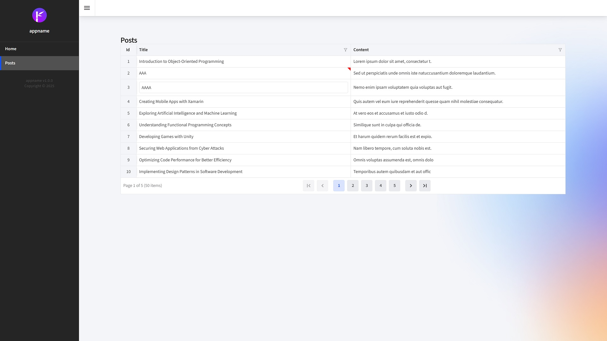

<p class="d-flex justify-content-center">
<br>
</p>


#### **Blazor Radzen .NET 8 DataGrid InCellEdit**

<p class="d-flex justify-content-center">
<br>
<p>

Blazor: ```Blazor``` A framework for building interactive web applications using C# instead of JavaScript. It allows developers to create rich web UIs with a component-based architecture.  
Radzen: ```Radzen``` A set of UI components for Blazor that simplifies the development of web applications. It provides a variety of ```controls```, including DataGrids, which are essential for displaying and managing data.  
.NET 8: ```.NET 8``` is the latest version of the ```.NET framework```, which includes enhancements and new features that improve performance, security, and developer productivity.  
DataGrid: ```DataGrid``` A component that displays data in a tabular format, allowing for operations like sorting, filtering, and editing.  
InCellEdit: ```InCellEdit``` A feature that enables users to edit data directly within the cells of the DataGrid.  
  
##### **Index.razor**
<kbd>Index.razor</kbd>
```
@page "/BlogPost"

<PageTitle>Posts</PageTitle>

<style>
    .table-cell-edited {
        position: relative;
    }

        .table-cell-edited::after {
            content: "";
            position: absolute;
            top: 0;
            right: 0;
            width: 0;
            height: 0;
            border-top: 10px solid red;
            border-left: 10px solid transparent;
        }
</style>

<RadzenRow>
    <RadzenColumn SizeSM="12" SizeMD="12" SizeLG="4">
        <RadzenStack Orientation="Orientation.Horizontal" AlignItems="AlignItems.Center">
            <RadzenText Text="Posts" TextStyle="TextStyle.H5" />
            @* <RadzenButton Text="Create" Icon="add_circle_outline"
                          Click="NavigatetoCreate"
                          ButtonStyle="ButtonStyle.Success" class="rz-mb-2 rz-p-2" /> *@
        </RadzenStack>
    </RadzenColumn>
</RadzenRow>


<RadzenDataGrid @ref="blogPostsGrid" KeyProperty="Id" IsLoading="@isLoading" Count="@totalCount" ShowPagingSummary=true AllowAlternatingRows="false" AllowFiltering="true" FilterMode="FilterMode.Advanced" FilterCaseSensitivity="FilterCaseSensitivity.CaseInsensitive" AllowPaging="true" PagerHorizontalAlign="HorizontalAlign.Center" PageSize="@itemPageSize" AllowSorting="true" Data="@blogPosts" TItem="BlogPostViewModel" LoadData="@LoadData" RowUpdate="@OnUpdateRow" Sort="@(args => Reset())" Page="@(args => Reset())" Filter="@(args => Reset())" CellClick="@OnCellClick">
    <Columns>
        <RadzenDataGridColumn TItem="BlogPostViewModel" Property="Id" Filterable="false" Title="Id" Frozen="true" Width="50px" MinWidth="50px" TextAlign="TextAlign.Center" />
        <RadzenDataGridColumn TItem="BlogPostViewModel" Property="Title" Title="Title" IsInEditMode="@IsEditing" CalculatedCssClass="@IsEdited">
            <EditTemplate Context="blogPost">
                <RadzenTextBox @bind-Value="blogPost.Title" Name="Title" style="width: 100%" aria-label="Enter Title" />
                <RadzenRequiredValidator Text="Title is required" Component="Title" Popup="true" />
            </EditTemplate>
        </RadzenDataGridColumn>
        <RadzenDataGridColumn TItem="BlogPostViewModel" Property="Content" Title="Content" IsInEditMode="@IsEditing" CalculatedCssClass="@IsEdited">
            <EditTemplate Context="blogPost">
                <RadzenTextBox @bind-Value="blogPost.Content" Name="Content" style="width: 100%" aria-label="Enter Content" />
                <RadzenRequiredValidator Text="Content is required" Component="Content" Popup="true" />
            </EditTemplate>
        </RadzenDataGridColumn>

    </Columns>
</RadzenDataGrid>

@code {

    const int itemPageSize = 10;
    private bool isLoading;
    private int totalCount;
    RadzenDataGrid<BlogPostViewModel>? blogPostsGrid;
    private IEnumerable<BlogPostViewModel>? blogPosts;

    List<BlogPostViewModel> blogPostsToUpdate = new List<BlogPostViewModel>();

    string columnEditing;
    List<KeyValuePair<int, string>> editedFields = new List<KeyValuePair<int, string>>();
    IRadzenFormComponent editor;
    bool editorFocused;


    protected override async Task OnInitializedAsync()
    {
        await base.OnInitializedAsync();
    }

    protected override async Task OnAfterRenderAsync(bool firstRender)
    {
        await base.OnAfterRenderAsync(firstRender);

        if (!editorFocused && editor != null)
        {
            editorFocused = true;

            try
            {
                await editor.FocusAsync();
            }
            catch { }
        }
    }

    private async Task LoadData(LoadDataArgs args)
    {
        isLoading = true;

        var result = await BlogPostService.GetBlogPostsAsync(filter: args.Filter, top: args.Top, skip: args.Skip, orderby: args.OrderBy, count: true);

        blogPosts = Mapper.Map<IEnumerable<BlogPost>, IEnumerable<BlogPostViewModel>>(result.Result);
        totalCount = result.TotalCount;

        isLoading = false;
    }

    private bool IsEditing(string columnName, BlogPostViewModel blogPostViewModel)
    {
        return columnEditing == columnName && blogPostsToUpdate.Contains(blogPostViewModel);
    }

    private string IsEdited(RadzenDataGridColumn<BlogPostViewModel> column, BlogPostViewModel blogPostViewModel)
    {
        return editedFields.Where(c => c.Key == blogPostViewModel.Id && c.Value == column.Property).Any() ?
            "table-cell-edited" :
            string.Empty;
    }

    private async Task OnCellClick(DataGridCellMouseEventArgs<BlogPostViewModel> args)
    {
        if (!blogPostsGrid.IsValid ||
            (blogPostsToUpdate.Contains(args.Data) && columnEditing == args.Column.Property)) return;

        if (blogPostsToUpdate.Any())
        {
            editedFields.Add(new(blogPostsToUpdate.First().Id, columnEditing));
            await Update();
        }

        columnEditing = args.Column.Property;

        await EditRow(args.Data);
    }

    private void Reset(BlogPostViewModel blogPostViewModel = null)
    {
        editorFocused = false;

        if (blogPostViewModel != null)
        {
            blogPostsToUpdate.Remove(blogPostViewModel);
        }
        else
        {
            blogPostsToUpdate.Clear();
        }
    }

    private async Task Update()
    {
        editorFocused = false;

        if (blogPostsToUpdate.Any())
        {
            await blogPostsGrid.UpdateRow(blogPostsToUpdate.First());
        }
    }

    private async Task EditRow(BlogPostViewModel blogPost)
    {
        Reset();
        blogPostsToUpdate.Add(blogPost);
        await blogPostsGrid.EditRow(blogPost);
    }

    async Task OnUpdateRow(BlogPostViewModel blogPostViewModel)
    {
        Reset(blogPostViewModel);

        var blogPost = Mapper.Map<BlogPostViewModel, BlogPost>(blogPostViewModel);
        bool result = await BlogPostService.UpdateBlogPostAsync(blogPostViewModel.Id, blogPost);
    }

}

```
  
Radzen's DataGrid to implement in-cell editing for blog posts. This feature allows users to edit data directly within the grid, enhancing user experience and efficiency. We will break down the code provided, explaining its structure and functionality in detail.  


```Cell Click Event```: Handles the logic when a cell is clicked, allowing for editing.  
```
private async Task OnCellClick(DataGridCellMouseEventArgs<BlogPostViewModel> args)
{
    if (!blogPostsGrid.IsValid || (blogPostsToUpdate.Contains(args.Data) && columnEditing == args.Column.Property)) return;

    if (blogPostsToUpdate.Any())
    {
        editedFields.Add(new(blogPostsToUpdate.First().Id, columnEditing));
        await Update();
    }

    columnEditing = args.Column.Property;
    await EditRow(args.Data);
}
```
  
By allowing users to ```edit``` blog post titles and content directly within the ```grid```, the application enhances ```usability and interactivity```. The combination of ```asynchronous data loading```, ```event handling```, and ```conditional rendering``` creates a robust and responsive user interface. This approach not only streamlines the editing process but also ensures that users have a clear understanding of which ```fields``` have been modified, thanks to the visual cues provided by the ```CSS styles```.  


#### **Source**
Full source code is available at this repository in GitHub:  
https://github.com/akifmt/DotNetCoding/tree/main/src/BlazorAppRadzenNet8DataGridInCellEdit
