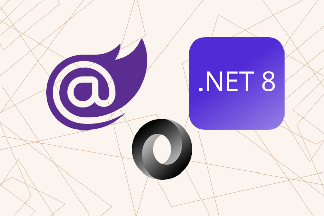

<p class="d-flex justify-content-center">
<br>
</p>


#### **Blazor .NET 8 Custom JSON Converters for (De)Serializing Built-in and Custom Types**

Blazor: ```Blazor``` is a web framework that enables developers to create interactive web applications using C# instead of JavaScript. It leverages the power of .NET to provide a rich user experience with reusable components.  
.NET 8: ```.NET 8```, is offering enhanced performance, new features, and improved support for cloud-based applications. It includes updates to libraries and tools that facilitate modern application development.  
JSON: ```JavaScript Object Notation (JSON)``` is a lightweight ```data interchange format``` that is easy for humans to read and write, and easy for machines to parse and generate. It is widely used for ```APIs``` and data exchange between a server and a client.  
JSON Converter: ```JSON converter``` is a component that allows for ```custom serialization and deserialization``` of objects to and from ```JSON``` format. This is particularly useful when dealing with ```complex types``` or when ```specific formatting``` is required.  
Serialization: ```Serialization```, The process of converting an object into a JSON string.  
Deserialization: ```Deserialization```, The reverse process, where a JSON string is converted back into an object.  


##### **Serializing and Deserializing Built-in Types**

<kbd>CustomConverterInt.cs</kbd>
```
public class CustomConverterInt : JsonConverter<int>
{
    private readonly static JsonConverter<int> s_defaultConverter = (JsonConverter<int>)JsonSerializerOptions.Default.GetConverter(typeof(int));

    // Custom serialization logic
    public override void Write(Utf8JsonWriter writer, int value, JsonSerializerOptions options)
    {
        writer.WriteNumberValue(value);
    }

    // Custom deserialization logic
    public override int Read(ref Utf8JsonReader reader, Type typeToConvert, JsonSerializerOptions options)
    {
        switch (reader.TokenType)
        {
            case JsonTokenType.String:
                return 0;
            case JsonTokenType.Number:
                return reader.GetInt32();
            default:
                return s_defaultConverter.Read(ref reader, typeToConvert, options); // Fall back to default deserialization logic
        }
    }
}
```

The ```CustomConverterInt``` class exemplifies how to implement ```custom JSON converters``` in Blazor .NET 8 for handling integer types. By defining specific ```serialization and deserialization``` logic, developers can ensure that their applications handle ```data``` in a way that meets their unique requirements.  


<kbd>CustomConverterDateOnly.cs</kbd>
```
public class CustomConverterDateOnly : JsonConverter<DateOnly>
{
    private readonly static JsonConverter<DateOnly> s_defaultConverter = (JsonConverter<DateOnly>)JsonSerializerOptions.Default.GetConverter(typeof(DateOnly));

    // Custom serialization logic
    public override void Write(Utf8JsonWriter writer, DateOnly value, JsonSerializerOptions options)
    {
        string customDateFormat = value.ToString("dd--MM--yyyy"); // 01--01--2000
        writer.WriteStringValue(customDateFormat);
    }

    // Custom deserialization logic
    public override DateOnly Read(ref Utf8JsonReader reader, Type typeToConvert, JsonSerializerOptions options)
    {
        switch (reader.TokenType)
        {
            case JsonTokenType.String:
                DateTime parsedDate = DateTime.MinValue;
                string pattern = "dd--MM--yyyy";
                DateTime.TryParseExact(reader.GetString(), pattern, null, DateTimeStyles.None, out parsedDate);
                return DateOnly.FromDateTime(parsedDate);
            default:
                return s_defaultConverter.Read(ref reader, typeToConvert, options); // Fall back to default deserialization logic
        }
    }
}
```
When a ```DateOnly``` object is serialized, the ```Write``` method formats it into a string using the specified pattern. For example, a ```DateOnly``` representing January 1, 2000, will be serialized as ```"01--01--2000"```.  
The ```Read``` method checks the ```token type```. If it encounters a ```string```, it attempts to parse it using the same format. If successful, it converts the parsed ```DateTime``` back into a ```DateOnly```. If the ```token type``` is not a string, it defaults to the standard deserialization logic.  


##### **Serializing and Deserializing Custom Types**

<kbd>CustomConverterWeatherForecast.cs</kbd>
```
public class CustomConverterWeatherForecast : JsonConverter<WeatherForecast>
{
    private readonly static JsonConverter<WeatherForecast> s_defaultConverter = (JsonConverter<WeatherForecast>)JsonSerializerOptions.Default.GetConverter(typeof(WeatherForecast));

    // Custom serialization logic
    public override void Write(Utf8JsonWriter writer, WeatherForecast value, JsonSerializerOptions options)
    {
        writer.WriteStartObject();

        writer.WriteString("Date", value.Date.ToString("yyyy-MM-dd"));
        writer.WriteNumber("TemperatureC", value.TemperatureC);
        writer.WriteString("Summary", value.Summary);

        writer.WriteEndObject();
    }

    // Custom deserialization logic
    public override WeatherForecast Read(ref Utf8JsonReader reader, Type typeToConvert, JsonSerializerOptions options)
    {
        WeatherForecast weatherForecast = new();

        while (reader.Read())
        {
            if (reader.TokenType == JsonTokenType.EndObject)
            {
                return weatherForecast;
            }

            string? propertyName = reader.GetString();
            if (reader.TokenType == JsonTokenType.PropertyName)
            {
                propertyName = reader.GetString();
                reader.Read();
                switch (propertyName)
                {
                    case "Date":
                        string? date = reader.GetString();
                        weatherForecast.Date = DateOnly.Parse(date);
                        break;
                    case "TemperatureC":
                        int temperatureC = reader.GetInt32();
                        weatherForecast.TemperatureC = temperatureC;
                        break;
                    case "Summary":
                        string? summary = reader.GetString();
                        weatherForecast.Summary = summary;
                        break;
                }
            }
        }

        throw new JsonException();
    }
}
```

```Write```: The ```method``` begins by starting a JSON object. It writes the Date property formatted as ```"yyyy-MM-dd"```, ensuring a consistent date format. The ```TemperatureC``` and ```Summary``` properties are written directly. Finally, it ends the ```JSON object```.  
```Read```: This ```method``` initializes a new ```WeatherForecast``` object. It reads through the ```JSON data```, checking for ```property names``` and their corresponding values. Each property is parsed and assigned to the ```WeatherForecast``` object. If the end of the object is reached, the populated object is returned. If the ```JSON``` structure is unexpected, a ```JsonException``` is thrown.


##### **Implement Custom JSON Converters in a Blazor Application for both Built-In and Custom Types**

<kbd>Weather.razor</kbd>
```
...
...

    <h3>JSON Results:</h3>

    <p>
        <b>SerializedValueBuildInType:</b> <br />
        <code>
            @serializedValueBuildInType
        </code>
    </p>

    <p>
        <b>SerializedValueCustomType:</b> <br />

        <code>
            @serializedValueCustomType
        </code>
    </p>

...
...

@code {
    private WeatherForecast[]? forecasts;

    private string serializedValueBuildInType;
    private string serializedValueCustomType;

    protected override async Task OnInitializedAsync()
    {
        // Simulate asynchronous loading to demonstrate a loading indicator
        await Task.Delay(500);


        var startDate = DateOnly.FromDateTime(DateTime.Now);
        var summaries = new[] { "Freezing", "Bracing", "Chilly", "Cool", "Mild", "Warm", "Balmy", "Hot", "Sweltering", "Scorching" };
        var testValueForecasts = Enumerable.Range(1, 5).Select(index => new WeatherForecast
        {
            Date = startDate.AddDays(index),
            TemperatureC = Random.Shared.Next(-20, 55),
            Summary = summaries[Random.Shared.Next(summaries.Length)]
        }).ToArray();


        // custom json Serialize/Deserialize (BuildInType)
        var options = new JsonSerializerOptions();
        options.Converters.Add(new Converters.CustomConverterInt());
        options.Converters.Add(new Converters.CustomConverterDateOnly());
        serializedValueBuildInType = JsonSerializer.Serialize(testValueForecasts, options);
        var deserializedValueBuildInType = JsonSerializer.Deserialize<WeatherForecast[]>(serializedValueBuildInType, options);


        // custom json Serialize/Deserialize (CustomType)
        var optionsObject = new JsonSerializerOptions();
        optionsObject.Converters.Add(new Converters.CustomConverterWeatherForecast());
        serializedValueCustomType = JsonSerializer.Serialize(testValueForecasts, optionsObject);
        var deserializedValueCustomType = JsonSerializer.Deserialize<WeatherForecast[]>(serializedValueCustomType, optionsObject);


        forecasts = deserializedValueBuildInType;
    }

}
```


```Two sets``` of JSON serialization and deserialization are performed.  
- The ```first``` uses ```built-in types``` with custom converters for ```int``` and ```DateOnly```.  
```
// custom json Serialize/Deserialize (BuildInType)
var options = new JsonSerializerOptions();
options.Converters.Add(new Converters.CustomConverterInt());
options.Converters.Add(new Converters.CustomConverterDateOnly());
serializedValueBuildInType = JsonSerializer.Serialize(testValueForecasts, options);
var deserializedValueBuildInType = JsonSerializer.Deserialize<WeatherForecast[]>(serializedValueBuildInType, options);
```

- The ```second``` uses a custom converter specifically for the ```WeatherForecast``` type.  
```
// custom json Serialize/Deserialize (CustomType)
var optionsObject = new JsonSerializerOptions();
optionsObject.Converters.Add(new Converters.CustomConverterWeatherForecast());
serializedValueCustomType = JsonSerializer.Serialize(testValueForecasts, optionsObject);
var deserializedValueCustomType = JsonSerializer.Deserialize<WeatherForecast[]>(serializedValueCustomType, optionsObject);
```


#### **Source**
Full source code is available at this repository in GitHub:  
https://github.com/akifmt/DotNetCoding/tree/main/src/BlazorAppCustomJSONConverters
