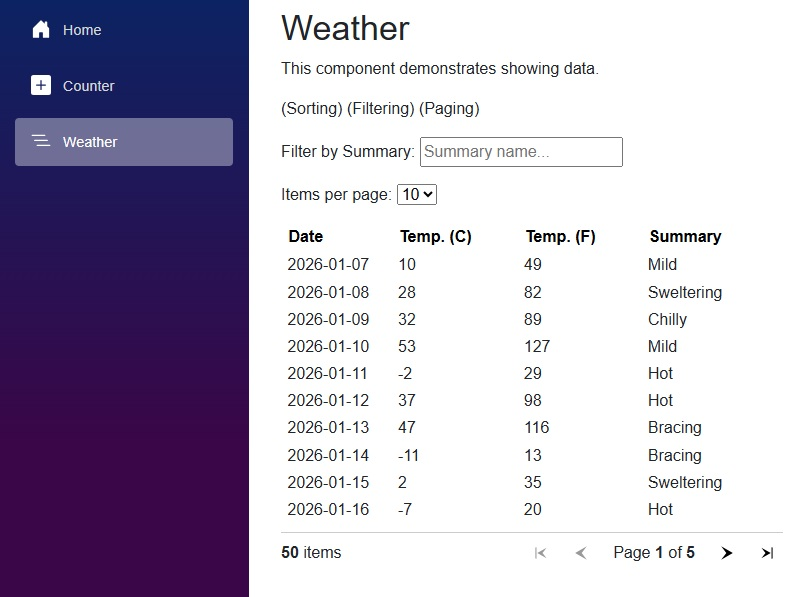

<p class="d-flex justify-content-center">
<br>
</p>


#### **Blazor .NET 10 QuickGrid Component**

<p class="d-flex justify-content-center">
<br>
</p>

.NET 10: ```.NET 10``` is the latest version of the .NET framework, which provides a robust platform for building web applications, services, and more.  

Blazor: ```Blazor``` A framework for building interactive web applications using C# instead of JavaScript. It allows developers to create rich web UIs with C#.  

QuickGrid: ```QuickGrid``` A component that simplifies the process of displaying tabular data in Blazor applications. It offers features like sorting, filtering, and pagination out of the box, making it a powerful tool for developers.  


##### **.csproj**

{}
{}{}
{}

```<PackageReference Include="Microsoft.AspNetCore.Components.QuickGrid" Version="10.0.1" />``` adds the ```QuickGrid``` package to the project, enabling the use of its components for displaying data in a grid format.


##### **Weather.razor**

{}
{}{}
{}

Filtering: The ```FilteredWeatherForecasts``` property filters the forecasts based on the user input in the search box. It checks if the ```summaryFilter``` is not empty and applies the filter accordingly.  

Pagination: The ```PaginationState``` object manages the number of items displayed per page, allowing users to select their preference from a dropdown.  

The ```Weather component``` exemplifies how to effectively implement ```sorting```, ```filtering```, and ```paging``` in a ```Blazor``` application using ```.NET 10``` and ```C#```. By understanding the structure and functionality of this component, developers can create ```dynamic``` and ```user-friendly``` interfaces for displaying data.  


#### **Source**

Full source code is available at this repository in GitHub:  
https://github.com/akifmt/DotNetCoding/tree/main/src/BlazorAppQuickGridComponent  
  