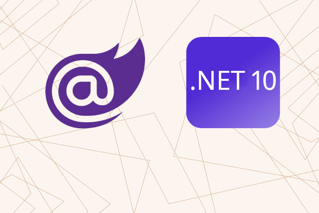

<p class="d-flex justify-content-center">
<br>
</p>


#### **Blazor .NET 10 Server-Sent Events (SSE) with Minimal APIs**

.NET 10: ```.NET 10``` is the latest version of the ```.NET platform```, which provides a unified development experience for building applications across various platforms. It includes enhancements in performance, security, and new features that streamline the development process.

Blazor: ```Blazor``` is a web framework that allows developers to build interactive web applications using C# instead of JavaScript. It leverages the power of .NET to create rich client-side applications that can run in the browser via WebAssembly or on the server.

Server-Sent Events (SSE): ```Server-Sent Events (SSE)``` is a standard allowing a server to push real-time updates to web clients over HTTP. Unlike ```WebSockets```, ```SSE``` is a one-way communication channel where the server can send updates to the client without requiring the client to request them.

Minimal APIs: ```Minimal APIs``` in ```.NET 10``` provide a simplified way to create ```HTTP APIs``` with minimal overhead. They allow developers to define routes and handle requests using a more concise syntax, making it easier to build lightweight services.

EventSource: ```EventSource```, a built-in ```JavaScript``` object that allows the client to receive updates from the server.

Event Listeners: ```Event Listeners```, functions that respond to specific events, such as ```receiving``` new data or ```encountering``` an error.

DOM Manipulation: ```DOM Manipulation```, code dynamically updates the ```HTML``` elements to display the latest weather forecasts.


| Project Name  			 | Port  |   |
|---|---|---|
| <kbd>WebApplicationNET10MinimalAPIs</kbd>	| :5001 | Blazor Web App |
| <kbd>BlazorAppNET10SSE</kbd> | :6001 | ASP.NET Core Web API (Minimal APIs) |


##### **WebApplicationNET10MinimalAPIs/Program.cs**

{}
{}{}
{}

```MapGet``` method defines a new ```GET``` endpoint at ```/sse-json-weatherforecast```. This endpoint will be responsible for streaming ```weather forecast``` data. ```GetWeatherForecasts``` method is defined as an ```asynchronous iterator``` using ```IAsyncEnumerable```. This allows the method to ```yield results``` over time rather than returning all data at once. Inside the while loop, the code generates a new weather forecast every two seconds. It creates an array of ```WeatherForecastRecord``` objects, each representing a forecast for the next five days. The temperature is randomly generated between -20 and 55 degrees, and a random summary is selected from a predefined list. Method yields a ```WeatherForecastDTO``` object that encapsulates the heart rate and the generated forecast data. This object is sent to the client as part of the ```SSE stream```.  ```TypedResults.ServerSentEvents``` method is called to return the generated data as a stream of ```Server-Sent Events```, with the event type specified as ```weatherforecasts```.


##### **BlazorAppNET10SSE/Weather.razor**

{}
{}{}
{}

```@inject IJSRuntime JS``` line allows the component to call JavaScript functions. ```InitEventSourceAsync``` and ```StopEventSourceAsync``` methods manage the connection to the SSE stream. 


##### **BlazorAppNET10SSE/Weather.js**

{}
{}{}
{}

```JavaScript``` code is structured into two main functions: ```InitEventSource``` and ```StopEventSource```. The ```InitEventSource``` function initializes the connection to the ```SSE endpoint```, while the ```StopEventSource``` function closes the connection when it is no longer needed.

```addEventListener``` method listens for the ```weatherforecasts``` event. When this ```event``` is triggered, the data is parsed from ```JSON format```, and the ```UI``` is updated accordingly. The previous forecast entries are removed, and new rows are created for each forecast.

```onopen```, ```onmessage```, and ```onerror``` event handlers manage the connection state, logging messages to the console for debugging purposes.


#### **Source**

Full source code is available at this repository in GitHub:  
https://github.com/akifmt/DotNetCoding/tree/main/src/BlazorAppNET10SSEwithBlazorandMinimalAPIs  
  