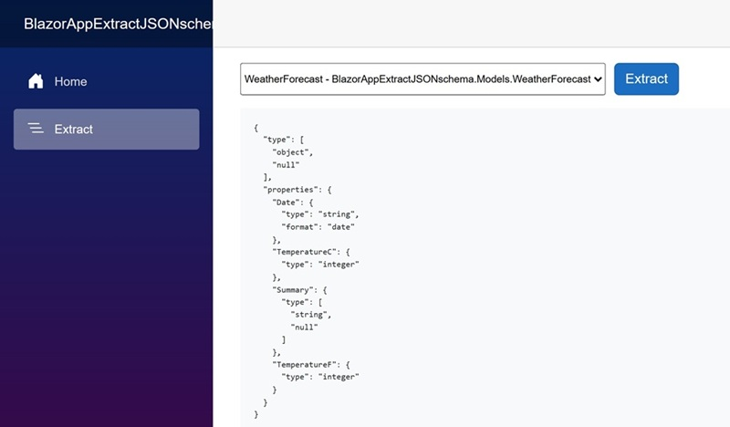

<p class="d-flex justify-content-center">
<br>
</p>


#### **Blazor .NET 10 Extract JSON schema**

<p class="d-flex justify-content-center">
<br>
</p>

.NET 10: ```.NET 10``` introduces several enhancements, including performance improvements, new APIs, and better support for cloud-native applications. The integration of JSON schema extraction in .NET 10 is a significant feature that aids in data validation and API documentation.

Blazor: ```Blazor``` is a web framework that allows developers to build interactive web applications using C# instead of JavaScript. It leverages the power of .NET to create rich client-side applications that can run in the browser via WebAssembly or on the server.

JSON Schema: ```JSON Schema``` is a powerful tool for validating the structure of JSON data. It defines the expected format, types, and constraints of JSON objects, ensuring that the data adheres to a specified structure. This is particularly useful in API development, where consistent data formats are crucial for interoperability.


##### **Models**

{}
{}{}
{}{}
{}
  
```WeatherForecast``` and ```BlogPost``` classes exemplify how to create structured data models in a Blazor .NET 10 application. By defining ```properties``` and utilizing calculated ```fields```, these models not only facilitate data management but also enhance the application's ability to interact with ```JSON data```.


##### **Extract.razor**

{}
{}{}
{}
  
```OnInitializedAsync```, retrieves all types from the application's assembly that belong to a specific namespace and stores them in the ```definedTypes``` array. ```ButtonExtractClick```, checks if a type has been selected and then calls either ```SimpleExtraction``` or ```CustomExtraction``` to generate the JSON schema. ```SimpleExtraction```, uses the default ```JSON serializer``` options to extract the schema from the selected type. ```CustomExtraction```, allows for more control over the JSON serialization process. It customizes the serializer options, such as naming policies and handling of unmapped members, providing a tailored schema output.

By utilizing both ```SimpleExtraction``` and ```CustomExtraction```, developers can choose the method that best fits their needs. This flexibility, combined with the ease of use provided by the Blazor framework, makes it an excellent choice for building interactive web applications that require ```JSON schema``` validation.


#### **Source**

Full source code is available at this repository in GitHub:  
https://github.com/akifmt/DotNetCoding/tree/main/src/BlazorAppExtractJSONschema  
  