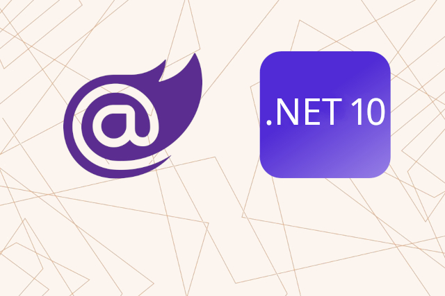

<p class="d-flex justify-content-center">
<br>
</p>


#### **.NET 10 Aspire Keycloak External Service Integration in .NET Aspire**


.NET 10: ```.NET 10```, which provides a unified platform for building applications across various devices and services.

Blazor: ```Blazor```, a framework for building interactive web applications using C# instead of JavaScript, allowing developers to create rich client-side applications.

Aspire: ```Aspire```, that simplifies the development of microservices and distributed applications, providing tools for service registration, health checks, and more.

Web API: ```Web API```, a set of protocols and tools for building HTTP-based services that can be consumed by various clients, including web browsers and mobile applications.

Keycloak: ```Keycloak```, an open-source identity and access management tool that allows you to secure applications and services with little to no code.


-------
##### **Projects**
| Project Name  			 | Port  | Template  |
|---|---|---|
| Keycloak				 | :9000 :8080 | Identity and Access Management |
| AspireKeycloakExternalService.ApiService				 | :6001 | ASP.NET Core Web API |
| AspireKeycloakExternalService.AppHost		 | :17001 | .NET Aspire App |
| AspireKeycloakExternalService.Web		 | :7001 | Blazor Web App |

-------


##### **Keycloak with specific parameters**

The command to run Keycloak with specific parameters is structured as follows:

```
keycloak run --health-enabled true --metrics-enabled true
```
  
```health-enabled``` enables the health check endpoint, allowing you to monitor the health status of the Keycloak server. This is particularly useful for ensuring that the service is running smoothly and can be integrated into monitoring tools.

```metrics-enabled``` activates the metrics endpoint, which provides valuable insights into the performance of the Keycloak server. Metrics can include request counts, response times, and other performance indicators.
  


##### **AspireKeycloakExternalService.AppHost/AppHost.cs**

{}
{}{}
{}
  
  
```AddExternalService("keycloak", "http://localhost:9000")``` registers Keycloak as an external service with the name ```"keycloak"``` and sets its base URL to ```http://localhost:9000```. This URL is where the application will communicate with Keycloak.

```WithUrl("http://localhost:8080")``` specifies the actual URL of the Keycloak server that the application will interact with. This is typically where the Keycloak API is hosted.

```WithHttpHealthCheck("/health")``` defines a health check endpoint. This endpoint will be used to verify if the Keycloak service is running and accessible. It is a best practice to include health checks to ensure that the application can gracefully handle service outages.


Integrating ```Keycloak``` as an external service in a ```.NET Aspire``` application enhances security and provides a seamless user experience. By enabling health and metrics monitoring, developers can ensure that the ```Keycloak service``` remains reliable and performant.


#### **Source**

Full source code is available at this repository in GitHub:  
https://github.com/akifmt/DotNetCoding/tree/main/src/AspireKeycloakExternalService  
  