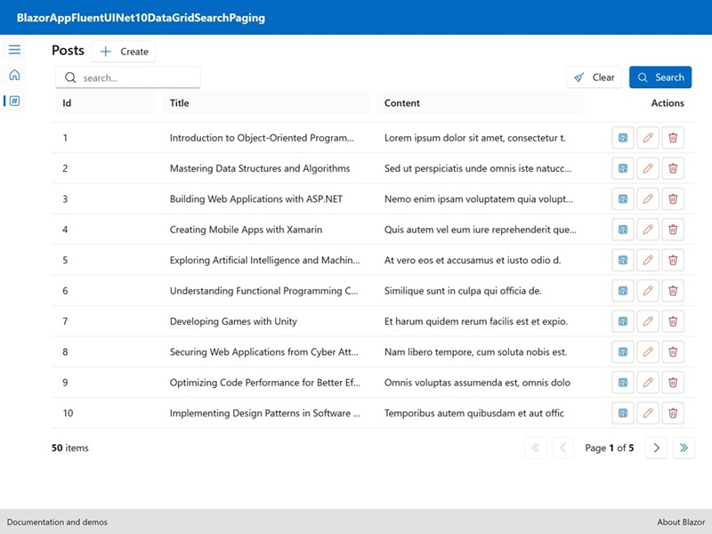

<p class="d-flex justify-content-center">
<br>
</p>


#### **Blazor Fluent UI .NET 10 DataGrid with Search Paging**

<p class="d-flex justify-content-center">
<br>
</p>

.NET 10: ```.NET 10``` introduces several enhancements, including performance improvements, new APIs, and better support for cloud-native applications. The integration of JSON schema extraction in .NET 10 is a significant feature that aids in data validation and API documentation.

Blazor: ```Blazor``` is a web framework that allows developers to build interactive web applications using C# instead of JavaScript. It leverages the power of .NET to create rich client-side applications that can run in the browser via WebAssembly or on the server.

Fluent UI Blazor: ```Fluent UI Blazor``` is a set of components that implement Microsoft's Fluent Design System for Blazor applications. It provides a consistent and modern user interface, enhancing the overall user experience.

DataGrid: A component that displays data in a tabular format, allowing for sorting, filtering, and pagination.

Pagination: A technique to divide a large dataset into smaller, manageable chunks, improving performance and user experience.


##### **Index.razor**

{}
{}{}
{}
  
```FluentTextField``` binds to ```_stateFilter```, allowing users to input search criteria. Search icon is displayed at the start of the input field. ```Clear``` button resets the search filter, while ```Search``` button triggers the data refresh based on the input. ```FluentDataGrid``` is configured to display blog posts with properties for ```ID```, ```title```, and ```content```. Each column is sortable. ```TemplateColumn``` includes action buttons for viewing, editing, and deleting posts, enhancing user interaction. ```FluentPaginator``` component manages the pagination state, allowing users to navigate through the pages of blog posts.


#### **Source**
Full source code is available at this repository in GitHub:  
https://github.com/akifmt/DotNetCoding/tree/main/src/BlazorAppFluentUINet10DataGridSearchPaging  
