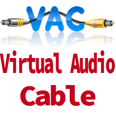

 
AWS veya Azure üzerindeki VPS cihazlarda gerçek bir ses kartı bulunmadığı için bu cihazlar üzerinde ses almak mümküm olmamakta. Bunun için çözüm ise VA, yani virtual audio. Uygun uygulama çözümümüz VAC kurulumu ile çözülmekte. Uygulama sanal bir ses sürücüsü oluşturarak sesi cihazımıza yönlendirme sağlamaktadır. 
**Problem:** VPS üzerinden Ses  
**Çözüm:** Virtual Audio Cable 4.15 kurulumu ve Ayarlama 
- VPS üzerinde test ettiğim "Virtual Audio Cable 4.15" kurulumunu yapınız. 
- VPS üzerinde "tsconfig.msc" içerisinde RDP-Tcp -> client services -> audio  
seçeneğini kaldırın. VPS resetleyin. 
Bu aşamadan sonra ses hazır. 
 
**İndirme linki:** 
Google -> Virtual Audio Cable 4.15

