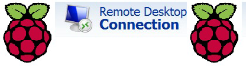

 
 
**Problem:** Raspbery Pi Remote Connection TR Keyboard Not Recognizing  
Solution: missing km-041f.ini file 
 
- Copy the km-041f.ini file to the /etc/xrdp/ directory on the Raspberry Pi. When xrdp is restarted, TR characters are no longer a problem. 
The thing to note is that you must access the directory as root. 
The step I followed;  
1. sudo pcmanfm on RasPi  
2. Copy the km-041f.ini file to /etc/xrdp/. 
3. sudo service xrdp restart 
**Note:** For those who have problems finding the file on the net, I downloaded it from this repo: [Link](https://github.com/Sighillrob/ulteo4Kode4kids/tree/master/xrdp/instfiles "asd")
