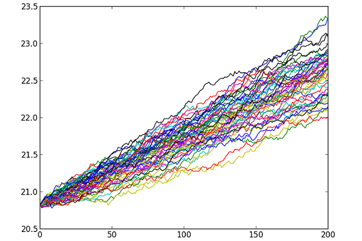

<br>
<br>
**Nedir:** Rastgele sayılar kullanılarak sistemlerin modellenmesinde kullanılabilir. Sistemin kesin sonucunun olduğu bazı durumlarda, veya olmadığı tüm durumlarda uygulanabilir. <br>
Örnek sayısı doğru sonuçlar elde etmede büyük önem taşımaktadır. Pi sayısı hesaplama, yazı tura ve zar hesaplaması örnek gösterilebilir.<br>

**Örnek:** C ile Yazı-Tura <br>

```c
double rastgele(){
  double r = (double) rand()/RAND_MAX;
  return r;
}
int main()
{
   int i, tura, yazi, n;
   double r, p;
   printf("deney sayisini girin: ");
   scanf("%d",&n);
   srand( time(NULL) );   
   for(tura=0, i=1; i<=n; i++){
     r = rastgele();
     if(r<0.5) tura++;
   }
   p = (double) tura/n;
   yazi = n-tura;
   printf("tura sayisi: %d\n",tura);
   printf("yazi sayisi: %d\n",yazi);
   printf("Olasiliklar: %lf  %lf\n",p, 1.0-p);

 return 0;
}
```

