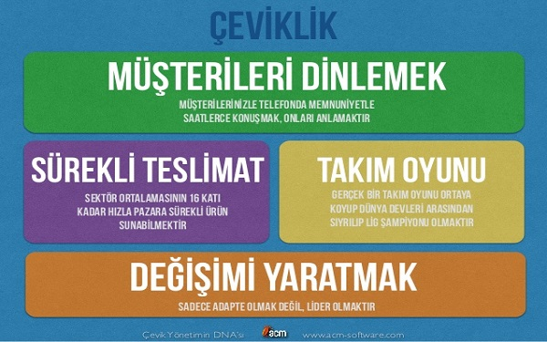

 
 

Agile Methodology is a practice-based method for modeling and documenting software systems effectively and efficiently.

Software projects are faced with the danger of failure due to improper use of resources, wrong prioritization and inaccurate understanding of customer demands throughout their lifecycle. According to The Standish Group's 2009 Chaos Report, software projects fail at a rate of 68% worldwide. This has led large companies in Europe and America to try various methods to produce projects with higher productivity, and most companies have adopted Agile software development approaches, which they find most successful in management and practice.

Increasing when Agile approaches are applied;

- project productivity,
- the ability of the project to adapt quickly to changes,
- project quality and
- speed to market of the project

In line with this, the success rates of the projects have been increased to 80% and project profitability has been increased with the significant competitive advantage obtained.

Source: www.acm-software.com/agile