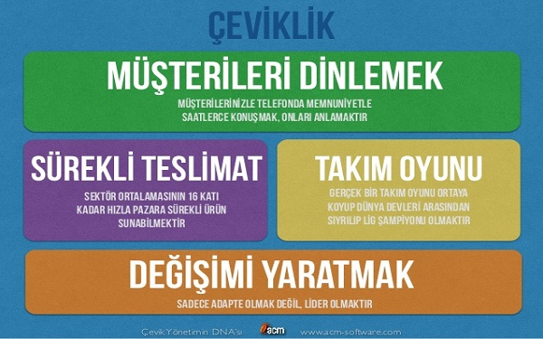

 
 

Agile Metodoloji (Çevik Metodoloji) yazılım sistemlerini etkili ve verimli bir şekilde modellemeye ve dokümantasyonunu yapmaya yönelik pratiğe dayalı yöntemlere denir.

Yazılım projeleri yaşam döngüleri boyunca kaynakların doğru kullanılmaması, yanlış önceliklendirmeler ve müşteri taleplerinin doğru anlaşılamaması nedeni ile başarısızlık tehlikesi ile karşı karşıya kalmaktadır. The Standish Group’un 2009 yılı Chaos Report’una göre yazılım projeleri dünya genelinde %68 oranında başarısızlıkla sonuçlanmaktadır. Bu durum, Avrupa ve Amerika’daki büyük şirketleri, üretkenliği daha yüksek projeler üretmek üzere çeşitli yöntemleri denemeye yöneltmiş ve çoğu şirket yönetimde ve uygulamada en başarılı buldukları Agile (çevik) yazılım geliştirme yaklaşımlarını benimsemişlerdir.

Agile yaklaşımlar uygulandığında artan;

- proje üretkenliği,
- projenin değişikliklere hızlı adapte olabilme yeteneği,
- proje kalitesi ve
- projenin pazara çıkış hızı

doğrultusunda projelerin başarı oranları %80’lere çıkartılabilmiş ve elde edilen önemli rekabet avantajı ile birlikte proje karlılıkları artırılmıştır.

Kaynak: www.acm-software.com/agile
