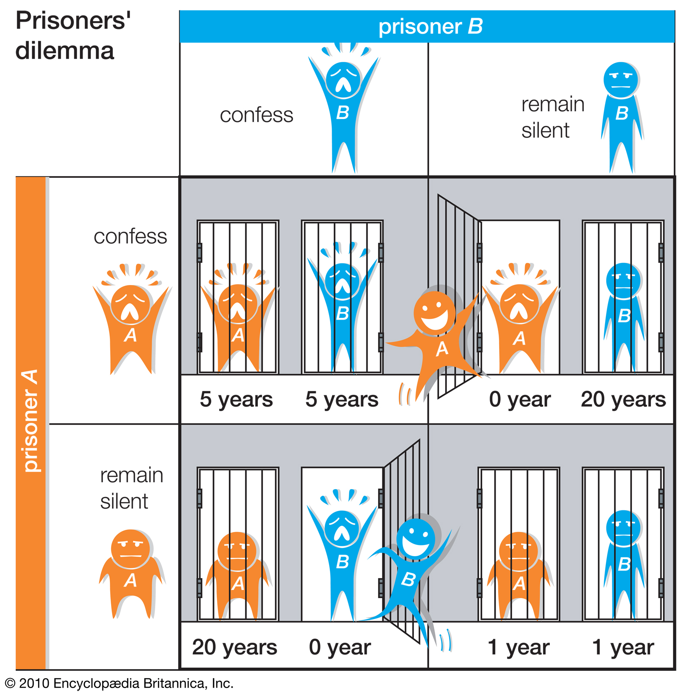

 

Get two people caught. If one testifies against the other and the other remains silent, the witness will be released, and the party who chooses to remain silent will be sentenced to 20 years in prison. If both remain silent, they will be sentenced to 1 year each. If both testify against each other, they will each be sentenced to 5 years.

The optimal option of the two is to keep both silent. The player, who is unaware of the other party's decision, will not remain silent and will testify against the other party, not risking the possibility of serving 20 years in prison. By testifying against the other party, he will consent to a shorter prison sentence of 5 years or be released. Here the player will aim at minimizing his loss (maximizing his win). It will be inevitable that the other party will testify by acting rationally under the same conditions.

The sole aim of the players is to maximize their own winnings, independently of the other player. Here, the **Nash Equilibrium** is formed when two individuals act by considering the other's movement and choose the best for their own situation instead of maximum gain.