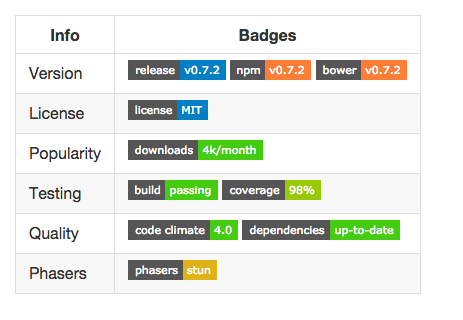

 

A tool for the ReadMe files of projects to display the project status in a nicer way. shields.io supports many tools used for project tracking. Travis, Jenkins and even Github allow badges to be added up to the release status of the project on SourceForce.

 
