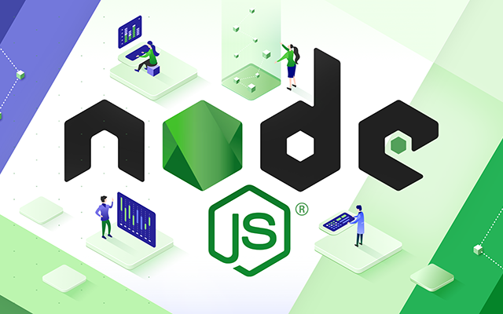

<br>

NodeJS Farklı Sürümleri Bir Arada Kullanma;

```
# Kurulum:
npm install -g nvmw         # nvmw kurulumu
nvmw install v8.12.0        # kullanılacak sürümlerin kurulumu
nvmw use v8.12.0            # Use the specific version

# Kullanım:
nvmw help                   # Yardım
nvmw install [version]      # Versiyon kurulumu [version]
nvmw uninstall [version]    # Versiyon kaldırma [version]
nvmw use [version]          # Versiyon değiştirme [version]
nvmw ls                     # Kurulan sürümlerin listesi
```

NodeJS Sürümler Listesi: [Sürümler](https://nodejs.org/en/download/releases/ "Sürümler")

NPM: [NPM Linki](https://www.npmjs.com/package/nvmw "NPM Linki")

Github: [Github Linki](https://github.com/hakobera/nvmw "Github Linki")
