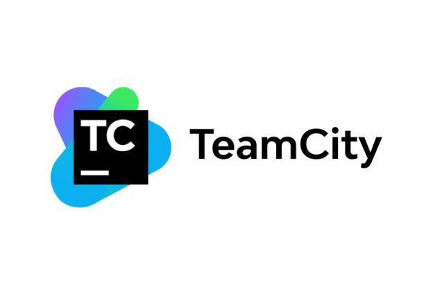

<p class="d-flex justify-content-center">
<br>
<p>

#### **Setting up Teamcity Hassle-Free CI/CD Tool on Self-hosted Server**

TeamCity, developed by ```JetBrains```, is a continuous integration and continuous delivery ```(CI/CD)``` platform designed to automate and streamline the software development process. It helps development teams efficiently ```build```, ```test```, and ```deploy``` software applications, accelerating ```development cycles``` and ```delivering high-quality code``` faster.


<kbd>Step 1</kbd> <b>Download TeamCity</b>
- Head to the ```JetBrains``` website: https://www.jetbrains.com/teamcity/download/
- Choose the ```"Executable Windows installer bundled with Tomcat and Java"``` option.
- Select the ```desired version``` and click ```"Download."```


Information
- TeamCity Professional (Free forever, even for commercial use)



<kbd>Step 2</kbd> <b>Installation</b>
- Run the downloaded ```.exe``` file.
- Follow the ```TeamCity Setup``` wizard instructions:
- Choose the ```TeamCity Home Directory``` for installation.
- ```Optionally``` change the ```default Server Port (8111)``` and ```Agent Port (9090)```.
- Select ```"Install TeamCity server and one build agent"``` option.
- Choose a ```user account``` for the service (with relevant permissions).
- Review and ```confirm``` the settings.


<kbd>Step 3</kbd> <b>Start TeamCity</b>
- After ```installation```, the wizard will automatically start ```TeamCity```.
- If not, open a command prompt and ```navigate``` to the ```TeamCity_Home\bin``` directory.
- Run the ```runAll.bat start``` command.



Configuring TeamCity Server Startup Properties;
- Navigate to the ```TeamCity_Home\conf``` directory
- Open ```teamcity-startup.properties```
```
teamcity.data.path=TEAMCITY_DATA_PATH
teamcity.server.git.executable.path=CUSTOM_GIT_PATH\\git.exe
```

More Information:  
https://www.jetbrains.com/help/teamcity/teamcity-documentation.html


